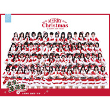

浪漫圣诞夜2014
============================

|  |  |
| :--: | :-- |
| [ 浪漫圣诞夜2014](https://emumo.xiami.com/album/2018880480) | **艺人**: [SNH48](../index.md) **语种**: 国语 **唱片公司**: 星四芭音乐 **发行时间**: 2014年12月18日 **专辑类别**: EP, 单曲 **专辑风格**: 女子团体 Girl Group, 国语流行 Mandarin Pop **播放数**: 91940 **收藏数**: 149 **评论数**: 28  |

## 简介

随着圣诞一天天的临近，节日气息开始在街头巷尾弥漫，浓浓的圣诞气息驱散了正浓的寒意，今年是SNH48成员与粉丝共同度过的第3个圣诞节。在这个充满温馨与甜蜜的节日里，SNH48三队成员首次合体献唱，六位代表成员徐晨辰、莫寒、林思意、易嘉爱、徐晗、刘炅然全新演绎《浪漫圣诞夜2014》，温暖整个冬季！

## 曲目

## 评论

|  |  |  |
| :-- | :-- | :-- |
|  [虾米用户](https://emumo.xiami.com/u/22601872)  2018-06-14 03:13 赞(0) 踩(0) | 
这首歌明明是只有六个人唱的版本，封面站了六十几个干嘛？还以为是大合唱版
 |
|  [虾米用户](https://emumo.xiami.com/u/9088938) 随便听听 2015-07-21 02:48 赞(0) 踩(0) | 
封面竟然能认清N队了部分S队了 作为脸盲真是佩服自己23333
 |
|  [虾米用户](https://emumo.xiami.com/u/48133794)  2015-03-14 19:28 赞(0) 踩(0) | 
封面让我想到了超市货架上的可乐 突然想去采购
 |
| ⇒ |  [虾米用户](https://emumo.xiami.com/u/9088938) 随便听听 2015-07-21 02:47 赞(0) 踩(0) | 
哈哈哈哈哈哈
 |
|  [虾米用户](https://emumo.xiami.com/u/6169699) \\m/ 2015-01-04 01:59 赞(0) 踩(0) | 
这怎么感觉曲子配中文这么不协调呢，这是翻唱吧
 |
|  [虾米用户](https://emumo.xiami.com/u/6169699) \\m/ 2015-01-04 01:57 赞(0) 踩(0) | 
整的和霓虹过会比寿葡萄一样
 |
|  [虾米用户](https://emumo.xiami.com/u/353663)  2014-12-23 10:33 赞(1) 踩(0) | 
不大理解为什么穿着圣诞的衣服双手作揖
 |
|  [虾米用户](https://emumo.xiami.com/u/26119143) 爱 是毁灭 2014-12-22 05:25 赞(0) 踩(0) | 
我竟然把人數完了
 |
|  [虾米用户](https://emumo.xiami.com/u/8586013) Life is an i... 2014-12-21 15:06 赞(0) 踩(0) | 
一眼看到卡皇
 |
|  [虾米用户](https://emumo.xiami.com/u/1407832)  2014-12-20 17:44 赞(0) 踩(0) | 
几年之后，多少人变黑白，多少人依旧精彩？
 |
|  [虾米用户](https://emumo.xiami.com/u/35279620) 又黑我！ 2014-12-20 16:17 赞(0) 踩(0) | 
当年随机听AKB第一首听到的歌
 |
|  [虾米用户](https://emumo.xiami.com/u/6374021) 暂无签名~ 2014-12-20 06:58 赞(0) 踩(0) | 
密集恐惧症啊
 |
|  [虾米用户](https://emumo.xiami.com/u/369150) ♥︎stay hunge... 2014-12-20 04:58 赞(0) 踩(0) | 
这封面真是让人泪流满面啊 囧rz
 |
|  [虾米用户](https://emumo.xiami.com/u/369150) ♥︎stay hunge... 2014-12-20 04:57 赞(0) 踩(0) | 
这封面真是让人泪流满面啊 囧rz
 |
|  [虾米用户](https://emumo.xiami.com/u/35410419) 我不知会遇见你，却偏偏遇... 2014-12-20 02:29 赞(0) 踩(0) | 
这么多人封面只能拍的像毕业照了
 |
|  [虾米用户](https://emumo.xiami.com/u/2975506) 和虾米相处的最后一天，第... 2014-12-20 00:03 赞(0) 踩(0) | 
这首歌真的好温暖。
 |
|  [虾米用户](https://emumo.xiami.com/u/2975506) 和虾米相处的最后一天，第... 2014-12-20 00:03 赞(0) 踩(0) | 
这首歌真的好温暖。
 |
|  [虾米用户](https://emumo.xiami.com/u/1862812) 精选集是好物啊｀ω´ 2014-12-19 23:42 赞(0) 踩(0) | 
么么嗒
 |
|  [虾米用户](https://emumo.xiami.com/u/190671) 初心忘るべからず 2014-12-19 21:33 赞(0) 踩(0) | 
封面人好多
 |
|  [虾米用户](https://emumo.xiami.com/u/1931086) 正义，或许会迟到，但永远... 2014-12-19 21:24 赞(0) 踩(0) | 
好温暖。
 |
|  [虾米用户](https://emumo.xiami.com/u/35639172) 情到浓时，心随你去。 2014-12-19 21:00 赞(0) 踩(0) | 
封面亮瞎我的眼睛了……
 |
|  [虾米用户](https://emumo.xiami.com/u/16037926) 艾斯兔一生推 2014-12-19 20:53 赞(0) 踩(0) | 
封面
 |
|  [虾米用户](https://emumo.xiami.com/u/16037926) 艾斯兔一生推 2014-12-19 20:53 赞(0) 踩(0) | 
封面
 |
|  [虾米用户](https://emumo.xiami.com/u/30720717)  2014-12-19 16:26 赞(0) 踩(0) | 
能和我来一发吗
 |
|  [虾米用户](https://emumo.xiami.com/u/134263) _(:3」∠)_ 2014-12-19 16:12 赞(0) 踩(0) | 
封面的规模我也是吓到了。 啊又是一年了。
 |
|  [虾米用户](https://emumo.xiami.com/u/2441655)  2014-12-19 15:50 赞(0) 踩(0) | 
兰兰~
 |
|  [虾米用户](https://emumo.xiami.com/u/34831732) Hell nawh to... 2014-12-19 14:49 赞(0) 踩(0) | 
每人给我口一下
 |
|  [虾米用户](https://emumo.xiami.com/u/34831732) Hell nawh to... 2014-12-19 14:47 赞(0) 踩(0) | 
En
 |
