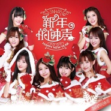

新年的钟声
============================

|  |  |
| :--: | :-- |
| [ 新年的钟声](https://emumo.xiami.com/album/2100247422) | **艺人**: [SNH48](../index.md) **语种**: 国语 **唱片公司**: 丝芭文化 **发行时间**: 2015年12月29日 **专辑类别**: EP, 单曲 **专辑风格**: 国语流行 Mandarin Pop **播放数**: 3689348 **收藏数**: 337 **评论数**: 37  |

## 简介

2015年是SNH48飞速成长的一年，所有的成员们都在这一年收获了很多，有汗水、泪水，也有欢笑和幸运，为了迎接新年的到来，SNH48所有成员为你送上这81人份的祝福，来年我们也一起成长，一起欢笑吧，新年快乐！

## 曲目

## 评论

|  |  |  |  |
| :-- | :-- | :-- | :-- |
|  [虾米用户](https://emumo.xiami.com/u/59276716) 帅气的鹰哥哥 2017-10-30 09:51 赞(0) 踩(0) | 
最近很喜欢的一群少女 这张专普通但叫人开心
 |
|  [虾米用户](https://emumo.xiami.com/u/34251824) 世界的本质在世界之外 2017-10-28 00:41 赞(0) 踩(0) | 
挺好听  但成员个体声音个性的辨识度经过调音后大大削减了
 |
|  [虾米用户](https://emumo.xiami.com/u/295128805) 国良 2017-09-14 00:16 赞(0) 踩(0) | 
...
 |
|  [虾米用户](https://emumo.xiami.com/u/1545424) 我还没想好要写什么... 2016-05-08 17:31 赞(0) 踩(0) | 
加油
 |
|  [虾米用户](https://emumo.xiami.com/u/140282942)  2016-04-15 18:01 赞(0) 踩(0) | 
大奖赛不要输
 |
|  [虾米用户](https://emumo.xiami.com/u/11247875)  2016-02-16 10:51 赞(0) 踩(0) | 
死吧文化。。。对不起笑出声
 |
| ⇒ |  [虾米用户](https://emumo.xiami.com/u/140282942)  2016-04-15 18:02 赞(0) 踩(0) | 
侯诗辰
 |
|  [虾米用户](https://emumo.xiami.com/u/46286141) 皇冠团连续十二年上春晚 2016-01-04 08:13 赞(0) 踩(0) | 
面包和奶油很洗脑很好听，good song
 |
|  [虾米用户](https://emumo.xiami.com/u/22523684)  2016-01-03 12:23 赞(0) 踩(0) | 
green flash歌曲舒缓部分没有问题，rap没有开闭原版部分顺口。生男孩的歌曲曲子没有问题，就是填词……
 |
| ⇒ |  [虾米用户](https://emumo.xiami.com/u/11247875)  2016-02-16 10:51 赞(0) 踩(0) | 
主要是高桥南个人太适合rap了，其次是...曲子是官方的所以没有什么问题不问题的存在吧...毕竟开闭开配信都会有off vocal ver
 |
|  [虾米用户](https://emumo.xiami.com/u/84038482)  2016-01-01 19:31 赞(0) 踩(0) | 
冴十长x
 |
|  [虾米用户](https://emumo.xiami.com/u/95866536) 生命太短，没留时间给遗憾... 2015-12-30 16:06 赞(0) 踩(0) | 
ts2的绿光好听！
 |
| ⇒ |  [虾米用户](https://emumo.xiami.com/u/84038482)  2016-01-01 19:30 赞(0) 踩(0) | 
oi
 |
|  [虾米用户](https://emumo.xiami.com/u/2698850)  2015-12-30 15:55 赞(0) 踩(0) | 
绿光的RAP，DUDU的电音都是以往没有涉及的曲风，让人耳目一新。面包和奶油由相声队N2来演唱总觉得下一秒就不再温柔唱歌而是油腻开搞了╮(￣▽￣&amp;quot;)╭奔跑和给你只能算及格，不过不失。主打新年的钟声若能推广出村，相信各类商场超市能从元旦一直播放到春节后，太应景了。
 |
|  [虾米用户](https://emumo.xiami.com/u/3205771) 就凭我心灵美呀 2015-12-30 00:16 赞(0) 踩(0) | 
封面字体醉了
 |
|  [虾米用户](https://emumo.xiami.com/u/12190677) 手上有活 心里有爱 何惧... 2015-12-29 22:56 赞(0) 踩(0) | 
森马鬼，新年的钟声下架了
 |
|  [虾米用户](https://emumo.xiami.com/u/1602838)  ❤️音乐❤️虾米 2015-12-29 22:29 赞(0) 踩(0) | 
每张专辑都觉得s队的歌好听些[带墨镜笑]
 |
|  [虾米用户](https://emumo.xiami.com/u/34871304) 不见五陵豪杰墓，无花无酒... 2015-12-29 21:45 赞(0) 踩(0) | 
实话实说 都不怎么样
 |
|  [虾米用户](https://emumo.xiami.com/u/54838364)   2015-12-29 19:57 赞(0) 踩(0) | 
希望能分别在歌曲名或者歌词那里标注一下哪一首歌是哪个队唱的和哪一句是谁唱的
 |
| ⇒ |  [虾米用户](https://emumo.xiami.com/u/2698850)  2015-12-30 15:57 赞(0) 踩(0) | 
<a href="http://www.snh48.com/event/s125/" target="_blank" rel="nofollow noreferrer noopener">http://www.snh48.com/event/s125/</a>
 |
| ⇒ |  [虾米用户](https://emumo.xiami.com/u/54838364)   2015-12-30 16:02 赞(0) 踩(0) | 
<q><b>飞行雾说：</b></q>
 |
| ⇒ |  [虾米用户](https://emumo.xiami.com/u/84038482)  2016-01-01 19:30 赞(0) 踩(0) | 
<q><b>ipooo说：</b></q>
 |
|  [虾米用户](https://emumo.xiami.com/u/94977666) 有你:-(IVeo世界中 2015-12-27 12:12 赞(0) 踩(0) | 
祝大家一起快乐
 |
|  [虾米用户](https://emumo.xiami.com/u/16037926) 艾斯兔一生推 2015-12-18 21:20 赞(1) 踩(0) | 
Mark
 |
|  [虾米用户](https://emumo.xiami.com/u/19395142) 不努力就去死 2015-12-18 16:37 赞(8) 踩(0) | 
sae酱毕业快乐
 |
| ⇒ |  [虾米用户](https://emumo.xiami.com/u/140282942)  2016-04-15 18:01 赞(0) 踩(0) | 
贵妃
 |
| ⇒ |  [虾米用户](https://emumo.xiami.com/u/140282942)  2016-04-15 18:02 赞(0) 踩(0) | 
@，
 |
|  [虾米用户](https://emumo.xiami.com/u/74763518)  2015-12-17 20:46 赞(1) 踩(0) | 
32132
 |
|  [虾米用户](https://emumo.xiami.com/u/76475648)  2015-12-17 16:22 赞(1) 踩(0) | 
前排
 |
| ⇒ |  [虾米用户](https://emumo.xiami.com/u/94977666) 有你:-(IVeo世界中 2015-12-27 12:12 赞(0) 踩(0) | 

 |
|  [虾米用户](https://emumo.xiami.com/u/48477039)  2015-12-17 15:28 赞(1) 踩(0) | 
一首非常应景的歌曲，妹子们甜美的歌声伴随着圣诞和新年为我们送来祝福！
 |
|  [虾米用户](https://emumo.xiami.com/u/42451639)  2015-12-16 21:38 赞(1) 踩(0) | 
海哥毕业快乐
 |
|  [虾米用户](https://emumo.xiami.com/u/10258883) 我还没想好要写什么... 2015-12-16 21:32 赞(1) 踩(0) | 
这不又是开闭的歌吗…
 |
|  [虾米用户](https://emumo.xiami.com/u/38918617) 你相信我，我相信你 2015-12-16 16:30 赞(1) 踩(0) | 
新年快乐 欢快的曲调
 |
|  [虾米用户](https://emumo.xiami.com/u/9088938) 随便听听 2015-12-16 14:26 赞(3) 踩(0) | 
可能还是少了一点少女感（有种人工雕砌的感觉，但还是天然的比较吸引），词曲不是很协调，要加油呀(￣^￣)ゞ
 |
| ⇒ |  [虾米用户](https://emumo.xiami.com/u/50895202)  2016-01-21 22:51 赞(0) 踩(0) | 
旋律挺好的-w- 词有点刻意
 |
|  [虾米用户](https://emumo.xiami.com/u/32065994) 暂无签名~ 2015-12-16 12:16 赞(0) 踩(0) | 
我团
 |
|  [虾米用户](https://emumo.xiami.com/u/8704998)  2015-12-16 12:09 赞(0) 踩(0) | 
新歌
 |
|  [虾米用户](https://emumo.xiami.com/u/1686997) 请期待我们的第二张EP。 2015-12-16 12:05 赞(0) 踩(0) | 
哦
 |
