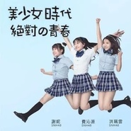

美少女时代
============================

|  |  |
| :--: | :-- |
| [ 美少女时代](https://emumo.xiami.com/album/2100353210) | **艺人**: [SNH48](../index.md) **语种**: 国语 **唱片公司**: 丝芭文化 **发行时间**: 2016年05月31日 **专辑类别**: EP, 单曲 **专辑风格**:  **播放数**: 223890 **收藏数**: 153 **评论数**: 13  |

## 简介

《美少女时代》作为SNH48 零零后小分队的首支单曲公布,由三位成员费沁源、洪佩云、谢妮演唱,同时也是《战斗吧剑灵》的游戏主题曲。

## 曲目

## 评论

|  |  |  |
| :-- | :-- | :-- |
|  [虾米用户](https://emumo.xiami.com/u/18718528) 付出和回报永远成正比。 2016-11-22 20:28 赞(3) 踩(0) | 
不看歌词，基本听不懂他在唱什么？
 |
|  [虾米用户](https://emumo.xiami.com/u/206526539)   2016-08-01 20:01 赞(5) 踩(0) | 
好难听
 |
|  [虾米用户](https://emumo.xiami.com/u/199820805)  2016-07-23 07:10 赞(0) 踩(0) | 

 |
|  [虾米用户](https://emumo.xiami.com/u/199820805)  2016-07-23 07:10 赞(0) 踩(0) | 

 |
|  [虾米用户](https://emumo.xiami.com/u/199820805)  2016-07-23 07:09 赞(0) 踩(0) | 
  
 |
|  [虾米用户](https://emumo.xiami.com/u/199820805)  2016-07-23 07:09 赞(0) 踩(0) | 
没
 |
|  [虾米用户](https://emumo.xiami.com/u/199820805)  2016-07-23 07:09 赞(0) 踩(0) | 
嘛
 |
|  [虾米用户](https://emumo.xiami.com/u/41419100)   苟且的活在犬儒社会 2016-07-19 01:13 赞(0) 踩(0) | 
我的蟹老闆
 |
|  [虾米用户](https://emumo.xiami.com/u/138360018)   2016-07-10 20:55 赞(1) 踩(0) | 
表白珮珮！！
 |
|  [虾米用户](https://emumo.xiami.com/u/163012974) exo m+exo k+... 2016-06-21 19:35 赞(0) 踩(0) | 
在snh48里面能认识这么多人的人，我真是
 |
|  [虾米用户](https://emumo.xiami.com/u/24277715) ハロ！プロが大好き 2016-06-14 17:33 赞(3) 踩(0) | 
三人太萌了，尤其是费心源（双马尾简直萌出血了）。
 |
| ⇒ |  [虾米用户](https://emumo.xiami.com/u/18718528) 付出和回报永远成正比。 2016-11-22 20:28 赞(0) 踩(0) | 
姓费的那个笑的太假了吧
 |
| ⇒ |  [虾米用户](https://emumo.xiami.com/u/163822746)   2017-01-27 12:29 赞(0) 踩(0) | 
<q><b>水瓶哥2012。说：</b></q>
 |
