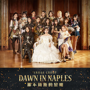

那不勒斯的黎明
============================

|  |  |
| :--: | :-- |
| [ 那不勒斯的黎明](https://emumo.xiami.com/album/2102871085) | **艺人**: [SNH48](../index.md) **语种**: 国语 **唱片公司**: 丝芭集团 **发行时间**: 2017年10月11日 **专辑类别**: EP, 单曲 **专辑风格**: 国语流行 Mandarin Pop, 女子团体 Girl Group **播放数**: 434923 **收藏数**: 168 **评论数**: 29  |

## 简介

《那不勒斯的黎明》是由SNH48 Group第四届偶像年度人气总决选“星光组”TOP16成员演唱，作为本届总决选的首支汇报曲，特别邀请格莱美制作人——Glen Ballard为SNH48量身定做此曲。除了在音乐上尝试了新的风格以外，同时SNH48 Group的成员们也日夜兼程，特地赶往意大利、罗马拍摄本曲的MV。“看似平静的背后，到底有多少秘密，一切的一切，仿佛早已命中注定。血雨腥风即将登场。”

## 曲目

## 评论

|  |  |  |
| :-- | :-- | :-- |
|  [虾米用户](https://emumo.xiami.com/u/426809850)  2019-08-06 17:15 赞(1) 踩(0) | 
这首歌好听真的很好听。
 |
|  [虾米用户](https://emumo.xiami.com/u/306588504)  2019-05-04 12:16 赞(0) 踩(0) | 
小姐姐们的声音太好听了
 |
|  [虾米用户](https://emumo.xiami.com/u/155018564) 一个被夏至的风吹醒了在深... 2018-01-06 17:45 赞(1) 踩(0) | 
这拍的什么呀，一群陪衬。。。。
 |
|  [虾米用户](https://emumo.xiami.com/u/292642330) sm家族粉(中国.张艺兴... 2017-12-10 14:23 赞(1) 踩(0) | 
一群陪衬。
 |
|  [虾米用户](https://emumo.xiami.com/u/290923948) 彼岸花，花开无叶，叶生无... 2017-12-02 21:29 赞(1) 踩(0) | 
小鞠
 |
|  [虾米用户](https://emumo.xiami.com/u/2953127)  2017-10-26 14:49 赞(0) 踩(0) | 
还不如以爱之名好听
 |
|  [虾米用户](https://emumo.xiami.com/u/187710480) 我还没想好要写什么... 2017-10-22 10:12 赞(3) 踩(0) | 
为小鞠打call
 |
|  [虾米用户](https://emumo.xiami.com/u/41663356)  2017-10-20 00:24 赞(1) 踩(0) | 
MV咋还没出？？？？？？？？？
 |
|  [虾米用户](https://emumo.xiami.com/u/41663356)  2017-10-17 19:30 赞(4) 踩(0) | 
这首歌歌词除了频繁掉书袋式的意象堆砌，我实在看不出这首歌的中心思想是什么？感觉像看了郭敬明的书一样，难受
 |
|  [虾米用户](https://emumo.xiami.com/u/41663356)  2017-10-17 10:49 赞(2) 踩(0) | 
这首歌的歌词到底想表达什么？谁能解释一下？
 |
| ⇒ |  [虾米用户](https://emumo.xiami.com/u/332606316)  2017-11-17 19:28 赞(0) 踩(0) | 
我觉得是在写文艺复兴？？？
 |
|  [虾米用户](https://emumo.xiami.com/u/116286342) 爱K-POP 2017-10-15 06:09 赞(1) 踩(0) | 
好听
 |
|  [虾米用户](https://emumo.xiami.com/u/320618489) qq1402606475 2017-10-14 20:07 赞(3) 踩(0) | 
鞠婧祎  
 |
|  [虾米用户](https://emumo.xiami.com/u/298166001)  2017-10-14 14:02 赞(3) 踩(0) | 
鞠婧祎鞠婧祎鞠婧祎
 |
|  [虾米用户](https://emumo.xiami.com/u/211202108) Only Irene 2017-10-13 20:14 赞(4) 踩(0) | 
鞠婧祎！鞠婧祎！我只喜欢鞠婧祎！
 |
|  [虾米用户](https://emumo.xiami.com/u/211202108) Only Irene 2017-10-13 19:44 赞(3) 踩(0) | 
只为鞠婧祎
 |
| ⇒ |  [虾米用户](https://emumo.xiami.com/u/211202108) Only Irene 2017-10-13 19:44 赞(0) 踩(0) | 
四连的约定鞠婧祎
 |
| ⇒ |  [虾米用户](https://emumo.xiami.com/u/41663356)  2017-12-21 20:41 赞(0) 踩(0) | 
怕是不会参加总选了
 |
|  [虾米用户](https://emumo.xiami.com/u/329987152)  2017-10-13 19:39 赞(3) 踩(0) | 
小鞠 
 |
|  [虾米用户](https://emumo.xiami.com/u/17669075) VIP号 2017-10-13 18:04 赞(0) 踩(0) | 
为骑士团打CALL
 |
|  [虾米用户](https://emumo.xiami.com/u/324044387)  2017-10-13 17:16 赞(3) 踩(0) | 
全世界最好的林思意
 |
|  [虾米用户](https://emumo.xiami.com/u/18930145)   2017-10-13 12:14 赞(8) 踩(0) | 
表白李艺彤李斯特公爵大人为你疯狂打call
 |
|  [虾米用户](https://emumo.xiami.com/u/252614733)  2017-10-12 23:29 赞(4) 踩(0) | 
鞠婧祎爱你❤
 |
|  [虾米用户](https://emumo.xiami.com/u/294408166)  2017-10-12 22:18 赞(0) 踩(0) | 
封面最前面女的是谁，第一眼看去我还在想怎么这么矮。。。
 |
| ⇒ |  [虾米用户](https://emumo.xiami.com/u/211202108) Only Irene 2017-10-13 19:45 赞(0) 踩(0) | 
是我们小鞠啦，只是裙子和拍摄角度问题哦
 |
| ⇒ |  [虾米用户](https://emumo.xiami.com/u/294408166)  2017-10-13 21:31 赞(0) 踩(0) | 
<q><b>BeWithBae说：</b></q>
 |
|  [虾米用户](https://emumo.xiami.com/u/225219475) 喜欢 VR ,VR和風 ... 2017-10-12 19:13 赞(0) 踩(0) | 

 |
|  [虾米用户](https://emumo.xiami.com/u/167161302)  2017-10-12 15:18 赞(0) 踩(0) | 
冯薪朵！冯薪朵！冯薪朵！
 |
|  [虾米用户](https://emumo.xiami.com/u/282226915)  2017-10-12 12:26 赞(0) 踩(0) | 
踢踢
 |
