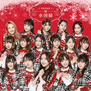

小团圆
============================

|  |  |
| :--: | :-- |
| [ 小团圆](https://emumo.xiami.com/album/2103463342) | **艺人**: [SNH48](../index.md) **语种**: 国语 **唱片公司**: 丝芭集团 **发行时间**: 2017年12月27日 **专辑类别**: EP, 单曲 **专辑风格**: 国语流行 Mandarin Pop **播放数**: 242125 **收藏数**: 50 **评论数**: 8  |

## 简介

作为整张EP的第二主打曲——《小团圆》，是由SNH48成员们通过猜拳大会的方式决出顺位，从而组成官方选拔组来进行歌曲演绎。《小团圆》的曲风整体沿袭SNH48传统的流行摇滚舞曲，青春、动感富有元气。这首歌从成员本身的角度出发，来描述小偶像们心中那大大的新年愿望，以及对梦想实现的渴望。  
“Happy New Year，请听听平凡女孩埋藏已久的心愿”、“离家在外的亲人，回家看看别再等，家中那个少女已长大成人。”《小团圆》这首歌较《甜蜜盛典》来说，是把歌曲的主题范围缩小，从成员内心出发来，来讲述成员们对“新年”的期许。

## 曲目

## 评论

|  |  |  |
| :-- | :-- | :-- |
|  [虾米用户](https://emumo.xiami.com/u/85884388) 人心好静，然欲牵之 2018-01-11 11:01 赞(0) 踩(0) | 
看着你们越来越好 我真的很开心
 |
|  [虾米用户](https://emumo.xiami.com/u/1394088) 世间智障合集 2017-12-29 01:44 赞(1) 踩(0) | 
封面：第一位给出评分的老铁抱拳了！(第一个评分为1星)
 |
|  [虾米用户](https://emumo.xiami.com/u/46286141) 皇冠团连续十二年上春晚 2017-12-28 17:05 赞(0) 踩(0) | 
没有新年的钟声和新年这一刻好听呀！等等，C位是栗子吗？意思就是说拳王终于诞生了，一拳丽娜竟然圈外！我好像知道了什么，还有愿世界都少争吵一点这歌词真是应景，甘菊菊在河内隐藏真深
 |
|  [虾米用户](https://emumo.xiami.com/u/341125399)  2017-12-27 23:19 赞(3) 踩(0) | 
过年超市商场音响曲库该更新了 
 |
|  [虾米用户](https://emumo.xiami.com/u/24323459) 发卡十八线粉丝 2017-12-27 16:21 赞(1) 踩(0) | 
词写得很不错了
 |
|  [虾米用户](https://emumo.xiami.com/u/60092834) 塞纳河黄推 陆推 粤推 ... 2017-12-27 12:19 赞(0) 踩(0) | 
哇！好听
 |
|  [虾米用户](https://emumo.xiami.com/u/1931086) 正义，或许会迟到，但永远... 2017-12-27 12:17 赞(0) 踩(0) | 
完美
 |
|  [虾米用户](https://emumo.xiami.com/u/13981119) Morning Coll... 2017-12-27 10:16 赞(0) 踩(0) | 
好
 |
