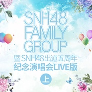

SNH48 FAMILY GROUP 暨 SNH48出道五周年纪念演唱会 (上)
============================

|  |  |
| :--: | :-- |
| [ SNH48 FAMILY GROUP 暨 SNH48出道五周年纪念演唱会 (上)](https://emumo.xiami.com/album/2103526690) | **艺人**: [SNH48](../index.md) **语种**: 国语 **唱片公司**: 永稻星娱乐 **发行时间**: 2018年02月12日 **专辑类别**: 现场专辑 **专辑风格**: 国语流行 Mandarin Pop, 女子团体 Girl Group **播放数**: 24411 **收藏数**: 42 **评论数**: 2  |

## 简介

2月2日晚，SNH48 FAMILY GROUP暨SNH48出道五周年纪念演唱会于上海梅赛德斯奔驰文化中心圆满落幕。二人小组合HO2 和五人小组合BLUE V 阵容现场揭晓，所有小组合候选成员与初代小组合7SENSES 和Color Girls、重庆姐妹团CKG48、时尚矩阵Focus-16的成员联袂献上专属表演。SNH48出道五周年纪念歌曲《我的世界还有你》现场首发，由SNH48五支队伍的所有在籍成员与分团成员代表感动演绎，为SNH48出道五周年系列庆祝活动画上温馨句号。

## 曲目

## 评论

|  |  |  |
| :-- | :-- | :-- |
|  [虾米用户](https://emumo.xiami.com/u/344590208) 试卷是一张微凉的遗书 2018-02-23 13:52 赞(2) 踩(0) | 
为什么有些郭清不了？
 |
|  [虾米用户](https://emumo.xiami.com/u/187545990) 小猪佩廷 2018-02-22 21:18 赞(2) 踩(0) | 
为什么没有！
 |
