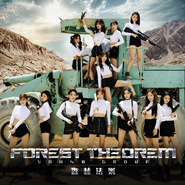

森林法则
============================

|  |  |
| :--: | :-- |
| [ 森林法则](https://emumo.xiami.com/album/2103717021) | **艺人**: [SNH48](../index.md) **语种**: 国语 **唱片公司**: 丝芭集团 **发行时间**: 2018年05月24日 **专辑类别**: EP, 单曲 **专辑风格**: 国语流行 Mandarin Pop, 女子团体 Girl Group **播放数**: 392682 **收藏数**: 111 **评论数**: 8  |

## 简介

《森林法则》是SNH48 GROUP的夏季EP《森林法则》的同名主打歌。整首歌用激昂的节奏，展示了在弱肉强食的命运丛林面前，少女们无畏艰险，希望以勇气主宰自我命运的刚毅与果决。“存在是种资格，命运青睐强者，输赢一线隔。”而这首歌也仿佛是“SNH48 GROUP第五届人气总决选”启动的战歌，鼓舞少女们执着追梦，去冲击自己认定的目标。

## 曲目

## 评论

|  |  |  |
| :-- | :-- | :-- |
|  [虾米用户](https://emumo.xiami.com/u/54838364)   2019-07-08 00:48 赞(0) 踩(0) | 
完美！
 |
|  [虾米用户](https://emumo.xiami.com/u/32934460) 不会挂科，你说对吧。 2018-06-30 22:45 赞(0) 踩(0) | 
《森林法则》编曲采用黑金属风格真的很惊艳!期待塞纳河的原创歌曲越做越好。
 |
|  [虾米用户](https://emumo.xiami.com/u/366474711)  2018-06-03 18:14 赞(0) 踩(0) | 
好听
 |
|  [虾米用户](https://emumo.xiami.com/u/198085977)  2018-05-26 10:19 赞(1) 踩(0) | 
表白双马尾发卡卡太好看啦，也请大家多多支持李艺彤李艺彤真的是个很好的女孩宠饭小天使
 |
|  [虾米用户](https://emumo.xiami.com/u/300340895) 很俗很固执 2018-05-26 08:24 赞(3) 踩(0) | 
希望大家今年能拿到更好的名次和想要的东西。 表白恩兔的大家。
 |
|  [虾米用户](https://emumo.xiami.com/u/17669075) VIP号 2018-05-25 18:35 赞(1) 踩(0) | 
总选的战歌
 |
|  [虾米用户](https://emumo.xiami.com/u/13981119) Morning Coll... 2018-05-24 11:15 赞(1) 踩(0) | 
好听
 |
|  [虾米用户](https://emumo.xiami.com/u/284221143) 我还没想好要写什么... 2018-05-24 10:08 赞(3) 踩(0) | 
前排表白李艺彤！主打很燃！期待MV的双马尾的卡卡～❤❤
 |
