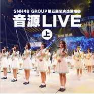

SNH48 Group第五届偶像年度人气总决选演唱会音源Live (上)
============================

|  |  |
| :--: | :-- |
| [ SNH48 Group第五届偶像年度人气总决选演唱会音源Live (上)](https://emumo.xiami.com/album/2103902205) | **艺人**: [SNH48](../index.md) **语种**: 国语 **唱片公司**: 永稻星娱乐 **发行时间**: 2018年08月07日 **专辑类别**: 现场专辑 **专辑风格**: 国语流行 Mandarin Pop, 女子团体 Girl Group **播放数**: 25052 **收藏数**: 47 **评论数**: 4  |

## 简介

“砥砺前行”SNH48 GROUP 第五届偶像年度人气总决选演唱会已圆满落幕，演唱会live音源正式上线。本届演唱会共有来自SNH48（上海）、BEJ48（北京）、GNZ48（广州）、SHY48（沈阳）、CKG48（重庆）五大团体300余名成员共同演绎，呈现了数十首往期金曲，展现了恢弘精致的偶像音乐盛宴。

## 曲目

## 评论

|  |  |  |
| :-- | :-- | :-- |
|  [虾米用户](https://emumo.xiami.com/u/378722337)  2018-08-07 23:45 赞(1) 踩(0) | 
冲鸭 
 |
|  [虾米用户](https://emumo.xiami.com/u/31616387) 浮生面具三千个，谁人与我... 2018-08-07 18:56 赞(3) 踩(0) | 
现场视频看妹子们一起为梦想奋力加油的样子，好燃哦   为塞纳河打call，壮哉我大艾斯兔 
 |
|  [虾米用户](https://emumo.xiami.com/u/48935681) 樓閣新晨花欲語，夢中誰是... 2018-08-07 11:50 赞(3) 踩(0) | 
那天看了現場，今天終於發佈了，鞠婧禕，鞠婧禕，鞠婧禕，嘎嘎(*˘︶˘*).｡.:*♡
 |
|  [虾米用户](https://emumo.xiami.com/u/306608359) 。。。 2018-08-07 11:27 赞(3) 踩(0) | 
沙发
 |
