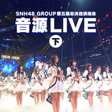

SNH48 Group第五届偶像年度人气总决选演唱会音源Live (下)
============================

|  |  |
| :--: | :-- |
| [ SNH48 Group第五届偶像年度人气总决选演唱会音源Live (下)](https://emumo.xiami.com/album/2103902973) | **艺人**: [SNH48](../index.md) **语种**: 国语 **唱片公司**: 永稻星娱乐 **发行时间**: 2018年08月09日 **专辑类别**: 现场专辑 **专辑风格**: 国语流行 Mandarin Pop, 女子团体 Girl Group **播放数**: 110711 **收藏数**: 69 **评论数**: 1  |

## 简介

“砥砺前行”SNH48 GROUP 第五届偶像年度人气总决选演唱会已圆满落幕，演唱会live音源正式上线。本届演唱会共有来自SNH48（上海）、BEJ48（北京）、GNZ48（广州）、SHY48（沈阳）、CKG48（重庆）五大团体300余名成员共同演绎，呈现了数十首往期金曲，展现了恢弘精致的偶像音乐盛宴。

## 曲目

## 评论

|  |  |  |  |
| :-- | :-- | :-- | :-- |
|  [虾米用户](https://emumo.xiami.com/u/47802571) 此人兴趣非常广泛… 2018-08-08 20:03 赞(1) 踩(0) | 
期待期待 htt 
 |
