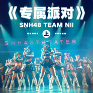

专属派对 (上)
============================

|  |  |
| :--: | :-- |
| [ 专属派对 (上)](https://emumo.xiami.com/album/2103940353) | **艺人**: [SNH48](../index.md) **语种**: 国语 **唱片公司**: 永稻星娱乐 **发行时间**: 2018年08月23日 **专辑类别**: 录音室专辑 **专辑风格**: 国语流行 Mandarin Pop, 女子团体 Girl Group **播放数**: 63428 **收藏数**: 62 **评论数**: 6  |

## 简介

2016年5月，SNH48首套原创公演《心的旅程》一经推出即广受好评。继《心的旅程》公演后，SNH48音乐制作团队又一力作——N队专属公演《专属派对》正式发布。SNH48全新推出"我们一起打造的，才是最好的！"运营理念，将逐步对剧场公演的内容和形式进行创新，展现与时俱进的进取精神，随着原创EP、原创剧场公演、专属定制综艺以及影视作品等一系列原创作品的推出，稳健实在地开拓中国原创道路，愿为"中国创造"奉献我们的青春和汗水！

## 曲目

## 评论

|  |  |  |  |
| :-- | :-- | :-- | :-- |
|  [虾米用户](https://emumo.xiami.com/u/40764533)  2018-09-09 16:54 赞(1) 踩(0) | 
Mb虾米退我钱 
 |
|  [虾米用户](https://emumo.xiami.com/u/31892749) 他很懒，他什么都没写。 2018-08-27 21:31 赞(0) 踩(0) | 
  
 |
|  [虾米用户](https://emumo.xiami.com/u/103850290)  2018-08-26 13:51 赞(1) 踩(0) | 
最好的恩兔
 |
|  [虾米用户](https://emumo.xiami.com/u/379057731)  2018-08-24 21:46 赞(0) 踩(0) | 
why you don't upload the rest of team s2 audio first?
 |
|  [虾米用户](https://emumo.xiami.com/u/16037926) 艾斯兔一生推 2018-08-24 20:30 赞(1) 踩(0) | 
封面是娜娜！QAQ
 |
|  [虾米用户](https://emumo.xiami.com/u/259518098)  2018-08-22 13:14 赞(1) 踩(0) | 
C位 
 |
