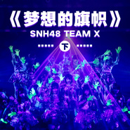

梦想的旗帜 (下)
============================

|  |  |
| :--: | :-- |
| [ 梦想的旗帜 (下)](https://emumo.xiami.com/album/2103968770) | **艺人**: [SNH48](../index.md) **语种**: 国语 **唱片公司**: 永稻星娱乐 **发行时间**: 2018年09月03日 **专辑类别**: EP, 单曲 **专辑风格**: 国语流行 Mandarin Pop, 女子团体 Girl Group **播放数**: 29799 **收藏数**: 37 **评论数**: 4  |

## 简介

继SNH48首场原创公演《心的旅程》、《专属派对》之后，SNH48原创战略新力作——Team X首场原创公演 《梦想的旗帜》将于10月28日接棒闪耀上演！《梦想的旗帜》是SNH48制作团队为Team X量身打造的一套全新原创公演，该套公演以"梦想旗帜"为指引，紧扣"冒险"主题，剧场的灯光舞美布置将切合主题，设计营造出航海寻宝的舞台氛围。用心聆听，《梦想的旗帜》将带给您一种舞台剧般的极致观感体验。

## 曲目

## 评论

|  |  |  |
| :-- | :-- | :-- |
|  [虾米用户](https://emumo.xiami.com/u/259518098)  2018-09-03 13:31 赞(1) 踩(0) | 
御三家 
 |
|  [虾米用户](https://emumo.xiami.com/u/48935681) 樓閣新晨花欲語，夢中誰是... 2018-09-03 12:26 赞(0) 踩(0) | 
不错(*๓&amp;acute;╰╯`๓)♡
 |
|  [虾米用户](https://emumo.xiami.com/u/301395123)   2018-09-03 11:28 赞(1) 踩(0) | 
比咪咕那边慢这么多么
 |
