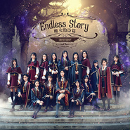

魔女的诗篇
============================

|  |  |
| :--: | :-- |
| [ 魔女的诗篇](https://emumo.xiami.com/album/2104098999) | **艺人**: [SNH48](../index.md) **语种**: 国语 **唱片公司**: 丝芭集团, 永稻星 **发行时间**: 2018年10月12日 **专辑类别**: EP, 单曲 **专辑风格**: 国语流行 Mandarin Pop **播放数**: 113068 **收藏数**: 77 **评论数**: 10  |

## 简介

未来感强烈的魔幻主题，搭配复古优雅的古典音乐，这样的碰撞会产生出怎样的效果？《魔女的诗篇》给出了一个答案。  
当生存的大环境在潜移默化之中变得不再美好，当追求的正义开始变得模糊不清，当心底里的欲望开始变得无穷无尽，那我们生存的意义，究竟又是什么？SNH48 GROUP第五届偶像年度人气总决选TOP16成员，在歌曲构造出的如此环境下，谱写出了一首创意十足的“魔女的诗篇”。

## 曲目

## 评论

|  |  |  |
| :-- | :-- | :-- |
|  [虾米用户](https://emumo.xiami.com/u/312747561)  2019-06-08 19:02 赞(0) 踩(0) | 
好听     
 |
|  [虾米用户](https://emumo.xiami.com/u/5873512) 逆光而舞 迎风而立-《期... 2018-11-04 11:36 赞(0) 踩(0) | 
总选单一年不如一年···
 |
|  [虾米用户](https://emumo.xiami.com/u/29103340)  2018-10-26 12:09 赞(0) 踩(0) | 
这条河还能往哪里流从总选单就略知一二了 士大夫克罗地亚公费旅游可好 
 |
|  [虾米用户](https://emumo.xiami.com/u/31616387) 浮生面具三千个，谁人与我... 2018-10-17 21:06 赞(2) 踩(0) | 
可怜我芮哥唉:-(高飞组第一名。。。所以要进星光组啊  公司太不靠谱！！ 
 |
|  [虾米用户](https://emumo.xiami.com/u/48935681) 樓閣新晨花欲語，夢中誰是... 2018-10-12 21:28 赞(0) 踩(0) | 
我來看看美女 
 |
|  [虾米用户](https://emumo.xiami.com/u/402443303)  2018-10-12 17:10 赞(0) 踩(0) | 
Hooray on new series!
 |
|  [虾米用户](https://emumo.xiami.com/u/345973427) 来自白羊星的你 2018-10-12 14:37 赞(0) 踩(0) | 
不好意思，请原谅我的笑  这里面就叉叉矮
 |
| ⇒ |  [虾米用户](https://emumo.xiami.com/u/327870305)  2018-10-12 16:42 赞(0) 踩(0) | 
有叉叉吗？
 |
| ⇒ |  [虾米用户](https://emumo.xiami.com/u/345973427) 来自白羊星的你 2018-10-12 18:40 赞(0) 踩(0) | 
<q><b>15159392351说：</b></q>
 |
|  [虾米用户](https://emumo.xiami.com/u/345973427) 来自白羊星的你 2018-10-12 14:32 赞(0) 踩(0) | 
废话不多说先给两个赞
 |
