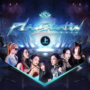

重生计划 (上)
============================

|  |  |
| :--: | :-- |
| [ 重生计划 (上)](https://emumo.xiami.com/album/2104265290) | **艺人**: [SNH48](../index.md) **语种**: 国语 **唱片公司**: 永稻星娱乐 **发行时间**: 2018年11月26日 **专辑类别**: 录音室专辑 **专辑风格**: 国语流行 Mandarin Pop **播放数**: 187447 **收藏数**: 194 **评论数**: 30  |

## 简介

公元2098年，曾经高度发达的人类文明早已化作断壁残垣，整个星球被一片炼狱般的末日景象所笼罩，处于爆炸毁灭的边缘，即使是第48区的守护者们，也无法扭转颓势。为了抓住最后一线生机，守护者们决定穿越虫洞，回到50年前，寻找那个创立第48区的传奇组织，希望能够改变未来……  
  
筹备期长达一年的SNH48 TEAM SII最新原创公演《重生计划》，不仅在剧情上与上一套公演《第48区》进行了衔接，完成了从“废土朋克”到“赛博朋克”的转变，同时创造性的对传统公演格局进行了突破，将SNH48各支队伍的公演全面串联起来，形成了一个世界观庞大而又复杂的“公演宇宙”。《重生计划》作为整个“公演宇宙”系列的重要节点，将彻底颠覆你的想象。 

## 曲目

## 评论

|  |  |  |  |
| :-- | :-- | :-- | :-- |
|  [虾米用户](https://emumo.xiami.com/u/34307126) 没有什么问题是一首歌解决... 2020-10-05 09:52 赞(0) 踩(0) | 
许佳琪未来可期
 |
|  [虾米用户](https://emumo.xiami.com/u/443832664)  2020-09-02 23:43 赞(0) 踩(0) | 
整套重生计划里的歌都太好听了，永远的team s2
 |
|  [虾米用户](https://emumo.xiami.com/u/327709885)  2019-10-15 13:11 赞(0) 踩(0) | 
整体风格非常不错
 |
|  [虾米用户](https://emumo.xiami.com/u/268877228) 我与百合同在 《战姬绝唱... 2019-04-23 12:34 赞(0) 踩(0) | 
hold me tight
 |
|  [虾米用户](https://emumo.xiami.com/u/193767522)   2019-02-20 16:19 赞(0) 踩(0) | 
喜欢
 |
|  [虾米用户](https://emumo.xiami.com/u/416256843)  2019-02-18 13:58 赞(0) 踩(0) | 
好听
 |
|  [虾米用户](https://emumo.xiami.com/u/75926396)  2019-02-13 10:22 赞(0) 踩(0) | 
超级喜欢，很有赶脚
 |
|  [虾米用户](https://emumo.xiami.com/u/17669075) VIP号 2018-12-20 08:50 赞(1) 踩(0) | 
诚挚团结，意志坚定，用汗水浇灌梦想，目标是做好现在的事，We are the best，Team SⅡ！
 |
|  [虾米用户](https://emumo.xiami.com/u/2251590) 気分転換チョウ苦手 2018-11-29 22:55 赞(0) 踩(0) | 
吹爆！！
 |
|  [虾米用户](https://emumo.xiami.com/u/409030423)  2018-11-28 23:33 赞(1) 踩(0) | 
很好听
 |
|  [虾米用户](https://emumo.xiami.com/u/24443452) 我还没想好要写什么... 2018-11-28 21:21 赞(0) 踩(0) | 
吹爆！
 |
|  [虾米用户](https://emumo.xiami.com/u/24443452) 我还没想好要写什么... 2018-11-28 21:21 赞(0) 踩(0) | 
吹爆新公演的歌！
 |
|  [虾米用户](https://emumo.xiami.com/u/193767522)   2018-11-28 11:24 赞(0) 踩(0) | 
这场新公演的每首歌都很好听！什么时候发布（下）！
 |
|  [虾米用户](https://emumo.xiami.com/u/99838096) 南征北战，既胜若否。 2018-11-27 20:20 赞(2) 踩(0) | 
现场看的这场公演首演，效果真的很棒，而且风格也打破了我们的固有印象。突破性很强。
 |
|  [虾米用户](https://emumo.xiami.com/u/401913490)  2018-11-26 23:19 赞(0) 踩(0) | 
快点出鸭╰（‵□′）╯在线等北极贝
 |
|  [虾米用户](https://emumo.xiami.com/u/48935681) 樓閣新晨花欲語，夢中誰是... 2018-11-26 19:43 赞(0) 踩(0) | 
不错
 |
|  [虾米用户](https://emumo.xiami.com/u/16536830) 我还没想好要写什么... 2018-11-26 19:37 赞(2) 踩(0) | 
主观感受是 这场公演上的曲子 耐听系数都挺高的 每一首都很洗脑。
 |
|  [虾米用户](https://emumo.xiami.com/u/354206986) 十年回首，初心不变。 2018-11-26 19:05 赞(0) 踩(0) | 
終於發佈了！！！
 |
|  [虾米用户](https://emumo.xiami.com/u/376313859)  2018-11-26 17:12 赞(0) 踩(0) | 
實名吹爆艾斯兔新公演歌好聽舞好看衣服也好看就是可惜這個mc分組._.
 |
|  [虾米用户](https://emumo.xiami.com/u/42308546) Super Junior... 2018-11-26 16:23 赞(0) 踩(0) | 
Team SII 加油
 |
|  [虾米用户](https://emumo.xiami.com/u/273943907)  2018-11-26 13:10 赞(1) 踩(0) | 
诚挚团结，意志坚定，用汗水浇灌梦想，目标是做好现在的事，We are the best，Team SⅡ！
 |
|  [虾米用户](https://emumo.xiami.com/u/273943907)  2018-11-26 11:18 赞(0) 踩(0) | 
终于来了
 |
|  [虾米用户](https://emumo.xiami.com/u/379345215)  2018-11-26 11:04 赞(1) 踩(0) | 
刚好刷新网页就上传了~
 |
|  [虾米用户](https://emumo.xiami.com/u/99838096) 南征北战，既胜若否。 2018-11-26 10:11 赞(1) 踩(0) | 
燃爆的公演，有幸在现场看了第二场。
 |
|  [虾米用户](https://emumo.xiami.com/u/409213120)  2018-11-26 00:09 赞(0) 踩(0) | 
默默等着晨光 
 |
|  [虾米用户](https://emumo.xiami.com/u/42355016)  2018-11-25 19:41 赞(0) 踩(0) | 
我在这等hold me tight 等几天了都 
 |
|  [虾米用户](https://emumo.xiami.com/u/352129315)  2018-11-24 19:58 赞(0) 踩(0) | 
还不发
 |
|  [虾米用户](https://emumo.xiami.com/u/47763456) 这家伙很聪明什么也没留下... 2018-11-24 18:04 赞(1) 踩(0) | 
快来
 |
|  [虾米用户](https://emumo.xiami.com/u/406580661)  2018-11-24 02:31 赞(0) 踩(0) | 
早点发布
 |
|  [虾米用户](https://emumo.xiami.com/u/73296346) 我想静静 2018-11-23 22:43 赞(0) 踩(0) | 
赶紧发布吧
 |
