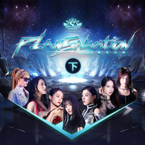

重生计划 (下)
============================

|  |  |
| :--: | :-- |
| [ 重生计划 (下)](https://emumo.xiami.com/album/2104303769) | **艺人**: [SNH48](../index.md) **语种**: 国语 **唱片公司**: 永稻星娱乐 **发行时间**: 2018年12月03日 **专辑类别**: 录音室专辑 **专辑风格**: 国语流行 Mandarin Pop **播放数**: 164747 **收藏数**: 146 **评论数**: 19  |

## 简介

公元2098年，曾经高度发达的人类文明早已化作断壁残垣，整个星球被一片炼狱般的末日景象所笼罩，处于爆炸毁灭的边缘，即使是第48区的守护者们，也无法扭转颓势。为了抓住最后一线生机，守护者们决定穿越虫洞，回到50年前，寻找那个创立第48区的传奇组织，希望能够改变未来……  
  
筹备期长达一年的SNH48 TEAM SII最新原创公演《重生计划》，不仅在剧情上与上一套公演《第48区》进行了衔接，完成了从“废土朋克”到“赛博朋克”的转变，同时创造性的对传统公演格局进行了突破，将SNH48各支队伍的公演全面串联起来，形成了一个世界观庞大而又复杂的“公演宇宙”。《重生计划》作为整个“公演宇宙”系列的重要节点，将彻底颠覆你的想象。 

## 曲目

## 评论

|  |  |  |  |
| :-- | :-- | :-- | :-- |
|  [虾米用户](https://emumo.xiami.com/u/44525884) 到2月5日就要与虾米告别... 2020-12-13 22:14 赞(0) 踩(0) | 
噩梦轮回呢？！！！
 |
|  [虾米用户](https://emumo.xiami.com/u/31616387) 浮生面具三千个，谁人与我... 2020-10-17 18:25 赞(1) 踩(0) | 
最爱的艾斯兔，一期生顶峰再见吧   新艾斯兔，扬帆起航吧！
 |
|  [虾米用户](https://emumo.xiami.com/u/34307126) 没有什么问题是一首歌解决... 2020-10-05 09:53 赞(1) 踩(0) | 
一期生加油。许佳琪未来可期
 |
|  [虾米用户](https://emumo.xiami.com/u/443832664)  2020-09-03 00:13 赞(1) 踩(0) | 
超棒的公演曲 ，永远的team s2
 |
|  [虾米用户](https://emumo.xiami.com/u/92784538) I am what yo... 2020-03-08 17:09 赞(0) 踩(0) | 
没有噩梦轮回
 |
|  [虾米用户](https://emumo.xiami.com/u/407360970)  2019-04-09 20:21 赞(0) 踩(0) | 
孔肖吟！
 |
|  [虾米用户](https://emumo.xiami.com/u/416256843)  2019-03-06 11:07 赞(0) 踩(0) | 
好听
 |
|  [虾米用户](https://emumo.xiami.com/u/327709885)  2019-02-19 23:47 赞(1) 踩(0) | 
依然很棒，这是你们开拓的世界，希望公司不要再辜负她们了，她们都很棒
 |
|  [虾米用户](https://emumo.xiami.com/u/75926396)  2019-02-13 10:23 赞(0) 踩(0) | 
喜欢，加油艾斯兔
 |
|  [虾米用户](https://emumo.xiami.com/u/70533350)  2019-01-19 13:23 赞(0) 踩(0) | 
好好
 |
|  [虾米用户](https://emumo.xiami.com/u/17669075) VIP号 2018-12-20 08:50 赞(0) 踩(0) | 
诚挚团结，意志坚定，用汗水浇灌梦想，目标是做好现在的事，We are the best，Team SⅡ 
 |
|  [虾米用户](https://emumo.xiami.com/u/273943907)  2018-12-03 18:55 赞(3) 踩(0) | 
诚挚团结，意志坚定，用汗水浇灌梦想，目标是做好现在的事，We are the best，Team SⅡ！
 |
|  [虾米用户](https://emumo.xiami.com/u/48935681) 樓閣新晨花欲語，夢中誰是... 2018-12-03 16:32 赞(0) 踩(0) | 
不錯
 |
|  [虾米用户](https://emumo.xiami.com/u/99838096) 南征北战，既胜若否。 2018-12-03 11:11 赞(1) 踩(0) | 
终于等到，也不知明年重组前还能不能再看见一次她们现阵容的公演了。。。
 |
|  [虾米用户](https://emumo.xiami.com/u/281542606)  2018-12-03 09:08 赞(0) 踩(0) | 
期待着呢~ 谢谢
 |
|  [虾米用户](https://emumo.xiami.com/u/369173212)  2018-12-03 01:20 赞(1) 踩(0) | 
12月03日01:19等发布。
 |
|  [虾米用户](https://emumo.xiami.com/u/73296346) 我想静静 2018-12-02 21:10 赞(1) 踩(0) | 
看你什么时候发
 |
|  [虾米用户](https://emumo.xiami.com/u/47763456) 这家伙很聪明什么也没留下... 2018-12-02 13:38 赞(2) 踩(0) | 
快来
 |
|  [虾米用户](https://emumo.xiami.com/u/193767522)   2018-12-01 00:43 赞(0) 踩(0) | 
。
 |
