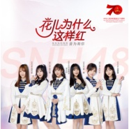

花儿为什么这样红
============================

|  |  |
| :--: | :-- |
| [ 花儿为什么这样红](https://emumo.xiami.com/album/2105240977) | **艺人**: [SNH48](../index.md) **语种**: 国语 **唱片公司**: 永稻星娱乐 **发行时间**: 2019年09月09日 **专辑类别**: EP, 单曲 **专辑风格**:  **播放数**: 1465 **收藏数**: 13 **评论数**: 0  |

## 简介

由国家音乐产业基地主办、无限星空音乐集团承办，联合数十组知名艺人加盟的《我和我的祖国》—“音为有你”献礼新中国成立70周年主题音乐活动火热持续中，内地流行乐女子组合SNH48亦在应邀之列，重新演绎由雷振邦先生改编的《花儿为什么这样红》，共同为祖国生日献礼。  
  
《花儿为什么这样红》用火热的旋律咏叹友谊，歌颂爱情，刻印了英雄主义和浪漫主义的时代内涵，铸就中华民族音乐文化的经典。歌曲背后所蕴含的崇高理想很好的促进了民族团结，也让这首歌成为当时年轻人奉献边疆、勇敢表达爱意的“主题曲”。SNH48的翻唱，用青春的声音将这份爱意巧妙传达，既是对祖国的祝福，也是当下年轻群体的心声表述，献礼中华，全民致敬。 

## 曲目

## 评论

