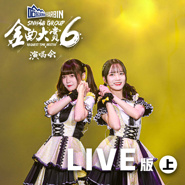

SNH48 GROUP第六届年度金曲大赏演唱会LIVE版 (上)
============================

|  |  |
| :--: | :-- |
| [ SNH48 GROUP第六届年度金曲大赏演唱会LIVE版 (上)](https://emumo.xiami.com/album/2105631146) | **艺人**: [SNH48](../index.md) **语种**: 国语 **唱片公司**: 永稻星娱乐 **发行时间**: 2019年12月27日 **专辑类别**: 现场专辑 **专辑风格**: 国语流行 Mandarin Pop **播放数**: 23466 **收藏数**: 23 **评论数**: 1  |

## 简介

由最受年轻群体喜爱的哈尔滨啤酒冠名赞助呈现，独家战略音乐合作平台及独家互联网直播平台咪咕音乐全程支持的SNH48 GROUP第六届年度金曲大赏BEST50 REQUEST TIME歌曲总决选演唱会在广州体育馆圆满落幕，来自SNH48、BEJ48、GNZ48三团成员共同献唱，为观众们呈现了一场精彩绝伦的音乐视听盛宴。“流萤组”25首入围人气金曲，第一名由方琪和吴羽霏《青涩的香蕉》获得，入围金曲首首动听，惊喜不断上演！ 

## 曲目

## 评论

|  |  |  |
| :-- | :-- | :-- |
|  [虾米用户](https://emumo.xiami.com/u/260167529) 爱音乐的疯子 2019-12-31 11:44 赞(0) 踩(0) | 
现场表演应该赏心悦目 但在这里听 唱上面还是要加强 唱的最好的是《降落伞》
 |
