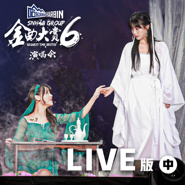

SNH48 GROUP第六届年度金曲大赏演唱会LIVE版 (中)
============================

|  |  |
| :--: | :-- |
| [ SNH48 GROUP第六届年度金曲大赏演唱会LIVE版 (中)](https://emumo.xiami.com/album/2105631298) | **艺人**: [SNH48](../index.md) **语种**: 国语 **唱片公司**: 永稻星娱乐 **发行时间**: 2019年12月28日 **专辑类别**: 现场专辑 **专辑风格**: 国语流行 Mandarin Pop **播放数**: 17671 **收藏数**: 23 **评论数**: 4  |

## 简介

由最受年轻群体喜爱的哈尔滨啤酒冠名赞助呈现，独家战略音乐合作平台及独家互联网直播平台咪咕音乐全程支持的SNH48 GROUP第六届年度金曲大赏BEST50 REQUEST TIME歌曲总决选演唱会在广州体育馆圆满落幕，来自SNH48、BEJ48、GNZ48三团成员共同献唱，为观众们呈现了一场精彩绝伦的音乐视听盛宴。“云舸组”15首入围人气金曲，第一名由钱蓓婷和孔肖吟《不安星》夺得，现场为大家带来不一样的惊喜舞台。 

## 曲目

## 评论

|  |  |  |
| :-- | :-- | :-- |
|  [虾米用户](https://emumo.xiami.com/u/95248584)  2020-01-02 00:07 赞(0) 踩(0) | 

 |
|  [虾米用户](https://emumo.xiami.com/u/95248584)  2020-01-02 00:07 赞(0) 踩(0) | 

 |
|  [虾米用户](https://emumo.xiami.com/u/330652289)  2019-12-29 02:58 赞(0) 踩(0) | 
肖钱 
 |
|  [虾米用户](https://emumo.xiami.com/u/260167529) 爱音乐的疯子 2019-12-28 13:35 赞(0) 踩(0) | 
比之前的现场好多了 主要歌好些
 |
