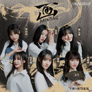

画 (青春有你2)
============================

|  |  |
| :--: | :-- |
| [ 画 (青春有你2)](https://emumo.xiami.com/album/2108198637) | **艺人**: [SNH48](../index.md) **语种**: 国语 **唱片公司**: 丝芭文化 **发行时间**: 2020年03月20日 **专辑类别**: EP, 单曲 **专辑风格**: 国语流行 Mandarin Pop **播放数**: 34415 **收藏数**: 16 **评论数**: 5  |

## 简介

《画》，出自SNH48 TEAM NII在2019年发行的原创公演《时之卷》的原声带专辑。这是一首融合了中国风和R&amp;B元素的舞曲，由韩国知名作曲家MUNA和CLEANUP HITTER共同创作。  
此次，SNH48莫寒、BEJ48段艺璇、SNH48宋昕冉、SNH48孙芮、BEJ48苏杉杉、SNH48费沁源六人出征大型励志综艺《青春有你2》，她们在初舞台表演选择用《画》来呈现中西方元素结合的美学，“我人亦如其画”，古风之中又带有一丝异域之美。另外，编舞也邀请到了著名舞蹈工作室ALIEN舞室，他们为成员和歌曲量身打造了这版独一无二的《画》。

## 曲目

## 评论

|  |  |  |
| :-- | :-- | :-- |
|  [虾米用户](https://emumo.xiami.com/u/442501513) 我还 2020-05-23 19:16 赞(0) 踩(0) | 
力度？感觉没表现出歌所要表达的意境，可能是编排的问题
 |
|  [虾米用户](https://emumo.xiami.com/u/400938902)  2020-03-22 16:19 赞(0) 踩(0) | 
好听 还不错 加油加油
 |
|  [虾米用户](https://emumo.xiami.com/u/9811746)  2020-03-20 20:08 赞(0) 踩(0) | 
啊 加油吧
 |
|  [虾米用户](https://emumo.xiami.com/u/260167529) 爱音乐的疯子 2020-03-20 10:50 赞(0) 踩(0) | 
还行吧 编曲不错
 |
