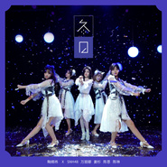

冬日
============================

|  |  |
| :--: | :-- |
| [ 冬日](https://emumo.xiami.com/album/2420411342) | **艺人**: [SNH48](../index.md) **语种**: 国语 **唱片公司**: 丝芭文化 **发行时间**: 2020年03月07日 **专辑类别**: EP, 单曲 **专辑风格**: 国语流行 Mandarin Pop **播放数**: 162089 **收藏数**: 45 **评论数**: 15  |

## 简介

2020年开端，冬日的雪还未消融，万物也在安静等待全新的复苏。愿一切都将拥有美好的开始，鞠婧祎秉承初心回归偶像舞台，与SNH48成员万丽娜、姜杉、陈思、陈琳惊喜合作，共同献唱《冬日》，既是七年来始终不负青春、登上广阔舞台后感慨回首的再次发光，也在鞠婧祎个人前作EP《恋爱告急》销量破14万之际为粉丝听众献上限定福利，在冬日雪景的吟诵里，一起等春来。

## 曲目

## 评论

|  |  |  |
| :-- | :-- | :-- |
|  [虾米用户](https://emumo.xiami.com/u/445258123) 这家伙很聪明什么也没留下... 2020-10-11 07:00 赞(0) 踩(0) | 
很好听
 |
|  [虾米用户](https://emumo.xiami.com/u/441346135)  2020-10-10 19:49 赞(0) 踩(0) | 
小鞠唱歌真好听，不愧是我们的偶像，舞也跳得好(｡･ω･｡)ﾉ♡
 |
|  [虾米用户](https://emumo.xiami.com/u/440950348)  2020-07-25 19:09 赞(0) 踩(0) | 
爱了呀  
 |
|  [虾米用户](https://emumo.xiami.com/u/419901334) 希望是她，最后是她，只能... 2020-04-05 17:41 赞(0) 踩(0) | 
我爱辽
 |
|  [虾米用户](https://emumo.xiami.com/u/405946113)  2020-03-28 13:42 赞(0) 踩(0) | 
好听呀！！！
 |
|  [虾米用户](https://emumo.xiami.com/u/426993325) 我是一个舞蹈爱好者 2020-03-13 19:19 赞(0) 踩(0) | 
特别好听
 |
|  [虾米用户](https://emumo.xiami.com/u/440242479)  2020-03-12 13:57 赞(0) 踩(0) | 
好听。小鞠的歌都好听
 |
|  [虾米用户](https://emumo.xiami.com/u/441125500) 无无无无无无 2020-03-10 10:03 赞(0) 踩(0) | 
很好听，声音美妙动听
 |
|  [虾米用户](https://emumo.xiami.com/u/344746799)  2020-03-09 12:31 赞(0) 踩(0) | 
如果是小鞠個人的歌 更好
 |
|  [虾米用户](https://emumo.xiami.com/u/433032957)  2020-03-08 17:34 赞(0) 踩(0) | 
小鞠的歌都好好听
 |
|  [虾米用户](https://emumo.xiami.com/u/260167529) 爱音乐的疯子 2020-03-08 10:07 赞(0) 踩(0) | 
和独唱不一样的感觉 也不错
 |
|  [虾米用户](https://emumo.xiami.com/u/257561145)  2020-03-07 22:09 赞(0) 踩(0) | 
很好听 加油
 |
|  [虾米用户](https://emumo.xiami.com/u/438168652)  2020-03-07 14:05 赞(1) 踩(0) | 
小鞠人美歌甜，更好的是说到做到❤❤❤❤❤
 |
|  [虾米用户](https://emumo.xiami.com/u/39176959) 免费VIP木有了(〝▼皿... 2020-03-07 14:01 赞(1) 踩(0) | 
回到梦想最初开始的地方，继续唱歌给我们听。鞠婧祎她说到做到   
 |
|  [虾米用户](https://emumo.xiami.com/u/39176959) 免费VIP木有了(〝▼皿... 2020-03-07 14:00 赞(1) 踩(0) | 
人美歌甜鞠婧祎 
 |
