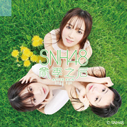

雨季之后After Rain
============================

|  |  |
| :--: | :-- |
| [ 雨季之后After Rain](https://emumo.xiami.com/album/427095873) | **艺人**: [SNH48](../index.md) **语种**: 国语 **唱片公司**: 星四芭音乐 **发行时间**: 2015年03月28日 **专辑类别**: EP, 单曲 **专辑风格**: 女子团体 Girl Group, 流行摇滚 Pop Rock, 国语流行 Mandarin Pop **播放数**: 163362 **收藏数**: 152 **评论数**: 27  |

## 简介

 

《雨季之后》是SNH48的第七张EP，也是SNH48首次以音乐纪录片的形式推出的EP。除了一张CD外，EP里还包含一张DVD。
 

在CD碟中，我们为您灌入了五首好听的歌曲：主打曲《雨季之后》讲述了SNH48成立至今，成员们在经历过挫折、伤痛与离别之后，看见彩虹那一瞬的元气歌曲；第二首《爱情养成日记》表达了爱情是需要经历各种阶段的，就如同像是一种修行，慢慢积累经验才能寻找到爱的真谛；第三首《幸福的压力》是从女生的内心出发，描述了当面对突如其来的幸福时，女生特有的细腻情感；第四首《悬铃木》是一首旋律好听，纪念青春与友谊的热血歌曲；专辑最后收录的是SNH48第一届年度金曲大赏TOP.1歌曲——《狼与自尊》。
 

在DVD碟中，我们精心挑选了SNH48建团两年来的视频资料，进行了剪辑并将其制作成《雨季之后》音乐纪录片分享给大家。这两年来的点滴回忆，值得您永久珍藏！同时，在这张DVD碟中，我们收录了Team HII在拍摄《悬铃木》MV时的花絮，为您真实再现拍摄过程中的细节。最后奉上的是由Team NII龚诗淇与易嘉爱演绎的《狼与自尊》MV。
 

 
 

 
 

 
 

 
 

 
 

 
 

 
 

 
 

## 曲目

## 评论

|  |  |  |
| :-- | :-- | :-- |
|  [虾米用户](https://emumo.xiami.com/u/37115251)  2017-03-17 21:54 赞(0) 踩(0) | 
还有各曲目的伴奏未上传
 |
|  [虾米用户](https://emumo.xiami.com/u/9088938) 随便听听 2015-07-28 02:33 赞(0) 踩(0) | 
作为朵推 竟然差点把莫莫看成二狗（
 |
|  [虾米用户](https://emumo.xiami.com/u/9088938) 随便听听 2015-07-28 02:30 赞(0) 踩(0) | 
上架啦！！上架啦！！又上架啦！！狼自可以听啦！！！我爱十七年！
 |
|  [虾米用户](https://emumo.xiami.com/u/9907362)  2015-05-15 23:43 赞(0) 踩(0) | 
GOOD
 |
|  [虾米用户](https://emumo.xiami.com/u/8133367)  2015-04-23 18:35 赞(0) 踩(0) | 
S！N！H！48！！！！！
 |
|  [虾米用户](https://emumo.xiami.com/u/32092417)  2015-04-11 14:15 赞(0) 踩(0) | 
卧槽，S队的歌听不了了
 |
|  [虾米用户](https://emumo.xiami.com/u/41200525) 真相只有一个。 2015-04-08 13:22 赞(0) 踩(0) | 
下架速度真快 
 |
|  [虾米用户](https://emumo.xiami.com/u/6877004) 本命灵梦酱 2015-04-07 18:53 赞(0) 踩(0) | 
我是N狗
 |
|  [虾米用户](https://emumo.xiami.com/u/7594170) 当时的月亮早已化做了阳光 2015-04-07 13:10 赞(0) 踩(0) | 
怎么下架了卧槽
 |
|  [虾米用户](https://emumo.xiami.com/u/8889689) 暂无签名~ 2015-04-05 18:29 赞(0) 踩(0) | 
狼与自尊不能听啦 不开心
 |
|  [虾米用户](https://emumo.xiami.com/u/38680416)  2015-04-05 15:22 赞(0) 踩(0) | 
爱情养成日记超好听诶~~~~
 |
|  [虾米用户](https://emumo.xiami.com/u/13028574) 捅死那个傻逼流行歌手 2015-04-02 12:34 赞(0) 踩(0) | 

 |
|  [虾米用户](https://emumo.xiami.com/u/12034309) 一直在一起 2015-03-31 22:53 赞(1) 踩(0) | 
幸福的压力好洗脑 喜欢～
 |
| ⇒ |  [虾米用户](https://emumo.xiami.com/u/28188860)  2015-05-08 06:20 赞(0) 踩(0) | 

 |
|  [虾米用户](https://emumo.xiami.com/u/13981119) Morning Coll... 2015-03-31 22:37 赞(0) 踩(0) | 
喜欢喜欢
 |
|  [虾米用户](https://emumo.xiami.com/u/47416574)   2015-03-31 19:44 赞(0) 踩(0) | 
SNH加油，会一直支持你们哦！
 |
|  [虾米用户](https://emumo.xiami.com/u/8702112) 暂无签名~ 2015-03-31 14:35 赞(0) 踩(0) | 
讨厌东方卫视，心疼你们。
 |
|  [虾米用户](https://emumo.xiami.com/u/2128621)  2015-03-31 12:36 赞(0) 踩(0) | 
嗯最喜歡你們了
 |
|  [虾米用户](https://emumo.xiami.com/u/4047138) 一瞬间 2015-03-31 11:04 赞(0) 踩(0) | 
讨厌东方卫视，心疼你们。
 |
|  [虾米用户](https://emumo.xiami.com/u/11202897)  2015-03-31 10:48 赞(0) 踩(0) | 
snh
 |
|  [虾米用户](https://emumo.xiami.com/u/8702112) 暂无签名~ 2015-03-31 10:34 赞(0) 踩(0) | 
snh48加油↖(^ω^)↗
 |
|  [虾米用户](https://emumo.xiami.com/u/48675056)  2015-03-31 09:31 赞(0) 踩(0) | 
snh48加油↖(^ω^)↗
 |
|  [虾米用户](https://emumo.xiami.com/u/8704998)  2015-03-31 08:03 赞(0) 踩(0) | 
.(*♡´◡` 人´◡` ♡*)ﾟ♡
 |
|  [虾米用户](https://emumo.xiami.com/u/48296723)  2015-03-31 07:41 赞(1) 踩(0) | 
不管怎么样都会一直支持你们的！
 |
|  [虾米用户](https://emumo.xiami.com/u/1403392) 落日熔金，暮云合壁 2015-03-31 01:18 赞(1) 踩(0) | 
我塞纳河~~~一年后的今天，相信你们会更红的！
 |
| ⇒ |  [虾米用户](https://emumo.xiami.com/u/138916082) 边伯贤 2016-08-08 14:06 赞(0) 踩(0) | 
现在真的红啦
 |
|  [虾米用户](https://emumo.xiami.com/u/48678984)  2015-03-31 00:01 赞(0) 踩(0) | 
snh
 |
