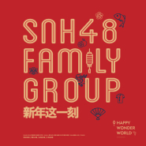

新年这一刻（丝芭家族版）
============================

|  |  |
| :--: | :-- |
| [ 新年这一刻（丝芭家族版）](https://emumo.xiami.com/album/5022254132) | **艺人**: [SNH48](../index.md) **语种**: 国语 **唱片公司**: 永稻星娱乐 **发行时间**: 2020年12月22日 **专辑类别**: EP, 单曲 **专辑风格**: 国语流行 Mandarin Pop **播放数**: 6382 **收藏数**: 15 **评论数**: 4  |

## 简介

2020年，SNH48 GROUP以蓬勃发展的姿态走入大众的视野，突破自我并获得认可，更展现出独属于SNH48 GROUP的实力与魅力。在2021年即将来临之际，SNH48 GROUP新年单曲正式上线。

“A new begining for new year，让我们说一声Happy new year。”

今年由SNH48 FAMILY GROUP组成丝芭家族带来全新的演唱阵容、再度演绎《新年这一刻》。此曲由SNH48明星殿堂艺人鞠婧祎、李艺彤领衔献唱，一期荣誉毕业生、国际小分队7SENESES、以及SNH48、GNZ48、BEJ48、CKG48各支队伍成员共同演唱。愿这首全新演绎的新年单曲，给这一年画上完美句号，和丝芭家族一起迎接全新且充满无限可能的2021年吧！

## 曲目

## 评论

|  |  |  |  |
| :-- | :-- | :-- | :-- |
|  [虾米用户](https://emumo.xiami.com/u/444045791)  2020-12-25 12:44 赞(0) 踩(0) | 
爱崽崽（鞠婧祎）
 |
|  [虾米用户](https://emumo.xiami.com/u/260167529) 爱音乐的疯子 2020-12-23 22:52 赞(0) 踩(0) | 
圣诞气氛
 |
|  [虾米用户](https://emumo.xiami.com/u/128030276) 小眼睛丑小丫 2020-12-23 21:33 赞(0) 踩(0) | 
一如既往的优秀。
 |
|  [虾米用户](https://emumo.xiami.com/u/182001212) 只有音乐才是我的解药/食... 2020-12-22 23:19 赞(0) 踩(0) | 
还好吧
 |
