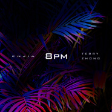

8PM
============================

|  |  |
| :--: | :-- |
| [ 8PM](https://emumo.xiami.com/album/2102817687) | **艺人**: [Terry Zhong 钟天利](../index.md) **语种**: 国语 **唱片公司**: 独立发行 **发行时间**: 2017年08月08日 **专辑类别**: EP, 单曲 **专辑风格**: 电音流行 Electropop **播放数**: 101428 **收藏数**: 7 **评论数**: 5  |

## 简介

和伯克利创作型才女，EnjiA，合作的全新单曲 “8PM”，收录在EnjiA的个人EP——《AM/PM》，8PM的生活，8PM的你，又在哪呢？  

## 曲目

## 评论

|  |  |  |
| :-- | :-- | :-- |
|  [虾米用户](https://emumo.xiami.com/u/257736766) 泛滥成灾 2020-02-17 20:01 赞(0) 踩(0) | 
路灯下的呢喃 让空荡的马路 少了一些倒春寒
 |
|  [虾米用户](https://emumo.xiami.com/u/308966393)  2019-02-26 07:51 赞(0) 踩(0) | 
一入电音，深似海
 |
|  [虾米用户](https://emumo.xiami.com/u/18619292) 我的舒适空间 2018-01-28 20:26 赞(0) 踩(0) | 
好听啊！！！！
 |
|  [虾米用户](https://emumo.xiami.com/u/40044477) closed 2017-09-02 22:55 赞(0) 踩(0) | 
好听der
 |
|  [虾米用户](https://emumo.xiami.com/u/10792732)  2017-09-02 22:32 赞(0) 踩(0) | 
我来了，沙发
 |
