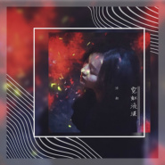

霓虹流波
============================

|  |  |
| :--: | :-- |
| [ 霓虹流波](https://emumo.xiami.com/album/2104948679) | **艺人**: [陈敏](../index.md) **语种**: 国语 **唱片公司**: StreetVoice **发行时间**: 2019年06月17日 **专辑类别**: EP, 单曲 **专辑风格**: 国语流行 Mandarin Pop **播放数**: 2633 **收藏数**: 0 **评论数**: 3  |

## 简介

Urban Pop 慵懒女声唱出都市人的生活底色  
  
Urban People's Life

## 曲目

## 评论

|  |  |  |  |
| :-- | :-- | :-- | :-- |
|  [虾米用户](https://emumo.xiami.com/u/2758083) 我还没想好要写什么... 2020-04-27 07:44 赞(0) 踩(0) | 

 |
|  [虾米用户](https://emumo.xiami.com/u/127885890) 明明就遇到爱 2019-07-06 23:03 赞(0) 踩(0) | 
感觉她红的，加油加油加油加油！
 |
|  [虾米用户](https://emumo.xiami.com/u/2161749)  2019-06-17 22:57 赞(0) 踩(0) | 
顶！
 |
