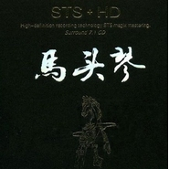

马头琴
============================

|  |  |
| :--: | :-- |
| [ 马头琴](https://emumo.xiami.com/album/1468499249) | **艺人**: [傲日格乐](../index.md) **语种**: 国语 **唱片公司**: 广东音像 **发行时间**: 2010年03月12日 **专辑类别**: 录音室专辑 **专辑风格**:  **播放数**: 466081 **收藏数**: 174 **评论数**: 8  |

## 简介

中国（ASM）德国（STS）美国（HD）联合打造  
开创革命性的STS+HD全方位多维环绕，  
Hi-Fi AUTO SOUND专业碟  
世界首创，最新技术，国际专利，特别授权  
HDSTS Magix Acoustic声学、录音、混音  
专有HDSTS Magix Mastering母带制作STS，  
Magix Vitual Live高临场感CD

## 曲目

## 评论

|  |  |  |  |
| :-- | :-- | :-- | :-- |
|  [虾米用户](https://emumo.xiami.com/u/8337431) 以乐会友 2019-08-31 06:53 赞(1) 踩(0) | 
8
 |
|  [虾米用户](https://emumo.xiami.com/u/356646627)  2018-04-13 14:31 赞(1) 踩(0) | 
我也是一名马头琴学生，向你学习。
 |
|  [虾米用户](https://emumo.xiami.com/u/356646627)  2018-04-13 14:29 赞(1) 踩(0) | 
真的太好听了
 |
|  [虾米用户](https://emumo.xiami.com/u/356646627)  2018-04-13 14:29 赞(1) 踩(0) | 
我喜欢你
 |
|  [虾米用户](https://emumo.xiami.com/u/14059028)  2016-10-04 12:50 赞(0) 踩(0) | 
怎么不能播放了？
 |
|  [虾米用户](https://emumo.xiami.com/u/43286643)  2015-02-12 21:14 赞(1) 踩(0) | 
动听，选曲非常好，赞！
 |
|  [虾米用户](https://emumo.xiami.com/u/1055494)  2014-12-30 20:21 赞(1) 踩(0) | 
喜欢
 |
|  [虾米用户](https://emumo.xiami.com/u/19763652)  2014-04-17 20:31 赞(1) 踩(0) | 
遥远的天边，寂寞凄凉，空旷幽远！
 |
