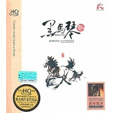

黑马琴
============================

|  |  |
| :--: | :-- |
| [ 黑马琴](https://emumo.xiami.com/album/2100376407) | **艺人**: [傲日格乐](../index.md) **语种**: 国语 **唱片公司**: 怡人唱片 **发行时间**: 2012年03月29日 **专辑类别**: 录音室专辑 **专辑风格**:  **播放数**: 237296 **收藏数**: 54 **评论数**: 5  |

## 简介

ISRC:CN-F18-11-700-00/A.J6  
马头琴演奏家傲日格勒,他凭着丰富的演出经验和新颖的创作思维。  
在当今的的马头琴乐坛形成了自己独特的风格,整张专辑飘散着温馨淳朴的草原气氛.  
中国马头琴协会会员 优秀马头琴演奏家“东方神骏”。

## 曲目

## 评论

|  |  |  |  |
| :-- | :-- | :-- | :-- |
|  [虾米用户](https://emumo.xiami.com/u/8990472) 暂无签名~ 2020-03-05 14:45 赞(0) 踩(0) | 
悠扬动听
 |
|  [虾米用户](https://emumo.xiami.com/u/421952730)  2019-12-19 16:34 赞(0) 踩(0) | 
非常棒的专辑！
 |
|  [虾米用户](https://emumo.xiami.com/u/5877617)  2019-12-18 07:40 赞(0) 踩(0) | 

 |
|  [虾米用户](https://emumo.xiami.com/u/8337431) 以乐会友 2019-08-31 06:56 赞(1) 踩(0) | 
2
 |
|  [虾米用户](https://emumo.xiami.com/u/30800139) 我在低俗与高雅间活的很尴... 2017-12-13 18:22 赞(0) 踩(0) | 
。
 |
