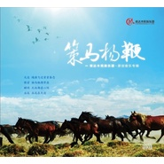

柴达木民族乐团专辑（二）《策马扬鞭》
============================

|  |  |
| :--: | :-- |
| [ 柴达木民族乐团专辑（二）《策马扬鞭》](https://emumo.xiami.com/album/2102693722) | **艺人**: [傲日格乐](../index.md) **语种**: 国语 **唱片公司**: 独立发行 **发行时间**: 2017年02月02日 **专辑类别**: 合集, 杂锦 **专辑风格**: 世界音乐 World Music, 国语流行 Mandarin Pop, 中国民乐 Chinese Folk Music **播放数**: 131664 **收藏数**: 71 **评论数**: 5  |

## 简介

 

《柴达木民族乐团》2014年11月成立于青海省海西州蒙古族藏族自治州德令哈市。三位歌手均来自柴达木盆地的蒙古族牧民家庭，自幼跟随父母及民间艺人学习民族音乐，青少年时期考入音乐专业学院，科学地、系统地接受训练并提高技艺。每位成员除保持传统原生态唱法外，还都具备拉弦乐、弹拨乐和呼麦演唱能力。2015年发行首张专辑《金手镯》并多次参加央视及国内外大型演出活动。他们是德都蒙古民歌传承者，每个成员都在为自己民族音乐的推广发展做着努力，他们的音乐完美地结合了世界音乐与民族音乐，他们的演唱演奏技巧娴熟，充满了大草原赋予他们热情豪放、深邃辽远的演唱风格。
 

## 曲目

## 评论

|  |  |  |  |
| :-- | :-- | :-- | :-- |
|  [虾米用户](https://emumo.xiami.com/u/5877617)  2019-10-31 06:49 赞(0) 踩(0) | 

 |
|  [虾米用户](https://emumo.xiami.com/u/8337431) 以乐会友 2019-08-31 06:52 赞(0) 踩(0) | 
4
 |
|  [虾米用户](https://emumo.xiami.com/u/80313) 我爱虾米 2018-01-22 18:23 赞(0) 踩(0) | 
真好
 |
|  [虾米用户](https://emumo.xiami.com/u/25174040) 冷冷清清风风火火 2018-01-18 08:08 赞(1) 踩(0) | 
这张砖出一版蒙语的该多好。
 |
|  [虾米用户](https://emumo.xiami.com/u/30800139) 我在低俗与高雅间活的很尴... 2017-12-13 17:50 赞(0) 踩(0) | 
.
 |
