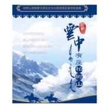

云中有座柏树山
============================

|  |  |
| :--: | :-- |
| [ 云中有座柏树山](https://emumo.xiami.com/album/2103502958) | **艺人**: [傲日格乐](../index.md) **语种**: 国语 **唱片公司**: 中国科学文化音像出版社 **发行时间**: 2014年08月08日 **专辑类别**: 精选集 **专辑风格**: 国语流行 Mandarin Pop, 标准歌曲 Standards, 蒙古 | 呼麦 Throat Singing **播放数**: 18684 **收藏数**: 13 **评论数**: 4  |

## 简介

青海省海西蒙古族藏族自治州
 

《柏树山德都蒙古原生态文化旅游景区宣传歌曲集》

## 曲目

## 评论

|  |  |  |
| :-- | :-- | :-- |
|  [虾米用户](https://emumo.xiami.com/u/5877617)  2019-10-31 07:59 赞(0) 踩(0) | 

 |
|  [虾米用户](https://emumo.xiami.com/u/8337431) 以乐会友 2019-08-31 06:56 赞(0) 踩(0) | 
1
 |
|  [虾米用户](https://emumo.xiami.com/u/320972572) 音声道场，西方莲台。 2018-01-28 10:53 赞(0) 踩(0) | 
好听，声声醉
 |
|  [虾米用户](https://emumo.xiami.com/u/30800139) 我在低俗与高雅间活的很尴... 2018-01-27 23:52 赞(0) 踩(0) | 
刚发就有下架的了
 |
