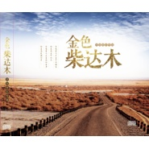

金色柴达木
============================

|  |  |
| :--: | :-- |
| [ 金色柴达木](https://emumo.xiami.com/album/2103502969) | **艺人**: [傲日格乐](../index.md) **语种**: 国语 **唱片公司**: 民族音像出版社 **发行时间**: 2016年12月02日 **专辑类别**: 精选集 **专辑风格**: 国语流行 Mandarin Pop, 标准歌曲 Standards **播放数**: 7488 **收藏数**: 11 **评论数**: 3  |

## 简介

《金色柴达木》——德令哈原创音乐专辑

## 曲目

## 评论

|  |  |  |
| :-- | :-- | :-- |
|  [虾米用户](https://emumo.xiami.com/u/5877617)  2019-10-31 07:59 赞(0) 踩(0) | 

 |
|  [虾米用户](https://emumo.xiami.com/u/8337431) 以乐会友 2019-08-31 06:52 赞(0) 踩(0) | 
2
 |
|  [虾米用户](https://emumo.xiami.com/u/30800139) 我在低俗与高雅间活的很尴... 2018-01-28 00:11 赞(0) 踩(0) | 
。
 |
