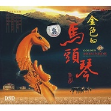

金色的马头琴
============================

|  |  |
| :--: | :-- |
| [ 金色的马头琴](https://emumo.xiami.com/album/419970) | **艺人**: [傲日格乐](../index.md) **语种**: 其他 **唱片公司**: 九洲音像 **发行时间**: 2003年12月01日 **专辑类别**: 录音室专辑 **专辑风格**:  **播放数**: 691870 **收藏数**: 233 **评论数**: 12  |

## 简介

《金色的马头琴》马头琴，蒙语称莫林胡尔，是蒙古族拉弦乐器，因琴杆上端雕有马头而得名。相传在公元十二世纪已在蒙古族中流传。音箱为松木制成，呈梯形，两面蒙以马皮或羊皮，琴杆细长，用榆木或紫檀木制。  
两根弦，用马尾制成。弓弦也是马尾制作，演奏时弓子不夹在两根弦中。马头琴发音低沉，音量较小。定弦与一殷拉弦乐器相反，外弦音低，内弦音高，多为四度定弦。马头琴除了作为独奏乐器外，也是民歌、说唱音乐的伴奏乐器。也可与四胡等合奏。   
演奏方法常用以下两种：一种足用左于指的二、二关节处按弦；一种用指甲从弦下向上顶弦。后一种指法所发音量较前一种大而清亮，声持结实有力。因琴弓和琴身分开，所以可以奏出双音，增加了色彩和表现力。马头琴善于演奏柔和细腻的抒情乐曲，特别适合于演奏悠长辽阔的旋律。在伴奏民歌时，多同三度、四度的颤音来模仿演唱者的一些特点。   
改革后的马头琴，扩大了音箱，改用蟒皮蒙面；弓子改为富于弹性的弓子；用尼龙丝弦代替马尾弦，使音量增大。将定弦提高了四度。这样既保持了马头琴原有的柔和、深厚的音色，又增加了清晰、明亮、有力的特点。  

## 曲目

## 评论

|  |  |  |  |
| :-- | :-- | :-- | :-- |
|  [虾米用户](https://emumo.xiami.com/u/8337431) 以乐会友 2019-08-31 06:53 赞(1) 踩(0) | 
12
 |
|  [虾米用户](https://emumo.xiami.com/u/276944698) 不要自我设限..... 2019-06-17 15:43 赞(3) 踩(0) | 

 |
|  [虾米用户](https://emumo.xiami.com/u/279479389)  2019-04-04 22:22 赞(0) 踩(0) | 
灵动通透，配器精纯。马头琴的又一经典派。希音啊希音……
 |
|  [虾米用户](https://emumo.xiami.com/u/379389422)  2018-09-05 20:37 赞(0) 踩(0) | 
洒脱
 |
|  [虾米用户](https://emumo.xiami.com/u/9080939) 不为无益之事，何遣有涯之... 2018-08-11 09:07 赞(3) 踩(0) | 
 
 |
|  [虾米用户](https://emumo.xiami.com/u/318667853) 这家伙很聪明什么也没留下... 2018-05-22 03:59 赞(1) 踩(0) | 
敖日格乐，蒙古族马头琴青年演奏家，出生于蒙古赤峰市，多次与乐队组合参加中央电视台、香港凤凰卫视及全国各省市电视台节目录制及演出。
 |
|  [虾米用户](https://emumo.xiami.com/u/302830785)  2018-05-06 20:23 赞(2) 踩(0) | 
******
 |
|  [虾米用户](https://emumo.xiami.com/u/30800139) 我在低俗与高雅间活的很尴... 2016-12-12 15:59 赞(1) 踩(0) | 
。
 |
|  [虾米用户](https://emumo.xiami.com/u/9943562) 多数盗版碟在02年发行 2015-08-05 15:39 赞(0) 踩(0) | 
<a href="http://www.amazon.cn/%E9%87%91%E8%89%B2%E7%9A%84%E9%A9%AC%E5%A4%B4%E7%90%B4/dp/B00118OUGA" target="_blank" rel="nofollow noreferrer noopener">http://www.amazon.cn/%E9%87%91%E8%89%B2%E7%9A%84%E9%A9%AC%E5%A4%B4%E7%90%B4/dp/B00118OUGA</a>
 |
| ⇒ |  [虾米用户](https://emumo.xiami.com/u/355865) Let it go, l... 2015-08-05 15:53 赞(0) 踩(0) | 
<a href="http://www.xiami.com/album/402908" target="_blank" rel="nofollow noreferrer noopener">http://www.xiami.com/album/402908</a><a href="http://www.xiami.com/album/404142" target="_blank" rel="nofollow noreferrer noopener">http://www.xiami.com/album/404142</a>跟这张非常相似，已合并。
 |
| ⇒ |  [虾米用户](https://emumo.xiami.com/u/355865) Let it go, l... 2015-08-05 15:56 赞(0) 踩(0) | 
根据网上的很多资料，虽然没见到封底或内页图，不能100%确定，但应该可以归属到：<a href="http://www.xiami.com/artist/1268499232" target="_blank" rel="nofollow noreferrer noopener">http://www.xiami.com/artist/1268499232</a><a href="http://www.renrencd.com/view-112442.html" target="_blank" rel="nofollow noreferrer noopener">http://www.renrencd.com/view-112442.html</a>
 |
|  [虾米用户](https://emumo.xiami.com/u/40105689) 10-157 2014-08-25 01:03 赞(0) 踩(0) | 
棒！金典！更经典！想到了小时候收音机的感觉
 |
