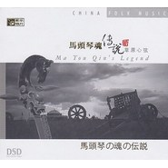

马头琴魂传说Ⅳ·草原心弦
============================

|  |  |
| :--: | :-- |
| [ 马头琴魂传说Ⅳ·草原心弦](https://emumo.xiami.com/album/435326) | **艺人**: [傲日格乐](../index.md) **语种**: 其他 **唱片公司**: 星文文化 **发行时间**: 2011年03月27日 **专辑类别**: 录音室专辑 **专辑风格**: 中国民乐 Chinese Folk Music **播放数**: 351956 **收藏数**: 462 **评论数**: 29  |

## 简介

绍马头琴是蒙古族拉弦乐器，是蒙古族的代表性乐器，不但在中国和世界乐器的家族中占有一席之地，而且也是民间艺人，牧民家中所喜欢的乐器。因琴杆上端雕有马头而得名。马头琴所演奏的乐曲，具有深沉粗犷，激昂的特点，体现了蒙古民族的生产、生活和草原风格。常用于独奏、合奏或为民间歌舞、说唱伴奏，广泛流行于内蒙古、新疆、甘肃、青海、云南以及东北等蒙古族聚居区。

## 曲目

## 评论

|  |  |  |  |
| :-- | :-- | :-- | :-- |
|  [虾米用户](https://emumo.xiami.com/u/401033282)  2020-07-30 16:38 赞(0) 踩(0) | 
悠扬 绵长 刚柔并济 娓娓道来 深情诉说的感觉
 |
|  [虾米用户](https://emumo.xiami.com/u/3529481)  2017-10-27 23:56 赞(0) 踩(0) | 
绍马头琴是蒙古族拉弦乐器，是蒙古族的代表性乐器，不但在中国和世界乐器的家族中占有一席之地，而且也是民间艺人，牧民家中所喜欢的乐器，所以喜欢有关马头琴的曲子。
 |
|  [虾米用户](https://emumo.xiami.com/u/15477722)  2017-07-10 23:07 赞(0) 踩(0) | 
马头琴
 |
|  [虾米用户](https://emumo.xiami.com/u/8337431) 以乐会友 2016-04-26 01:42 赞(1) 踩(0) | 
27
 |
|  [虾米用户](https://emumo.xiami.com/u/33759880) 熠呼百应 2015-03-17 16:50 赞(0) 踩(0) | 
草原、纯粹、刚柔
 |
|  [虾米用户](https://emumo.xiami.com/u/33759880) 熠呼百应 2015-03-17 16:50 赞(0) 踩(0) | 
草原、纯粹、刚柔
 |
|  [虾米用户](https://emumo.xiami.com/u/8481944)  2014-06-29 11:19 赞(0) 踩(0) | 
琴声悠扬，好听。
 |
|  [虾米用户](https://emumo.xiami.com/u/8481944)  2014-06-29 11:18 赞(0) 踩(0) | 
好听到想哭
 |
|  [虾米用户](https://emumo.xiami.com/u/3829496)  2014-04-30 08:48 赞(0) 踩(0) | 
喜欢
 |
|  [虾米用户](https://emumo.xiami.com/u/9484396)  2014-04-09 20:00 赞(1) 踩(0) | 
忧伤的马头琴
 |
|  [虾米用户](https://emumo.xiami.com/u/31218176)  2014-02-19 23:51 赞(0) 踩(0) | 
4
 |
|  [虾米用户](https://emumo.xiami.com/u/8870967)  2013-10-10 11:24 赞(0) 踩(0) | 
太给肺油了！！！
 |
|  [虾米用户](https://emumo.xiami.com/u/9134017)  2013-04-19 22:37 赞(0) 踩(0) | 
好听
 |
|  [虾米用户](https://emumo.xiami.com/u/7867049)  2013-04-03 10:21 赞(0) 踩(0) | 
精品
 |
|  [虾米用户](https://emumo.xiami.com/u/10285772) 丝不如竹，竹不如肉。 2013-01-15 19:17 赞(0) 踩(0) | 
好，喜欢
 |
|  [虾米用户](https://emumo.xiami.com/u/1320125)  2012-12-28 11:57 赞(0) 踩(0) | 
有点忧伤
 |
|  [虾米用户](https://emumo.xiami.com/u/1644466)  2012-10-21 11:14 赞(0) 踩(0) | 
马头琴
 |
|  [虾米用户](https://emumo.xiami.com/u/7625763)  2012-08-31 09:29 赞(0) 踩(0) | 
永远的马头琴
 |
|  [虾米用户](https://emumo.xiami.com/u/6229958) 音乐天下最美的东西 2012-07-12 21:06 赞(0) 踩(0) | 
4
 |
|  [虾米用户](https://emumo.xiami.com/u/7718433)   2012-05-06 14:40 赞(0) 踩(0) | 
好听
 |
|  [虾米用户](https://emumo.xiami.com/u/7887100)  2012-02-10 19:14 赞(0) 踩(0) | 
等我够虾米了再来下555555
 |
|  [虾米用户](https://emumo.xiami.com/u/7887100)  2012-02-10 19:14 赞(0) 踩(0) | 
等我够虾米了再来下555555
 |
|  [虾米用户](https://emumo.xiami.com/u/7597059)  2012-01-18 02:06 赞(0) 踩(0) | 
马头琴4
 |
|  [虾米用户](https://emumo.xiami.com/u/2169740)  2012-01-12 23:56 赞(0) 踩(0) | 
深情
 |
|  [虾米用户](https://emumo.xiami.com/u/1554820)  2011-11-14 13:09 赞(0) 踩(0) | 
有感觉
 |
|  [虾米用户](https://emumo.xiami.com/u/6061268) 青丝柳黛流光舞，玉人如画... 2011-10-08 21:38 赞(0) 踩(0) | 
马头琴。
 |
|  [虾米用户](https://emumo.xiami.com/u/3592590)  2011-05-13 14:54 赞(0) 踩(0) | 
好啊！
 |
|  [虾米用户](https://emumo.xiami.com/u/363069)  2011-04-15 20:34 赞(0) 踩(0) | 
终于等到马头琴魂4了，收下收下~~~~~~~~~~~~
 |
|  [虾米用户](https://emumo.xiami.com/u/844205)  2011-04-11 16:45 赞(0) 踩(0) | 
马头琴魂传说Ⅳ•草原心弦艺人: 包朝克发行: 广东星文文化传播有限公司出版: 广东音像出版社唱片编号: CN-F18-11-341-00/A.J6类型: 民乐雅韵发行日期: 2011-03-27马头琴是蒙古族拉弦乐器，是蒙古族的代表性乐器，不但在中国和世界乐器的家族中占有一席之地，而且也是民间艺人，牧民家中所喜欢的乐器。因琴杆上端雕有马头而得名。马头琴所演奏的乐曲，具有深沉粗犷，激昂的特点，体现了蒙古民族的生产、生活和草原风格。常用于独奏、合奏或为民间歌舞、说唱伴奏，广泛流行于内蒙古、新疆、甘肃、青海、云南以及东北等蒙古族聚居区。
 |
