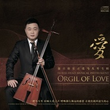
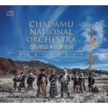
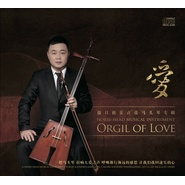

傲日格乐
============================

|  |  |
| :--: | :-- |
| [ 傲日格乐](https://i.xiami.com/aori) | **地区**: China 中国大陆 **风格**: 轻音乐 Easy Listening, 世界音乐 World Music, 音乐剧 Musical theatre, 中国民乐 Chinese Folk Music, 国语流行 Mandarin Pop **播放数**: 1978118 **粉丝数**: 842 **评论数**: 18  |

## 档案

姓名：金峰　 蒙语名：傲日格乐 
民族：蒙古族　 性别：男 
语言：蒙 汉　 专业：马头琴 
生日：10月26日 出生地：内蒙古 
优秀青年马头琴演奏家、音乐人 
黑骏马组合,马头琴手 
中国马头琴学会会员 
潮尔乐团,队长 
呼狼马头琴乐团,队长 
柴达木民族乐团，团长 
柴达木马头琴乐团，团长 
中国东方神骏马头琴乐团，音乐总监 
一个来自大草原的蒙古族男儿,拥有与草原一样广阔的胸怀。习惯用音乐思考,喜爱用马头琴诉说对祖先的崇敬之情。 扎实的基本功让他可以游刃有余的演奏不同风格的作品。 凭着丰富的演出经验和泉水般迸发的创作思维,傲日格乐在当今的民族乐坛树立了自己独特的风格。是集创作与演奏于一体的综合音乐人才。 
出生地：内蒙古赤峰市巴林右旗 
1989年 开始学习马头琴 
1994年 考入赤峰市艺校，马头琴专业 
1996年 内蒙古艺术学院，深造马头琴专业 
1998年 进入中国马头琴学会 
2000年 到北京发展马头琴专业 
2003年 创建黑骏马组合 
2008年 创建呼狼马头琴乐团 
2010年 创建潮尔乐团 
3013年 创办北京浩瀚星空文化传媒有限公司 
2014年 创建柴达木民族乐团 
2015年 创办德令哈傲日格乐文化发展有限公司 
2016年 创建柴达木马头琴乐团 
演出 
2003年创建：《黑骏马组合》 
2004年01月 参加：中央电视台举办的《首届西部民歌大赛》，获得民族改编组金奖， 
2004年03月 参加：贵州电视台“3,15”专题晚会录制， 
2004年04月 参加：内蒙古电视台《草原往事》节目录制， 
2004年12月 参加：广西卫视《唱山歌》节目录制， 
2005年01月 参加：《内蒙古卫视2005春节联欢晚会》， 
2005年02月 参加：《湖南卫视2005春节晚会》， 
2005年04月 参加：中央电视台《十佳楼盘领奖晚会》， 
2005年07月 参加：《内蒙古昭君艺术节》， 
2007年07月 发行：黑骏马首张专辑《勇士》， 
2007年07月 参加：《第二届(北京2008)奥运征歌大型颁奖晚会》， 
2005年07月 参加：《第三届(北京2008)奥林匹克文化节闭幕式》， 
2005年08月 参加：《内蒙古国际草原文化节》， 
2005年08月 参加：中央电视台《同一首歌》走进呼和浩特晚会， 
2005年09月 参加：中央电视台《中秋晚会》，民歌中国《中秋晚会》， 
2005年09月 参加：《我的中国心》纪念反法西斯60周年晚会、“心连心”丹东慰问演出， 
2005年09月 参加：凤凰卫视《太和邀月故宫中秋招待会》， 
2005年09月 参加：广西卫视《唱山歌国庆特辑》， 
2006年01月 参加：《2006文化部春节晚会》， 
2006年01月 参加：内蒙卫视2006春节联欢晚会，《天堂草原大型晚会》， 
2006年07月 参加：《内蒙古昭君艺术节》， 
2006年12月 参加：人民大会堂《2007辉煌中国》新年音乐会， 
2007年02月 参加：中央电视台《2007文化部春节晚会》， 
2007年02月 参加：《内蒙电视台2007春节联欢晚会》， 
2007年03月 参加："两会"少数民族代表,委员茶花会,文艺演出， 
2007年03月 越日本名古屋参加《保护大草原》宣传演出， 
2007年06月 参加：《第十界上海国际电影节》， 
2007年07月 参加：庆祝《中国共产党成立86周年》，北京人民大会堂大型公益演唱会， 
2007年07月 参加：《内蒙古昭君艺术节》， 
2007年08月 参加："同一首歌"走进额尔多斯大型演唱会， 
2007年09月 参加：《2007上海旅游节开幕大狂欢》， 
2007年10月 参加：《南宁国际民歌艺术节开幕式晚会"大地飞歌"》， 
2008年01月 参加：中央领导《新年座谈会》， 
2008年01月 参加：《内蒙电视台2008春节联欢晚会》， 
2008年03月 参加：《中国新春电影音乐会》， 
2008年04月 参加：《博鳌亚洲论坛》2008年年会， 
2008年04月 创建：《呼狼马头琴乐团》， 
2008年05月 参加：《爱在天地间》百名歌手赈灾大行动， 
2008年08月 参加：《内蒙古昭君艺术节》， 
2008年08月 参加：内蒙古国际“草原文化节”， 
2008年10月 参加：《同一首歌》走进阿拉沙胡杨林， 
2008年12月 参加：《内蒙古2009春节联欢晚会》， 
2009年01月 参加：《加拿大2009迎春歌舞晚会》， 
2009年01月 参加：芝加哥地区《2009中国乔联文艺晚会》， 
2009年01月 参加：美国洛杉矶《南加州华人春节晚会》， 
2009年01月 参加：美国好莱坞柯达剧院《五洲同春大型文艺晚会》， 
2009年08月 参加：《内蒙古昭君艺术节》， 
2009年09月 参加：《李杰北京演唱会》， 
2009年12月 参加：《内蒙古2010春节联欢晚会》， 
2010年03月 越日本，东京交流演出， 
2010年04月 创建：《潮尔乐团》 
2010年11月 参加：《广州亚运会》，第十六届亚运会闭幕式， 
2011年03月 参加：正大综艺娱乐节目《墙来了》， 
2011年03月 发行：黑骏马全新专辑《心的力量》， 
2011年04月 举办：“爱的光芒”黑骏马组合全国巡回演唱会， 
2011年04月 荣获：内蒙古青少年基金会《爱心大师》， 
2011年08月 参加：《内蒙古昭君艺术节》， 
2011年10月 越：欧洲四国（俄罗斯，挪威，芬兰，意大利）交流演出， 
2011年12月 参加：《2011嘟琴网音乐颁奖典礼》获得：（十大金曲奖）（最佳组合奖）， 
2012年01月 参加：北京保利剧院：《草原神韵－马头琴与交响乐新年音乐会》， 
2012年01月 参加：《宁夏回族自治区银川2012春节联欢晚会》， 
2012年01月 参加：《辽宁省朝阳2012春节联欢晚会》， 
2014年12月 拍摄电影：《德令哈之夜》， 
2015年02月 赴香港举办：《柴达木民族乐团香港站》专场演出， 
2016年04月 赴美国洛杉机参加：《世界民族电影节》并获得：（最佳电影入围奖）（最佳电影音乐奖）（民族之星奖）， 
2016年12月 赴日本东京参加：首届《成吉思汗民族电影节》并举办柴达木乐团专场演出

## 专辑

| 名称 | 语种 | 唱片公司 | 发行时间 | 专辑类别 | 专辑风格 |
| :--: | :-- | :-- | :-- | :-- | :-- |
| [ 《故乡》柴达木马头琴乐团](./albums/2103502938.md) | 纯音乐 | 中国和平音像电子出版社 | 2017年06月08日 | 精选集 | 器乐流行 Instrumental Pop, 蒙古 | 呼麦 Throat Singing, 中国传统民歌 Chinese Traditional Folk |
| [ 柴达木民族乐团专辑（二）《策马扬鞭》](./albums/2102693722.md) | 国语 | 独立发行 | 2017年02月02日 | 合集, 杂锦 | 世界音乐 World Music, 国语流行 Mandarin Pop, 中国民乐 Chinese Folk Music |
| [ 金色柴达木](./albums/2103502969.md) | 国语 | 民族音像出版社 | 2016年12月02日 | 精选集 | 国语流行 Mandarin Pop, 标准歌曲 Standards |
| [ 浪子的草原](./albums/125029724.md) | 国语 | 酝星文化 | 2015年02月26日 | EP, 单曲 |  |
| [ 柴达木民族乐团专辑金手镯](./albums/2102691981.md) | 其他 | 独立发行 | 2015年02月02日 | 精选集 | 世界音乐 World Music |
| [ 爱](./albums/922415389.md) | 其他 | 星文唱片 | 2014年10月01日 | 录音室专辑 |  |
| [ 云中有座柏树山](./albums/2103502958.md) | 国语 | 中国科学文化音像出版社 | 2014年08月08日 | 精选集 | 国语流行 Mandarin Pop, 标准歌曲 Standards, 蒙古 | 呼麦 Throat Singing |
| [ 黑马琴](./albums/2100376407.md) | 国语 | 怡人唱片 | 2012年03月29日 | 录音室专辑 |  |
| [ 马头琴魂传说Ⅳ·草原心弦](./albums/435326.md) | 其他 | 星文文化 | 2011年03月27日 | 录音室专辑 | 中国民乐 Chinese Folk Music |
| [ 马头琴](./albums/1468499249.md) | 国语 | 广东音像 | 2010年03月12日 | 录音室专辑 |  |
| [ 金色的马头琴](./albums/419970.md) | 其他 | 九洲音像 | 2003年12月01日 | 录音室专辑 |  |
| [ 傲日格乐的专辑](./albums/5022616931.md) | 其他 |  | 不详 |  |  |

## 评论

|  |  |  |
| :-- | :-- | :-- |
|  [虾米用户](https://emumo.xiami.com/u/14747594) 大音希声 2020-03-27 21:44 赞(1) 踩(0) | 
翻开2009年末在陕西绥德支教时买的《中国旅游交通地图册》，有几句描写真美:&amp;ldquo;内蒙古自治区版图如一匹奔驰的骏马，又似一只展翅高飞的苍鹰，而这，也正是蒙古族人民民族精神的写照。其湿润气候区是无垠的草原，干旱气候区则是广袤的沙漠，而大大小小的湖泊，则仿佛一颗颗珍珠，镶嵌期间。&amp;rdquo;
 |
|  [虾米用户](https://emumo.xiami.com/u/14747594) 大音希声 2020-03-27 20:22 赞(1) 踩(0) | 
好棒的音乐，最近爱上马头琴曲了。给你们点赞。
 |
|  [虾米用户](https://emumo.xiami.com/u/400715332) 留白 2020-03-05 00:04 赞(0) 踩(0) | 
——
 |
|  [虾米用户](https://emumo.xiami.com/u/379454972) 听我所喜欢的 百听不厌 2019-09-17 11:04 赞(0) 踩(0) | 
有快乐沙吾尔登音乐吗？我找了好久，没找到！
 |
|  [虾米用户](https://emumo.xiami.com/u/8337431) 以乐会友 2019-08-31 06:23 赞(2) 踩(0) | 
柴达木11
 |
|  [虾米用户](https://emumo.xiami.com/u/276944698) 不要自我设限..... 2019-06-17 15:42 赞(3) 踩(0) | 
⚛️
 |
|  [虾米用户](https://emumo.xiami.com/u/82768502)  2019-01-07 10:46 赞(1) 踩(0) | 
好听 感情饱满
 |
|  [虾米用户](https://emumo.xiami.com/u/1163787) 暂无签名~ 2018-12-21 04:09 赞(2) 踩(0) | 
真好听，真好听
 |
|  [虾米用户](https://emumo.xiami.com/u/34522244)  2018-06-09 07:25 赞(2) 踩(0) | 
  
 |
|  [虾米用户](https://emumo.xiami.com/u/39080801) 虚无缥缈 2016-02-29 01:52 赞(2) 踩(0) | 
好听，声声醉
 |
|  [虾米用户](https://emumo.xiami.com/u/9943562) 多数盗版碟在02年发行 2015-08-05 15:44 赞(2) 踩(0) | 
好像是同一个人，可以合并过来：<a href="http://www.xiami.com/artist/1925029724" target="_blank" rel="nofollow noreferrer noopener">http://www.xiami.com/artist/1925029724</a>
 |
|  [虾米用户](https://emumo.xiami.com/u/21338074)  2015-04-15 23:30 赞(3) 踩(0) | 
琴声悠扬~~~
 |
|  [虾米用户](https://emumo.xiami.com/u/13831197) 乐 生活 2014-12-26 01:31 赞(2) 踩(0) | 
琴声悠扬〜 好美
 |
