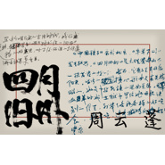

四月旧州
============================

|  |  |
| :--: | :-- |
| [ 四月旧州](https://emumo.xiami.com/album/1796402725) | **艺人**: [周云蓬](../index.md) **语种**: 国语 **唱片公司**: 独立发行 **发行时间**: 2014年04月29日 **专辑类别**: 录音室专辑 **专辑风格**: 自由民谣 Free Folk **播放数**: 1436665 **收藏数**: 2793 **评论数**: 260  |

## 简介

《四月旧州》记
 

   大理三月好风光，蝴蝶泉边好梳妆。按时令算，那是阳历的四月，满城满山的樱花开得又无耻又灿烂。不想总在北京活死人墓的地下室里，抽着烟红着眼，熬夜制作音乐，所以我的新唱片要在大理完成。2013年4月，我跟制作人音乐家小河找到了苍山最后一峰云弄峰下的旧州村。
 

   朋友提供给我们一个大院子，后有养鱼塘，前院草树摇曳。院子里面有座三层小楼，一楼睡觉，二楼喝茶，三楼就是我们的录音棚，该处有个好名字叫“幸福起点线录音棚”。
 

我们不酗酒、不熬夜，每天跟小鸟一同起床，小河先诵经一小时，我在院子里伸胳臂伸腿地晨练，然后吃健康早点，九点开始工作，中午有个简短的小憩，下午两点继续工作，晚饭后去山上散步，顺便总结当日工作得失，晚上十一点前上床休息。我们像退休老干部一样地爱护身体，营造了一个绿色、环保、养生的健康录音氛围。
 

院子里有一名保安，负责我们的安全工作，它叫阿黄，它是一只短腿赶山狗，每做出一首新歌，我们先给它听，征求一下意见。
 

在工作中，小河老师纠正了我很多唱歌的技术问题。例如尾音抖、音准不到位、呼吸不流畅，一首歌有时候要反复唱好几十遍才能达到他的要求。让我感到跟小河一起工作就像跟高手练剑，能耐噌噌地长。
 

大理的音乐同道们经常带上酒来村里探班。本着雁过拔毛的精神，每个人来了都得为新唱片留下一两根羽毛。歌曲《暗香》里有杨一疏影横斜的尺八，《林昭狱中给母亲的信》有欢庆长吁短叹的箫声，野孩子乐队参与了最后狂欢般的露天录音，大家坐在院子里喝酒烤羊肉，小河抱着中阮，张佺是吉他里里，张玮玮当然是忧伤的手风琴了，郭龙手鼓，杨一尺八，欢庆口弦，十八般兵器，各展其能，大家一起反复合唱我的《散场曲》：“找个大排档，一杯一杯到天亮”。露天录音有风声有鸡鸣狗吠，随意性很强，偶有人天相应的刹那，记录下来，那就是难得的宝贝。        
 

在这个唱片业的末法时代，我们感觉到，录制唱片时抓住一闪而逝的好感觉，比事后所谓的高保真混音效果更重要。
 

既然唱片不好卖，既然还要录唱片，那就要在录音中得到真正的快乐，让每一次录音都成为一场闭关修炼。不是掏空心思，而是吸纳储备，像田鼠在冬天储存粮食。经过十天的工作，我们红光满面地完成了新唱片的录制。这是一个降生在大理的孩子，我们给它就地取名，叫做《四月旧州》。
 

《中国孩子》属于北京，《牛羊下山》发于绍兴，《四月旧州》是大理苍山下一株茂盛的植物。然而，它骨子里并非很阳光。唱片的核心歌曲是有关林昭的，她是中华民族的圣女贞德。文革时她在狱中写给母亲诀别的信里，列举了各种各样的好吃食，她要吃，近乎撒娇般向妈妈索求，想象中奢华的美食装点了孤苦伶仃的牺牲。
 

还有一首挽歌属于我的亲人，我父亲2013年8月17日去世，他是一个拥有几十年工龄的沈阳铁西区响当当的工人，车钳铣刨样样精通。他年轻时自己买图纸为家里组装过黑白电视机，为我装过落地式音响，我少年时听到的重低音版本的《流浪者》、《大篷车》插曲都来自于此。很遗憾老爸没有看过我的现场演出。北方的爸爸们是威严的，他无论心里对你多么柔软，但是脸上的那副铁面具是无论如何摘不下来的。他矜持着还没有来得及分享我的荣誉就躺下了，几年辗转病榻，听也听不见，说也说不清。去年在遥远的云南我总梦见他，梦里的他很年轻，三十多岁，板着脸，皱着眉，筋骨强壮，让我心生畏惧，可能他在长久的弥留中还想着我，千山万水地感应过来。想起他年轻时支撑全家的开销，老妈带我四处求医看眼病，每个月收到他从沈阳寄来的汇款和全国粮票，这些好处在后来与他的对峙中都选择性地遗忘了。一朝没了老爸，这下子可掀开房盖了，满眼星月，天风透骨寒，忽然意识到：自己也要老了，跟死亡不再有隔断。新唱片里的《安魂曲》献给他，愿他能往生西方净土。
 

《四月旧州》的视觉设计还是我们的金牌设计师区区500元先生，他建议唱片内页文字不再采用惯常的电脑字体，而是找真人书写，不要那种书法体的漂亮字，要的是那种有人间烟火气的日常书信体。我们很幸运很偶然地找到大理巍山古镇年过八旬的李萌老先生，他平时坐在街边的店铺里代人写对联以及一些简短的家书。老先生屈着眼，一行一行地帮我们认真誊抄，花了整整两天的时间把《四月旧州》的歌词全部写完，并且还用毛笔为唱片题了字“四月旧州”。这回新唱片从头到脚成了一个大理孩子了。
 

《四月旧州》孕于四月，生于四月，怀胎一年。前几天我还催小河：快点完成混音工作，我马上就要巡演了，不能现场没个卖啊。小河答曰：每一首歌完成后都要冷却几天再听再改，不能急啊。他最后承诺清明节一定把孩子好胳臂好腿地抱回来。后面就轮到我了，带着乐队上路，一个城市一个城市地演下去，唱着歌，开始幸福的“卖儿卖女”的新生活。
 

 
 

 
 

                2014年3月29日写于云南大理
 

 
 

 
 

《四月旧州》制作人员：
 

 
 

 
 

录音/监制/部分编曲/混音：小河
 

视觉设计：区区500元先生
 

文字统筹：周云蓬
 

文字校对：尹晓冬   王大方    金灵
 

 
 

感谢：陈升  左小祖咒  欢庆  杨一  野孩子乐队 晓天小梨 大理巍山李萌老先生    郭小寒   乐童音乐  
 

同时感谢：阿黄（晓天的狗） 不无、不有（小河的狗）
 

 
 

录音于云南大理旧州村幸福起点线录音棚
 

 
 

 
 

 

## 曲目

- [暗香](./1796402725/JBdker2134a.md)
- [随心所欲](./1796402725/mQOWQc7f974.md)
- [大磨盘](./1796402725/xL4SbWa127a.md)
- [镜中改编自张枣同名诗歌《镜中》](./1796402725/bqvrFw4396ce.md)
- [安魂曲](./1796402725/xL9VFf22f0c.md)
- [北极光](./1796402725/U5QSgQ2bc2e.md)
- [散场曲](./1796402725/xL9VFia3aa8.md)

## 评论

|  |  |  |  |
| :-- | :-- | :-- | :-- |
|  [虾米用户](https://emumo.xiami.com/u/35899561)   2020-11-20 13:20 赞(0) 踩(0) | 
值得反反复复的听
 |
|  [虾米用户](https://emumo.xiami.com/u/440794371)  2020-07-13 22:49 赞(0) 踩(0) | 
有三首是我最喜欢的，生命的底色平静而开阔
 |
|  [虾米用户](https://emumo.xiami.com/u/134697)  2020-04-04 15:14 赞(0) 踩(0) | 
^_^
 |
|  [虾米用户](https://emumo.xiami.com/u/422663772) 刘尧安 2020-01-31 12:28 赞(0) 踩(0) | 
40岁的我，爱听
 |
|  [虾米用户](https://emumo.xiami.com/u/375056483) 喜欢攒90后的大叔 2019-12-03 07:47 赞(0) 踩(0) | 
好
 |
|  [虾米用户](https://emumo.xiami.com/u/9047731) 失责亏恩 度时虚浮 意志... 2019-09-10 17:14 赞(1) 踩(0) | 
周老师的歌真的可怕。反复听了几年，至了今日再听，终究学会了说那一句：天凉好个秋。
 |
|  [虾米用户](https://emumo.xiami.com/u/29285843) 潜鱼水底传心诀，栖鸟枝头... 2019-03-08 08:52 赞(0) 踩(0) | 

 |
|  [虾米用户](https://emumo.xiami.com/u/6176524) 随遇而安 2019-02-27 13:09 赞(1) 踩(0) | 
有幸当年在麻雀瓦舍亲身经历了周大师的该专辑发布会，并且购得原始版的光碟！
 |
|  [虾米用户](https://emumo.xiami.com/u/378390973)  2018-11-09 19:58 赞(1) 踩(0) | 
四月挽歌沒了
 |
|  [虾米用户](https://emumo.xiami.com/u/9348071) 泛听 2018-11-07 13:11 赞(0) 踩(0) | 
我想知道封面字是谁写的
 |
| ⇒ |  [虾米用户](https://emumo.xiami.com/u/362178) 我还没想好要写什么... 2018-11-23 19:45 赞(0) 踩(0) | 
正好在看书：大理巍山古镇年过八旬的李萌老先生，他平时坐在街边的店铺里代人写对联以及一些简短的家书。老先生屈着眼，一行一行地帮我们认真誊抄，花了整整两天的时间把《四月旧州》的歌词全部写完，并且还用毛笔为唱片题了字——“四月旧州”。
 |
| ⇒ |  [虾米用户](https://emumo.xiami.com/u/362178) 我还没想好要写什么... 2018-11-23 20:12 赞(0) 踩(0) | 
《四月旧州》的视觉设计还是我们的金牌设计师区区500元先生。他建议唱片内页文字不再采用惯常的电脑字体，而是找真人书写，不要那种书法体的漂亮字，要的是那种有人间烟火气的日常书信体。
 |
|  [虾米用户](https://emumo.xiami.com/u/3256844) 恩斯波肯 多姆 2018-10-10 03:21 赞(0) 踩(0) | 
为什么 北极光 没了
 |
|  [虾米用户](https://emumo.xiami.com/u/3950215) 天刚好亮了 2018-09-30 16:46 赞(0) 踩(0) | 
那时候回来杭州听现场，还不知道以后会发生什么
 |
|  [虾米用户](https://emumo.xiami.com/u/4234256)  2018-07-22 19:38 赞(0) 踩(0) | 
老周的专辑还是最喜欢这张
 |
|  [虾米用户](https://emumo.xiami.com/u/4234256)  2018-07-22 15:40 赞(0) 踩(0) | 
在虾米老周的歌挺少的
 |
|  [虾米用户](https://emumo.xiami.com/u/703863)  2018-07-07 18:14 赞(0) 踩(0) | 
看了这张专辑介绍，老周写的真赞！
 |
|  [虾米用户](https://emumo.xiami.com/u/341654823)  2018-01-18 21:27 赞(0) 踩(0) | 
在好几首里面听到了小河的声音 
 |
|  [虾米用户](https://emumo.xiami.com/u/10311689) 我食人间烟火 2017-10-30 10:13 赞(0) 踩(0) | 
喷子的意义是另一种关注的方式也说不好
 |
|  [虾米用户](https://emumo.xiami.com/u/13298058)  2017-10-28 00:07 赞(1) 踩(0) | 
是喜欢张枣的诗的。望着窗外，只要想起一生中后悔的事，梅花便落满了南山。
 |
|  [虾米用户](https://emumo.xiami.com/u/13249534) 人们多么仇恨音乐，才会用... 2017-10-27 23:37 赞(2) 踩(0) | 
阿波罗的金车渐渐驶近，天边升起了嫣红的黎明，高加索的峰岭迎着朝曦，悬崖上，普洛米修士已经苏醒。
 |
|  [虾米用户](https://emumo.xiami.com/u/8248411) 月光晒了很凉快 2017-10-12 12:57 赞(0) 踩(0) | 
张枣的原诗神韵更美。
 |
|  [虾米用户](https://emumo.xiami.com/u/49905125)  2017-10-07 23:19 赞(1) 踩(0) | 
少了 林昭给母亲的信 和 北极光
 |
|  [虾米用户](https://emumo.xiami.com/u/8238638) 我还没想好要写什么... 2017-05-24 16:28 赞(1) 踩(0) | 
少了一首歌！少了一首歌啊
 |
| ⇒ |  [虾米用户](https://emumo.xiami.com/u/50252085) 信可樂也 2017-06-24 11:02 赞(0) 踩(0) | 
是两首啊
 |
| ⇒ |  [虾米用户](https://emumo.xiami.com/u/8238638) 我还没想好要写什么... 2017-06-30 20:52 赞(0) 踩(0) | 
<q><b>戰鬥粒说：</b></q>
 |
|  [虾米用户](https://emumo.xiami.com/u/160902)  2017-03-22 08:34 赞(0) 踩(0) | 
旋律通俗一点让有意义的歌词流传的更广一些不好吗？
 |
|  [虾米用户](https://emumo.xiami.com/u/6555609)  2017-02-08 16:55 赞(0) 踩(0) | 
什么叫耐听？这就是
 |
|  [虾米用户](https://emumo.xiami.com/u/6555609)  2017-02-08 16:55 赞(0) 踩(0) | 
什么叫耐听？这就是
 |
|  [虾米用户](https://emumo.xiami.com/u/6281127) 你我的交错是青空下的礼歌 2016-12-29 20:08 赞(0) 踩(0) | 
没人注意到专辑封面吗？？
 |
|  [虾米用户](https://emumo.xiami.com/u/1891152)  2016-07-26 16:03 赞(0) 踩(0) | 
周云蓬的声音真的舒服，拥有治愈系般神奇的声音，幽默的词曲实在是潇洒，越听越有味道。
 |
|  [虾米用户](https://emumo.xiami.com/u/54597161) 万古长空，一朝风月！ 2016-01-24 08:27 赞(0) 踩(0) | 
急功近利的贵圈，这样精致的音乐和诗歌真的不多了！
 |
|  [虾米用户](https://emumo.xiami.com/u/2166652)  2015-10-22 14:06 赞(2) 踩(0) | 
之前听现场版会更震撼，因为后面插入了林昭狱中写给母亲的信的念白。听完这曲后，后面演奏的歌都听不进去了，一直徘徊在脑海，泪线也崩了
 |
|  [虾米用户](https://emumo.xiami.com/u/12064965) : ) 2015-10-20 16:28 赞(2) 踩(0) | 
呼吸着苍山脚下的空气，老周的音乐有点不一样了
 |
|  [虾米用户](https://emumo.xiami.com/u/3476784)  2015-10-14 18:09 赞(0) 踩(0) | 
非常好
 |
|  [虾米用户](https://emumo.xiami.com/u/4234256)  2015-10-08 15:57 赞(4) 踩(0) | 
看发行时间  林昭狱中给母亲的信  才是这张专辑最主要的一首
 |
|  [虾米用户](https://emumo.xiami.com/u/3476784)  2015-10-01 23:52 赞(4) 踩(0) | 
相比前面几张，这张的风格更开放、元素更多样、编曲也有很多独到之处，虽说标签是贴的民谣，但这张专辑更显现出独立音乐的品格。从每首歌来看，随心所欲、四月挽歌、今夜、散场曲、镜中……都非常耐听，特别是歌词，在这年头能保持水准和以诗为魂的歌词，实际是不多的
 |
|  [虾米用户](https://emumo.xiami.com/u/6617203) 我还没想好要写什么... 2015-10-01 16:11 赞(0) 踩(0) | 
无意听到暗香 挺美
 |
|  [虾米用户](https://emumo.xiami.com/u/703863)  2015-06-11 17:31 赞(0) 踩(0) | 
一直关注的歌手，很有个性，我喜欢！
 |
|  [虾米用户](https://emumo.xiami.com/u/13249534) 人们多么仇恨音乐，才会用... 2015-05-17 09:16 赞(1) 踩(0) | 
灰蓝色的海洋上暮色苍黄，一艘船驶行着穿越波浪，满载着带有镣链的囚犯，去向某个不可知道的地方。囚徒们沉默着凝望天末，深陷的眼睛里闪着火光，破碎的衣衫上沾遍血迹，枯瘠的胸膛上布满鞭伤。
 |
|  [虾米用户](https://emumo.xiami.com/u/18819555)  2015-05-06 05:33 赞(0) 踩(0) | 
喜欢这张专辑，平实而动人。但是唯一的瑕疵就是那个奇怪的比利时法语口音。打个比方就像用东北话念《暗香》一样别耳朵。找个标准巴黎腔很难么。。
 |
| ⇒ |  [虾米用户](https://emumo.xiami.com/u/13228841) 我还没想好要写什么... 2015-05-24 10:10 赞(0) 踩(0) | 
这不是很有趣吗？标准有什么意义？标准和不标准各有什么表达优势？思考清楚再开口讲话。
 |
|  [虾米用户](https://emumo.xiami.com/u/5676) 我还没想好要写什么... 2015-05-05 08:38 赞(1) 踩(0) | 
实体专辑制作精美，令人爱不释手，小河制作。小河最近喜欢加点小众乐器进行编配，比如中阮、尺八，最后一首《散场曲》采用室外录音，大赞。另实体CD最后有一轨2分钟的田野录音这里也没有收录。巡演现场喝嗨打扰了老周和乐队，现在想来还是不安。2014年个人的十佳专辑，建议购买实体CD。
 |
| ⇒ |  [虾米用户](https://emumo.xiami.com/u/13249534) 人们多么仇恨音乐，才会用... 2015-05-17 09:17 赞(0) 踩(0) | 
问个问题 有点忘了 这张有没有妈妈谁也别想找到她？有的话 名字改了？
 |
| ⇒ |  [虾米用户](https://emumo.xiami.com/u/5676) 我还没想好要写什么... 2015-05-18 09:23 赞(0) 踩(0) | 
<q><b>早起看见绿玻璃恶魔就撞墙说：</b></q>
 |
|  [虾米用户](https://emumo.xiami.com/u/430285)  2015-04-23 20:18 赞(1) 踩(0) | 
就是喜欢这种醉兮兮的怪歌
 |
|  [虾米用户](https://emumo.xiami.com/u/38613587)   2015-04-23 15:11 赞(0) 踩(0) | 
诗
 |
|  [虾米用户](https://emumo.xiami.com/u/4462967) ☀️ 2015-04-18 22:48 赞(0) 踩(0) | 
就那样吧，谈不上好不好！
 |
|  [虾米用户](https://emumo.xiami.com/u/5571596) jelifish-lee 2015-04-16 14:38 赞(0) 踩(0) | 
的啊
 |
|  [虾米用户](https://emumo.xiami.com/u/5571596) jelifish-lee 2015-04-16 14:38 赞(1) 踩(0) | 
周还是最好啊的
 |
|  [虾米用户](https://emumo.xiami.com/u/1082671)  2015-04-13 15:13 赞(1) 踩(0) | 
这么有才华的歌手，既然这么多喷的？周的歌比起国内其他民谣的沉闷，孤独、绝望，展现了更多的平静、柔情与超脱，可谓调适而上遂。尤其大爱《镜中》，原诗超棒，旋律绝对配得上。
 |
|  [虾米用户](https://emumo.xiami.com/u/9026935) 路，还是那条路，只是每天... 2015-04-01 03:08 赞(0) 踩(0) | 
这是书法大赛咋地？！在纸上画几个字就能当封面了？那要封里干啥了？！现在搞这种封面象中了邪似的，真把市场当书房了。
 |
| ⇒ |  [虾米用户](https://emumo.xiami.com/u/4105548)  2015-04-25 20:54 赞(0) 踩(0) | 
文人的癖好嘛~再说也没什么不妥嘛……
 |
| ⇒ |  [虾米用户](https://emumo.xiami.com/u/5676) 我还没想好要写什么... 2015-05-05 08:45 赞(0) 踩(0) | 
那是因为您大概从来也不买实体唱片。实体唱片是很少人买了，所以老周花了很大的代价请@區區500元先生设计，并制作出来，然后接受你来喷。
 |
| ⇒ |  [虾米用户](https://emumo.xiami.com/u/9026935) 路，还是那条路，只是每天... 2015-05-05 15:02 赞(0) 踩(0) | 
<q><b>尘与锈说：</b></q>
 |
|  [虾米用户](https://emumo.xiami.com/u/1618810) 毙 2015-03-29 18:20 赞(0) 踩(0) | 
我想求助老周的粉丝们 我喜欢老周的歌 可是男票非说老周的歌都是一个调 我不是音乐专业的 但我知道这观点很愚蠢 可是怎么理据服地回应这种愚蠢的论断？（除了“你听得少耳朵不敏感”以外- -）
 |
| ⇒ |  [虾米用户](https://emumo.xiami.com/u/6854168)  2015-05-04 09:00 赞(0) 踩(0) | 
不用去解释和争论。你喜欢就好了，自己有感触就好了。
 |
| ⇒ |  [虾米用户](https://emumo.xiami.com/u/9071388)  2015-09-17 17:44 赞(0) 踩(0) | 
你男票说的没错，可是不耽误你喜欢啊
 |
| ⇒ |  [虾米用户](https://emumo.xiami.com/u/190256) 我的80年代 2016-03-21 17:26 赞(0) 踩(0) | 
我并不觉的你男票说的有什么不对，萝卜青菜各有所爱。喜爱的菜才能吃出香甜，不喜爱的自然满嘴都是苦涩。重要的是尊重彼此的喜爱而不是改变对方的看法，这种做法本就是一种思想强奸。
 |
| ⇒ |  [虾米用户](https://emumo.xiami.com/u/1618810) 毙 2016-03-22 08:53 赞(0) 踩(0) | 
<q><b>CJ说：</b></q>
 |
| ⇒ |  [虾米用户](https://emumo.xiami.com/u/190256) 我的80年代 2016-03-23 13:03 赞(0) 踩(0) | 
<q><b>核词说：</b></q>
 |
| ⇒ |  [虾米用户](https://emumo.xiami.com/u/1618810) 毙 2016-03-24 08:48 赞(0) 踩(0) | 
<q><b>CJ说：</b></q>
 |
| ⇒ |  [虾米用户](https://emumo.xiami.com/u/190256) 我的80年代 2016-03-24 19:05 赞(0) 踩(0) | 
<q><b>核词说：</b></q>
 |
| ⇒ |  [虾米用户](https://emumo.xiami.com/u/1618810) 毙 2016-03-25 12:30 赞(0) 踩(0) | 
<q><b>CJ说：</b></q>
 |
|  [虾米用户](https://emumo.xiami.com/u/9108216)  2015-03-28 21:17 赞(0) 踩(0) | 
支持！
 |
|  [虾米用户](https://emumo.xiami.com/u/2227725)  2015-03-28 07:22 赞(0) 踩(0) | 
还是那么的美好
 |
|  [虾米用户](https://emumo.xiami.com/u/8662300) 白 2015-03-27 20:15 赞(0) 踩(0) | 
周韵味。
 |
|  [虾米用户](https://emumo.xiami.com/u/40564661) 你丫才是美工 2015-03-27 14:37 赞(0) 踩(0) | 
献花给老周
 |
|  [虾米用户](https://emumo.xiami.com/u/1644333) 传说中的小明 2015-03-27 14:22 赞(1) 踩(0) | 
<a href="http://emumo.xiami.com/u/4275776" target="_blank" rel="nofollow" name_card="4275776">@320K专门店</a> 合格320K
 |
|  [虾米用户](https://emumo.xiami.com/u/1618810) 毙 2015-03-27 09:14 赞(0) 踩(0) | 
万岁
 |
|  [虾米用户](https://emumo.xiami.com/u/356)  2015-03-27 08:05 赞(1) 踩(0) | 
听完了,唱得都是一首歌,叫做 &amp;quot;红萼无言耿相忆&amp;quot;......
 |
|  [虾米用户](https://emumo.xiami.com/u/3221758) 摇啊摇摇到外婆桥 2015-03-26 23:18 赞(1) 踩(0) | 
四月旧州记真是美好极了
 |
|  [虾米用户](https://emumo.xiami.com/u/11968494) . 2015-03-26 20:46 赞(0) 踩(0) | 
和万总关系好吗
 |
|  [虾米用户](https://emumo.xiami.com/u/3449737) ww 2015-03-26 20:36 赞(0) 踩(0) | 
一定是约好的和(￣▽￣)&amp;quot;
 |
|  [虾米用户](https://emumo.xiami.com/u/17286353) 暂无签名~ 2015-03-26 20:30 赞(1) 踩(0) | 
哈哈哈，怎么和万总同一天完整发布了～太好了
 |
|  [虾米用户](https://emumo.xiami.com/u/5143703) 有一个公举号：sisyp... 2015-03-26 20:28 赞(0) 踩(0) | 
今天万晓利和周云蓬同一天发片，你俩约好的吧XD
 |
| ⇒ |  [虾米用户](https://emumo.xiami.com/u/580278)  2015-03-27 15:49 赞(0) 踩(0) | 
这张早出了，只是刚放上来
 |
| ⇒ |  [虾米用户](https://emumo.xiami.com/u/5143703) 有一个公举号：sisyp... 2015-03-27 19:02 赞(0) 踩(0) | 
<q><b>饕餮说：</b></q>
 |
|  [虾米用户](https://emumo.xiami.com/u/13048549) 回应大地的召唤 2015-03-26 20:04 赞(0) 踩(0) | 
最近补了挺多歌啊
 |
|  [虾米用户](https://emumo.xiami.com/u/10692506) 现实挡不住想飞的心发芽 2015-03-26 19:59 赞(0) 踩(0) | 
终于来了
 |
|  [虾米用户](https://emumo.xiami.com/u/23144668) 我需要安靜。我自已和自己... 2015-03-26 19:56 赞(0) 踩(0) | 
终于补全
 |
|  [虾米用户](https://emumo.xiami.com/u/23144668) 我需要安靜。我自已和自己... 2015-03-26 19:55 赞(0) 踩(0) | 
听听心境变样没
 |
|  [虾米用户](https://emumo.xiami.com/u/36147268) 苦路第十四处：耶稣死于我... 2015-03-26 19:40 赞(0) 踩(0) | 
看到楼下说楼下有喷子，我也是醉了
 |
|  [虾米用户](https://emumo.xiami.com/u/13816404) 可爱的人难道不是我吗 2015-03-26 19:29 赞(0) 踩(0) | 
看到下面那么多喷子也是醉了
 |
|  [虾米用户](https://emumo.xiami.com/u/20491889)   2015-03-26 19:28 赞(0) 踩(0) | 
。
 |
|  [虾米用户](https://emumo.xiami.com/u/1331382) 点击编辑 2015-03-22 16:03 赞(0) 踩(0) | 
求补全
 |
|  [虾米用户](https://emumo.xiami.com/u/583406) 乐体贴呗 2015-03-18 11:11 赞(0) 踩(0) | 
江国，正寂寂。叹寄与路遥，夜雪初积。翠尊易泣，红萼无言耿相忆
 |
|  [虾米用户](https://emumo.xiami.com/u/17286353) 暂无签名~ 2015-03-10 12:48 赞(0) 踩(0) | 
什么时候补全歌曲啊……
 |
|  [虾米用户](https://emumo.xiami.com/u/45585901) - 2015-02-02 15:14 赞(0) 踩(0) | 
-
 |
|  [虾米用户](https://emumo.xiami.com/u/39271882)  2014-12-09 17:20 赞(0) 踩(0) | 
可爱的专辑~毛驴毛驴不要哭，家里有个大磨盘，屋里还有半缸米
 |
|  [虾米用户](https://emumo.xiami.com/u/39271882)  2014-12-09 17:18 赞(0) 踩(0) | 
毛驴不让上飞机。。。毛驴毛驴不要哭，家里有个大磨盘，屋里还有半缸米！太可爱了！！！大爱~
 |
|  [虾米用户](https://emumo.xiami.com/u/17694252) 归于真实 2014-12-04 14:51 赞(0) 踩(0) | 
很舒服~老周的四月旧州不过绿油油、软嫩嫩的，带着春天的体息，光影细碎，斑斑驳驳里映着故人的如花笑靥。给这寒冷的冬季带来一丝斜照暖阳
 |
|  [虾米用户](https://emumo.xiami.com/u/43195320) 我还没想好要写什么... 2014-10-31 10:38 赞(0) 踩(0) | 
大爱老周，大爱～四月旧州
 |
|  [虾米用户](https://emumo.xiami.com/u/4157248) 但请不要停止我的音乐 2014-10-12 17:50 赞(0) 踩(0) | 
虾米去买张CD，把四月旧州的歌补全啊
 |
| ⇒ |  [虾米用户](https://emumo.xiami.com/u/10900203)  2015-01-25 23:09 赞(0) 踩(0) | 
对的确是你不懂
 |
|  [虾米用户](https://emumo.xiami.com/u/7804810) 生活，我们可以更美好 2014-10-08 13:38 赞(0) 踩(0) | 
为毛这里都有喷子了
 |
|  [虾米用户](https://emumo.xiami.com/u/5632721)  2014-10-06 17:40 赞(0) 踩(0) | 
民谣
 |
|  [虾米用户](https://emumo.xiami.com/u/38922879)  2014-09-28 22:21 赞(0) 踩(0) | 
旋律不错，好听，如果把男生吟唱的部分去掉，我就下载了。
 |
|  [虾米用户](https://emumo.xiami.com/u/220) 微信公众号：最后的梦田 2014-09-19 13:24 赞(0) 踩(0) | 
暗香也许是听宋代词人姜夔留下来的古曲先入为主了吧，觉得还不够冷
 |
|  [虾米用户](https://emumo.xiami.com/u/3762589) 我还没想好要写什么... 2014-09-05 10:45 赞(0) 踩(0) | 
刚听差点喷了~~但是越听越觉得不错~~
 |
|  [虾米用户](https://emumo.xiami.com/u/40460827) 肮脏的卡纳斯塔把泰菲鸭的... 2014-09-03 14:17 赞(0) 踩(0) | 
瞎子越来越装了，一定是左小的错
 |
| ⇒ |  [虾米用户](https://emumo.xiami.com/u/1631108)  2014-09-03 23:34 赞(0) 踩(0) | 
有道理
 |
|  [虾米用户](https://emumo.xiami.com/u/1461388) 我害怕你们的到来 2014-09-02 16:13 赞(0) 踩(0) | 
抱歉无法欣赏
 |
|  [虾米用户](https://emumo.xiami.com/u/2291765) 无音乐吾宁死。 2014-09-02 14:50 赞(0) 踩(0) | 
点了几首萧亚轩再来听周云蓬，好听到无语。哈哈哈！骑上我的小毛驴，我要去巴黎，有趣。谁不是磨盘边的小毛驴？念词，太有意思！改天练毛笔就拿这首词来练
 |
| ⇒ |  [虾米用户](https://emumo.xiami.com/u/1815734)  2014-11-09 10:18 赞(0) 踩(0) | 
你好
 |
| ⇒ |  [虾米用户](https://emumo.xiami.com/u/32444689) 我还没想好要写什么... 2014-12-23 22:07 赞(0) 踩(0) | 
说的好！练习不错！！！我也效仿
 |
|  [虾米用户](https://emumo.xiami.com/u/31305174)  2014-08-30 02:39 赞(0) 踩(0) | 
少丢人了，这能聽听吗？
 |
| ⇒ |  [虾米用户](https://emumo.xiami.com/u/10900203)  2015-01-25 23:10 赞(0) 踩(0) | 
劝您别在这儿丢自己
 |
|  [虾米用户](https://emumo.xiami.com/u/31305174)  2014-08-30 02:37 赞(0) 踩(0) | 
中国就产这种音樂嗎？晕
 |
| ⇒ |  [虾米用户](https://emumo.xiami.com/u/6320126) 无乐自欣豫 2014-10-05 19:25 赞(0) 踩(0) | 
周不具代表性，有好的，吴吞窦唯子曰王凡...
 |
| ⇒ |  [虾米用户](https://emumo.xiami.com/u/1331382) 点击编辑 2015-03-22 16:02 赞(0) 踩(0) | 
凑撒比
 |
|  [虾米用户](https://emumo.xiami.com/u/8323837)   2014-08-28 15:30 赞(0) 踩(0) | 
周的风格不是我的菜
 |
|  [虾米用户](https://emumo.xiami.com/u/29682762) 网易云：滑滑的_ 2014-08-27 12:35 赞(0) 踩(0) | 
静得下来 好好听
 |
|  [虾米用户](https://emumo.xiami.com/u/1512674) 玩您 2014-08-27 11:59 赞(2) 踩(0) | 
我觉得吧，对一种自己不了解、没听过、不喜欢的风格和东西，说人装逼是特别不好的事情。音乐风格形式万万种，你我没听过、不了解的多了去了。
 |
| ⇒ |  [虾米用户](https://emumo.xiami.com/u/30876076) 我的心胸该始终毫无保留的... 2014-08-27 13:19 赞(0) 踩(0) | 
我也觉得，现在很排斥这个词，虽然以前说着挺爽
 |
|  [虾米用户](https://emumo.xiami.com/u/478527) 好想跟衣服在洗衣机里滚 2014-08-27 11:43 赞(0) 踩(0) | 
已听
 |
|  [虾米用户](https://emumo.xiami.com/u/15846355) 18till i die 2014-08-27 11:37 赞(0) 踩(0) | 
一声叹息，这逼格我不懂！
 |
|  [虾米用户](https://emumo.xiami.com/u/29080200)  2014-08-27 10:07 赞(0) 踩(0) | 
这么高的逼格欣赏不来。
 |
|  [虾米用户](https://emumo.xiami.com/u/3092111) 走走停停 2014-08-27 08:06 赞(0) 踩(0) | 
配乐诗朗诵。
 |
|  [虾米用户](https://emumo.xiami.com/u/10435106) 听靓歌 2014-08-27 01:46 赞(0) 踩(0) | 
不错。
 |
|  [虾米用户](https://emumo.xiami.com/u/6112982)  2014-08-27 00:51 赞(0) 踩(0) | 
服服服服服服服服服服
 |
|  [虾米用户](https://emumo.xiami.com/u/874501) 心系鎏金，从未离开。 2014-08-27 00:39 赞(0) 踩(0) | 
经常觉得，这也算歌吗。，装逼集大成。
 |
|  [虾米用户](https://emumo.xiami.com/u/4398187)  2014-08-26 21:48 赞(0) 踩(0) | 
既然要传上来，为什么一首一首地憋，为啥不一下子整张专辑传上来
 |
| ⇒ |  [虾米用户](https://emumo.xiami.com/u/4145927) 我还没想好要写什么... 2014-09-11 22:30 赞(0) 踩(0) | 
那是人家的自由
 |
|  [虾米用户](https://emumo.xiami.com/u/5806141)  2014-08-26 19:19 赞(0) 踩(0) | 
呵呵~好难听
 |
|  [虾米用户](https://emumo.xiami.com/u/1515590) 我还没想好要写什么... 2014-08-26 17:12 赞(0) 踩(0) | 
周云蓬《四月旧州》秋收行即将启程。北京（9.5 麻雀瓦舍）、石家庄（9.7 红糖俱乐部）、成都（9.12 MINI LiveHouse）、重庆（9.13 坚果 LiveHouse）、武汉（9.20 VOX）。预售：<a href="http://www.musikid.com/tour/32" target="_blank" rel="nofollow noreferrer noopener">http://www.musikid.com/tour/32</a>
 |
| ⇒ |  [虾米用户](https://emumo.xiami.com/u/48685739)  2015-03-31 04:28 赞(0) 踩(0) | 
好听，就是听不懂。
 |
|  [虾米用户](https://emumo.xiami.com/u/8244559)  2014-08-26 16:25 赞(1) 踩(0) | 
******
 |
|  [虾米用户](https://emumo.xiami.com/u/779540)  2014-08-22 20:18 赞(0) 踩(0) | 
封面有点像寂地的画风诶
 |
|  [虾米用户](https://emumo.xiami.com/u/37674738) 逐风之人必然拥抱虚无 2014-08-12 09:54 赞(0) 踩(0) | 
惊艳。听到镜中，又被惊艳了。超级喜欢，磨米磨面磨豆腐，谁又想去巴黎。童谣的感觉
 |
|  [虾米用户](https://emumo.xiami.com/u/15946839) 暂无签名~ 2014-08-11 11:14 赞(0) 踩(0) | 
太可爱了
 |
|  [虾米用户](https://emumo.xiami.com/u/525562) 青山青水青少年 2014-06-05 12:37 赞(2) 踩(0) | 
就是翔
 |
|  [虾米用户](https://emumo.xiami.com/u/6590993) 新浪微博@草一样 2014-05-28 21:53 赞(0) 踩(0) | 
你我都是一隻小毛驢，被蒙上眼睛整天圍著一個大磨盤轉……
 |
|  [虾米用户](https://emumo.xiami.com/u/3749362)  2014-05-12 09:14 赞(0) 踩(0) | 
还不错啊，期待的欢庆，这位才是真正的大师周云蓬的音乐阵容太强大了
 |
|  [虾米用户](https://emumo.xiami.com/u/36090015)  2014-05-01 19:08 赞(0) 踩(0) | 
熏陶成性
 |
|  [虾米用户](https://emumo.xiami.com/u/2803524)   2014-04-30 18:11 赞(0) 踩(0) | 
镜中歌词很有诗意，
 |
| ⇒ |  [虾米用户](https://emumo.xiami.com/u/1143143) 暂无签名~ 2014-05-06 08:04 赞(0) 踩(0) | 
诗人张枣同名诗改编
 |
| ⇒ |  [虾米用户](https://emumo.xiami.com/u/1143143) 暂无签名~ 2014-05-06 08:05 赞(0) 踩(0) | 
可再看看张枣《楚王梦雨》
 |
| ⇒ |  [虾米用户](https://emumo.xiami.com/u/39042168) 暂无签名~ 2014-07-16 11:33 赞(0) 踩(0) | 
<q><b>月明天中说：</b></q>
 |
|  [虾米用户](https://emumo.xiami.com/u/2803524)   2014-04-30 18:08 赞(0) 踩(0) | 
可以给小孩子当童谣听也不错
 |
|  [虾米用户](https://emumo.xiami.com/u/10011013)  2014-04-30 15:26 赞(0) 踩(0) | 
童谣加上人生感悟，一切都是似曾相识
 |
|  [虾米用户](https://emumo.xiami.com/u/2455114)  2014-04-30 15:12 赞(0) 踩(0) | 
这首《镜中》更像周云蓬，而不像张枣。歌比起诗浅显易懂些，也多了些许温情，满满的怀念，但也仅限于爱情。但第一次读《镜中》的时候，却有一下子被击中的感觉，不了解写作背景，甚至不知道张枣其人，但读到第一句的时候超级惊艳啊！从此没有任何一句对后悔的形容比得上这句：只要想起一生中后悔的事/梅花便落了下来
 |
|  [虾米用户](https://emumo.xiami.com/u/35346017)  2014-04-28 10:22 赞(0) 踩(0) | 
听着挺欣慰的
 |
|  [虾米用户](https://emumo.xiami.com/u/4911910) 优美的低于生活 2014-04-26 15:47 赞(0) 踩(0) | 
大磨盘以前不是收录在《金色推土机》里面么。
 |
| ⇒ |  [虾米用户](https://emumo.xiami.com/u/8227665)  2014-08-05 04:33 赞(0) 踩(0) | 
是的
 |
|  [虾米用户](https://emumo.xiami.com/u/1286980)  2014-04-19 18:29 赞(0) 踩(0) | 
是不是有二胡在唱
 |
|  [虾米用户](https://emumo.xiami.com/u/111609)  2014-04-19 18:28 赞(0) 踩(0) | 
怎么会有这么难听的歌啊。。。。。。。。。。。
 |
|  [虾米用户](https://emumo.xiami.com/u/25639638)  2014-04-18 13:53 赞(0) 踩(0) | 
喜欢大磨盘的前奏
 |
|  [虾米用户](https://emumo.xiami.com/u/434900)  2014-04-17 20:37 赞(1) 踩(0) | 
怎么会有这么难听的歌，OMG。
 |
|  [虾米用户](https://emumo.xiami.com/u/22407720) 你的声音述说一个你的过去 2014-04-17 19:42 赞(0) 踩(0) | 
好有趣啊哈哈哈。
 |
|  [虾米用户](https://emumo.xiami.com/u/1071832) 我还没想好要写什么... 2014-04-17 18:51 赞(0) 踩(0) | 
㊣
 |
|  [虾米用户](https://emumo.xiami.com/u/5473721) - 2014-04-17 13:45 赞(0) 踩(0) | 
一眼就看到寂地的画啦 :D
 |
|  [虾米用户](https://emumo.xiami.com/u/1264561)  2014-04-17 13:06 赞(0) 踩(0) | 
...混搭的大磨盘
 |
|  [虾米用户](https://emumo.xiami.com/u/2119676) 爱国摇，爱90年代 2014-04-17 09:28 赞(0) 踩(0) | 
惊艳，那首镜中很棒
 |
|  [虾米用户](https://emumo.xiami.com/u/6336735) We are one i... 2014-04-17 05:18 赞(0) 踩(0) | 
喜欢镜中
 |
|  [虾米用户](https://emumo.xiami.com/u/35232129)  2014-04-17 02:19 赞(0) 踩(0) | 
四月旧州么不是？
 |
|  [虾米用户](https://emumo.xiami.com/u/4752979) 梦想还是要有的 万一实现... 2014-04-16 22:42 赞(0) 踩(0) | 
小毛驴诶哎哟喂！
 |
|  [虾米用户](https://emumo.xiami.com/u/3456059)  2014-04-16 21:23 赞(0) 踩(0) | 
赞封面
 |
|  [虾米用户](https://emumo.xiami.com/u/6150978) 音乐无国界 音乐无分别 2014-04-16 18:36 赞(0) 踩(0) | 
喜欢这首  音乐元素依然独到
 |
|  [虾米用户](https://emumo.xiami.com/u/220438)   2014-04-16 14:40 赞(0) 踩(0) | 
《镜中》改编没有想象中那么好。
 |
|  [虾米用户](https://emumo.xiami.com/u/15983817)  2014-04-16 14:13 赞(0) 踩(0) | 
喜欢
 |
|  [虾米用户](https://emumo.xiami.com/u/2857420) 昨天晚上我梦见你 2014-04-15 11:01 赞(0) 踩(0) | 
寂地的画儿么？
 |
|  [虾米用户](https://emumo.xiami.com/u/10246599) 你猜••• 2014-04-14 21:04 赞(0) 踩(0) | 
哈哈
 |
|  [虾米用户](https://emumo.xiami.com/u/8244559)  2014-04-14 16:44 赞(0) 踩(0) | 
******
 |
|  [虾米用户](https://emumo.xiami.com/u/9405335)  2014-04-14 15:30 赞(0) 踩(0) | 
封面美呆了，32个赞~
 |
|  [虾米用户](https://emumo.xiami.com/u/1618810) 毙 2014-04-14 14:30 赞(0) 踩(0) | 
原来还是寂地的画 0 30
 |
|  [虾米用户](https://emumo.xiami.com/u/20238509)  2014-04-14 13:36 赞(0) 踩(0) | 
喜欢这份质朴的感觉。
 |
|  [虾米用户](https://emumo.xiami.com/u/446413)  2014-04-14 11:15 赞(0) 踩(0) | 
不动人呀
 |
|  [虾米用户](https://emumo.xiami.com/u/13989814) 响彻群山 2014-04-13 22:49 赞(0) 踩(0) | 
刚看到改编自镜中，非常期待，听了以后却有点哪跟哪的感觉。。。
 |
|  [虾米用户](https://emumo.xiami.com/u/35268149)  2014-04-12 20:36 赞(0) 踩(0) | 
好听
 |
|  [虾米用户](https://emumo.xiami.com/u/3730078)  2014-04-11 13:11 赞(0) 踩(0) | 
喜欢
 |
|  [虾米用户](https://emumo.xiami.com/u/33168789) 印象五洲，国际视野。 2014-04-11 09:58 赞(0) 踩(0) | 
好玩儿
 |
|  [虾米用户](https://emumo.xiami.com/u/34208319)  2014-04-11 08:17 赞(0) 踩(0) | 
好吵，那拉的什么琴啊，割耳朵。
 |
| ⇒ |  [虾米用户](https://emumo.xiami.com/u/4741112)   2014-04-12 21:23 赞(0) 踩(0) | 
这位一定没个好耳机
 |
| ⇒ |  [虾米用户](https://emumo.xiami.com/u/651403) 虾米住在我心里。 2014-04-14 19:26 赞(0) 踩(0) | 
<q><b>AW说：</b></q>
 |
|  [虾米用户](https://emumo.xiami.com/u/45480)  2014-04-08 12:33 赞(0) 踩(0) | 
张枣的诗
 |
|  [虾米用户](https://emumo.xiami.com/u/2947037)  2014-04-08 10:22 赞(1) 踩(0) | 
编曲牛
 |
|  [虾米用户](https://emumo.xiami.com/u/16111401)  2014-04-07 21:44 赞(0) 踩(0) | 
这歌换其他人唱的话……蓬哥唱，意境有了
 |
|  [虾米用户](https://emumo.xiami.com/u/794813)  2014-04-07 19:58 赞(0) 踩(0) | 
hao
 |
|  [虾米用户](https://emumo.xiami.com/u/9768091)  2014-04-07 18:30 赞(0) 踩(0) | 
诗不错，曲子不好，有点浪费。
 |
|  [虾米用户](https://emumo.xiami.com/u/1708271)   2014-04-07 14:47 赞(0) 踩(0) | 
镜中张枣只要想起一生中后悔的事梅花便落了下来比如看她游泳到河的另一岸比如登上一株松木梯子危险的事固然美丽不如看她骑马归来面颊温暖羞惭。低下头，回答着皇帝一面镜子永远等候她让她坐到镜中常坐的地方望着窗外，只要想起一生中后悔的事梅花便落满了南山
 |
|  [虾米用户](https://emumo.xiami.com/u/3423193)  2014-04-07 14:10 赞(0) 踩(0) | 
单凭一首是无法诠释整张专辑的 水平 风格是否发生变化 我期待《四月旧州》的问世。
 |
|  [虾米用户](https://emumo.xiami.com/u/413795) 啦啦啦 2014-04-07 09:35 赞(0) 踩(0) | 
歌反正不咋好听哈哈  原来对张枣有几首诗还比较喜欢
 |
|  [虾米用户](https://emumo.xiami.com/u/17053969) 砍柴，打猎！ 2014-04-07 00:59 赞(0) 踩(0) | 
难听死了！
 |
|  [虾米用户](https://emumo.xiami.com/u/21980400) 写自己过瘾的诗~ 2014-04-06 23:51 赞(0) 踩(0) | 
想起一生中后悔的事情，梅花就会落下来
 |
|  [虾米用户](https://emumo.xiami.com/u/8659850) 用孩童的眼睛/看世界.遇... 2014-04-06 16:45 赞(0) 踩(0) | 
一看封面就知道是个爱国的人儿…
 |
|  [虾米用户](https://emumo.xiami.com/u/1399104)  2014-04-05 19:21 赞(0) 踩(0) | 
。。。
 |
|  [虾米用户](https://emumo.xiami.com/u/15825667)  2014-04-05 17:09 赞(0) 踩(0) | 
so so
 |
|  [虾米用户](https://emumo.xiami.com/u/9044095) 别有用心的一小撮分子 2014-04-05 10:43 赞(1) 踩(0) | 
一丝愁绪从民国的镜子晃晃走来。
 |
|  [虾米用户](https://emumo.xiami.com/u/7304138)  2014-04-04 22:44 赞(0) 踩(0) | 
到底我是在镜中还是镜外？到底你是在镜外还是镜中？我是我还是镜子？你是你还是镜子？我跟你是同一面镜子吗？你到底是走了还是归来了？如果你不走会不会归来？到底梅花是落了还是开了？如果梅花没有开过它也会落吗？我们是同在镜中，或是同在镜外，或是一人镜中一人镜外？你会不会从镜外归到镜里？你会不会从镜里归到镜外？坐在镜中看的云天是镜中的云天还是镜外的云天？镜中的云天到底是不是云天？如果没有光，没有你，会不会有影？影会不会到镜里？你在镜中你的影也会在镜中吗？影在黑暗里还是不是影？影子抱着影子到底是一个影子还是两个影子？我是我还是镜子还是镜中的我还是影子还是镜中的影子？我在等的你，又是哪个你……
 |
|  [虾米用户](https://emumo.xiami.com/u/626143)  2014-04-04 21:37 赞(1) 踩(0) | 
张枣的虚幻之作被他改成这么一个样子 可见他也不太懂得诗
 |
| ⇒ |  [虾米用户](https://emumo.xiami.com/u/166582)  2014-04-06 17:18 赞(0) 踩(0) | 
先去把他的诗集《春天责备》拿来读一遍，然后你就不会得出这样轻率的结论。
 |
| ⇒ |  [虾米用户](https://emumo.xiami.com/u/626143)  2014-04-23 23:22 赞(0) 踩(0) | 
<q><b>麦子说：</b></q>
 |
|  [虾米用户](https://emumo.xiami.com/u/626143)  2014-04-04 21:36 赞(1) 踩(0) | 
周云蓬除了九月 基本没有可以听得歌  九月歌词是海子的。曲子则是张慧生的 这样算来 应该是没啥好歌了
 |
| ⇒ |  [虾米用户](https://emumo.xiami.com/u/81818)  2014-04-04 22:50 赞(0) 踩(0) | 
其实我觉得不会说话的爱情也还好
 |
| ⇒ |  [虾米用户](https://emumo.xiami.com/u/81818)  2014-04-04 22:51 赞(0) 踩(0) | 
当然这首《九月》被他演绎的实在太经典。可以拿终身成就。
 |
| ⇒ |  [虾米用户](https://emumo.xiami.com/u/626143)  2014-04-04 23:50 赞(0) 踩(0) | 
<q><b>裸奔仲夏夜说：</b></q>
 |
| ⇒ |  [虾米用户](https://emumo.xiami.com/u/4421850) 我还没想好要写什么... 2014-04-05 15:59 赞(0) 踩(0) | 
<q><b>啦啦啦说：</b></q>
 |
| ⇒ |  [虾米用户](https://emumo.xiami.com/u/2109049) 我的死亡們對生存局部誤解 2014-04-06 12:08 赞(0) 踩(0) | 
哈哈哈 “不得不承认” 总是拿出来搞笑的。
 |
| ⇒ |  [虾米用户](https://emumo.xiami.com/u/4741112)   2014-04-12 21:25 赞(0) 踩(0) | 
。。。。。。。。。。。。。。不会说话的爱情  沉默如谜的呼吸那张都很好很好
 |
| ⇒ |  [虾米用户](https://emumo.xiami.com/u/6590993) 新浪微博@草一样 2014-05-28 21:48 赞(0) 踩(0) | 
中國孩子～寫的不好？
 |
|  [虾米用户](https://emumo.xiami.com/u/17184746)  2014-04-04 20:14 赞(0) 踩(0) | 
ok
 |
|  [虾米用户](https://emumo.xiami.com/u/356)  2014-04-04 16:57 赞(0) 踩(0) | 
以前听歌觉得真诚，现在觉得有一丝顽痞在里头。镜子啊镜子，你就梅花落满山坡似的后悔吧。
 |
|  [虾米用户](https://emumo.xiami.com/u/255380)  2014-04-04 13:07 赞(0) 踩(0) | 
今年，目前为止最佳歌曲。几乎没得可比。提琴是谁啊？提琴是谁啊？
 |
|  [虾米用户](https://emumo.xiami.com/u/10913) 签什么签 2014-04-04 10:45 赞(0) 踩(0) | 
这个完全不行啊。
 |
|  [虾米用户](https://emumo.xiami.com/u/1506459) stay gold 2014-04-04 00:01 赞(34) 踩(0) | 
也是一种体味，但是感觉和这首诗怅然的意境不太对付。唱成富贵闲愁了
 |
| ⇒ |  [虾米用户](https://emumo.xiami.com/u/2720465)  2014-08-31 16:10 赞(0) 踩(0) | 
还是配乐压不住。。个人倒是觉得，他的念白倒是马马虎虎。。。
 |
|  [虾米用户](https://emumo.xiami.com/u/72262) 长风万里 2014-04-03 22:33 赞(0) 踩(0) | 
枯竭
 |
|  [虾米用户](https://emumo.xiami.com/u/26066210) 不眞実の世界······ 2014-04-03 22:32 赞(0) 踩(0) | 
...
 |
|  [虾米用户](https://emumo.xiami.com/u/3629734) 莫失莫忘，仙寿恒昌 2014-04-03 22:10 赞(0) 踩(0) | 
同原诗的意境还差一些些。作为致敬作品，也值得听者致敬。
 |
|  [虾米用户](https://emumo.xiami.com/u/6661335)  2014-04-03 22:08 赞(0) 踩(0) | 
真好听
 |
|  [虾米用户](https://emumo.xiami.com/u/6661335)  2014-04-03 22:08 赞(0) 踩(0) | 
真好听
 |
|  [虾米用户](https://emumo.xiami.com/u/11812378)  2014-04-03 22:05 赞(0) 踩(0) | 
好听
 |
|  [虾米用户](https://emumo.xiami.com/u/691317) 微店搜索 空之穴 2014-04-03 22:05 赞(0) 踩(0) | 
听说您唱什么都有人舔
 |
|  [虾米用户](https://emumo.xiami.com/u/25379265)  2014-04-03 20:42 赞(0) 踩(0) | 
昨天出炉的热乎乎的新歌，虽再难寻当年听《不会说话时的爱情》时的心动，慢慢听还是出味的，可伴赏花品茶。
 |
|  [虾米用户](https://emumo.xiami.com/u/1844) 农夫 山泉 有点田 2014-04-03 20:11 赞(0) 踩(0) | 
摇摇欲坠
 |
|  [虾米用户](https://emumo.xiami.com/u/865844) 我有个牛逼的复古海报店 2014-04-03 19:01 赞(0) 踩(0) | 
现在虾米这个播放器怎么都打不开  这更新的是个什么玩意
 |
|  [虾米用户](https://emumo.xiami.com/u/25379265)  2014-04-03 18:51 赞(0) 踩(0) | 
慢慢听出味儿
 |
|  [虾米用户](https://emumo.xiami.com/u/4277042) 不是非要飘扬。 2014-04-03 18:25 赞(0) 踩(0) | 
举报我 我还是要喷  矫情作态的代入小清醒们，擦擦眼睛看看世界吧，呵呵。
 |
|  [虾米用户](https://emumo.xiami.com/u/12983562)  2014-04-03 15:45 赞(0) 踩(0) | 
回忆总让人惆怅
 |
|  [虾米用户](https://emumo.xiami.com/u/2132547) 等到你为了歌唱而震动血脉... 2014-04-03 15:25 赞(0) 踩(0) | 
封面这种殷秀梅阿姨唱“红岩上红梅开”的感觉!......
 |
|  [虾米用户](https://emumo.xiami.com/u/356)  2014-04-03 15:10 赞(0) 踩(0) | 
歌还好,但是歌手实在喜欢不起来了!
 |
|  [虾米用户](https://emumo.xiami.com/u/9664383) 一旦拥有，别无他求！ 2014-04-03 14:39 赞(0) 踩(0) | 
听听咋样？
 |
|  [虾米用户](https://emumo.xiami.com/u/7404557)  2014-04-03 13:13 赞(0) 踩(0) | 
最后的吟咏让人落泪
 |
|  [虾米用户](https://emumo.xiami.com/u/2022341) 懶似精靈。。。。 2014-04-03 11:13 赞(0) 踩(0) | 
老周能唱出自己感受到的，你是否能听出你想感受的。喜欢那一段摇坠的演奏。是二胡吧？
 |
|  [虾米用户](https://emumo.xiami.com/u/5806141)  2014-04-03 10:22 赞(0) 踩(0) | 
.....哎 受不了.....
 |
|  [虾米用户](https://emumo.xiami.com/u/51539) 冷暖自知 2014-04-03 10:20 赞(1) 踩(0) | 
这歌确实没法说 哎
 |
|  [虾米用户](https://emumo.xiami.com/u/20238509)  2014-04-03 09:05 赞(0) 踩(0) | 
特别喜欢配乐，民谣特色和西南音乐特色融汇其中，很耐听。封面做得不是很好，盛开的梅花不贴意境，落梅更好些吧......不管是不是看得见，人人心中自有自己的那面镜。
 |
|  [虾米用户](https://emumo.xiami.com/u/1306103)  2014-04-03 08:50 赞(0) 踩(0) | 
关于上面的乐评，就是一堆狗屎，“traveler 发表于 2014-04-02评”你能听出什么？你什么都不要听了。
 |
|  [虾米用户](https://emumo.xiami.com/u/1209389)   2014-04-03 08:04 赞(0) 踩(0) | 
神一般的编曲
 |
|  [虾米用户](https://emumo.xiami.com/u/9707848)  2014-04-03 08:01 赞(0) 踩(0) | 
民谣歌曲
 |
|  [虾米用户](https://emumo.xiami.com/u/300550)   2014-04-03 00:01 赞(1) 踩(0) | 
封面做成这样。云哥知道吗！？
 |
| ⇒ |  [虾米用户](https://emumo.xiami.com/u/5829036)  2014-04-04 17:38 赞(0) 踩(0) | 
同意，哪个设计师，太忒妈欺负云哥了。。。
 |
| ⇒ |  [虾米用户](https://emumo.xiami.com/u/12277041) 迷幻，前卫，太空，爵士， 2014-04-04 17:54 赞(0) 踩(0) | 
<q><b>怀念37度_Q.J说：</b></q>
 |
| ⇒ |  [虾米用户](https://emumo.xiami.com/u/300550)   2014-04-04 20:03 赞(0) 踩(0) | 
<q><b>怀念37度_Q.J说：</b></q>
 |
|  [虾米用户](https://emumo.xiami.com/u/9475604)  2014-04-02 23:55 赞(0) 踩(0) | 
他是照不了镜子 却比能照到镜子的我们 更能看清自己你 【照过】镜子吗
 |
|  [虾米用户](https://emumo.xiami.com/u/1634060) 。 2014-04-02 23:32 赞(0) 踩(0) | 
这词真TM化神奇为腐朽
 |
|  [虾米用户](https://emumo.xiami.com/u/14004917) 酒不够 2014-04-02 23:17 赞(0) 踩(0) | 
看了诗也没听懂
 |
|  [虾米用户](https://emumo.xiami.com/u/2774140) 暂无签名~ 2014-04-02 22:26 赞(0) 踩(0) | 
后面是拉的哪样乐器，吱嘎吱嘎的，刺耳啊。
 |
|  [虾米用户](https://emumo.xiami.com/u/2066122) 穷逼VIP 2014-04-02 21:57 赞(0) 踩(0) | 
镜在心中，可观世界！
 |
|  [虾米用户](https://emumo.xiami.com/u/6507607) 请把我的尸体埋在音乐里。 2014-04-02 21:19 赞(0) 踩(0) | 
非常不错
 |
|  [虾米用户](https://emumo.xiami.com/u/1765259) 抽你抽的烟 2014-04-02 20:11 赞(0) 踩(0) | 
编曲神。
 |
|  [虾米用户](https://emumo.xiami.com/u/1609946) 一即一切 2014-04-02 18:51 赞(0) 踩(0) | 
心 境不二
 |
|  [虾米用户](https://emumo.xiami.com/u/300550)   2014-04-02 16:31 赞(0) 踩(0) | 
我只想说：艺术并非完全写实。
 |
|  [虾米用户](https://emumo.xiami.com/u/373760)  2014-04-02 14:34 赞(0) 踩(0) | 
歌普通的不能普通。喜欢的是张枣的诗句 “想起一生中后悔的事情 梅花就会落下来”
 |
|  [虾米用户](https://emumo.xiami.com/u/451902)  2014-04-02 14:05 赞(0) 踩(0) | 
支持一个！
 |
|  [虾米用户](https://emumo.xiami.com/u/451902)  2014-04-02 14:04 赞(0) 踩(0) | 
支持一个！
 |
|  [虾米用户](https://emumo.xiami.com/u/3592527)  2014-04-02 13:57 赞(0) 踩(0) | 
改编自张枣同名诗歌《镜中》。我就纳闷老周永远再见不到镜中的自己，咋还那么怨念的要作这么一首歌。 或许还就因为看不见而看见了。
 |
|  [虾米用户](https://emumo.xiami.com/u/14448276) 暂无签名~ 2014-04-02 13:20 赞(0) 踩(0) | 
好美的旋律，配上此时的阳光和微风，真真棒极了！
 |
|  [虾米用户](https://emumo.xiami.com/u/9306238) 一念清静，烈焰城池 2014-04-02 12:55 赞(0) 踩(0) | 
在大理院子里的创作，或多或少能体会到那种安静和恬适
 |
|  [虾米用户](https://emumo.xiami.com/u/3531256) 倾听一切 2014-04-02 12:42 赞(0) 踩(0) | 
张枣、老周、四月、诗歌、啊！
 |
|  [虾米用户](https://emumo.xiami.com/u/260853) 少听音乐多上火 2014-04-02 12:12 赞(0) 踩(0) | 
背景里一直在左右摇摆的是二胡吗，像风声，吹过梅花瓣，摇摇欲坠啊
 |
|  [虾米用户](https://emumo.xiami.com/u/1598094) 我还没想好要写什么... 2014-04-02 11:59 赞(0) 踩(0) | 
是张枣的《镜中》 他真的能看见美丽
 |
|  [虾米用户](https://emumo.xiami.com/u/9) 不来都得死 2014-04-02 11:32 赞(1) 踩(0) | 
新歌
 |
|  [虾米用户](https://emumo.xiami.com/u/5774103)  2014-04-02 11:01 赞(0) 踩(0) | 
像首三四十年代的老歌，镜中看人是幅值得遐想的画面
 |
|  [虾米用户](https://emumo.xiami.com/u/1618810) 毙 2014-04-02 10:53 赞(0) 踩(0) | 
here
 |
|  [虾米用户](https://emumo.xiami.com/u/197725) 我还没想好要写什么... 2014-04-02 10:52 赞(0) 踩(0) | 
老周
 |
|  [虾米用户](https://emumo.xiami.com/u/8244559)  2014-04-02 10:18 赞(0) 踩(0) | 
******
 |
|  [虾米用户](https://emumo.xiami.com/u/4795452) 黑色玻璃里有你想要的样子 2014-04-02 10:12 赞(0) 踩(0) | 
张枣这回！！！
 |
|  [虾米用户](https://emumo.xiami.com/u/6276944)  噗 2014-04-02 10:11 赞(0) 踩(0) | 
我在镜中等你归来坐在镜中望窗外想起一生中后悔的事情梅花就会落下来我在镜中等你归来坐在镜中看云天想起一生中后悔的事情梅花就会落满南山镜子照镜子很多的镜子所有镜中都要有你一个小影子一个老影子抱着睡进黑暗里
 |
