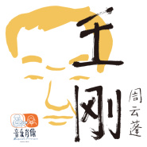

王刚
============================

|  |  |
| :--: | :-- |
| [ 王刚](https://emumo.xiami.com/album/2100267432) | **艺人**: [周云蓬](../index.md) **语种**: 国语 **唱片公司**: 音乐肖像 **发行时间**: 2016年01月28日 **专辑类别**: EP, 单曲 **专辑风格**:  **播放数**: 224515 **收藏数**: 323 **评论数**: 77  |

## 简介

 IIIIIIIIIIIIIIIIIIIIIIIIIIIIIIIIIIIIIIIIIIII 阿里音乐·首发音频 IIIIIIIIIIIIIIIIIIIIIIIIIIIIIIIIIIIIIIIIIIII   
  
『音乐肖像』单曲《王刚》 
  
  

<strong>肖像人物：</strong>
 

<strong> </strong>
 

《王刚》是音乐人小河发起的『音乐肖像』项目首期《音乐肖像 2015》十二首歌的其中一首，由周云蓬根据小河的Demo所编曲并演唱。歌曲中所描述的肖像人物王刚是安徽颍上人，5年前，他喜欢卡夫卡，愿意到北京漂，愿意去巴黎，愿意像海明威那样生活。可他哥哥嫂子都离家出走了，比他先“飘”了一步，他只能顾全大局，回乡陪伴父母还有年幼的侄子，成为一名乡村教师。王刚服从了自己的命运，甚至有一点牺牲的感觉，但他没有特别叛逆，理解和接受着世上所有的人，这一点又是柔软而明亮的。
 
  

<strong>周云蓬x《王刚》：</strong>
 

周云蓬的音乐以人文的气质、诗化的语言以及温良的旋律，如同“沉默如迷的呼吸”那般用柔软的力量触动听者心怀。在《王刚》这首歌中，老周收起以往惯长表现的浪漫和诗意，从素描式音乐角度出发，结合自己的创作经验，形而上地表达着对音乐本身的理解。他将自己变成一个冷静的旁观者，见证呈现，克制抒情，没有野心、平易近人地把歌唱好。
 
  

透过他冷暗的墨镜，我们反而看到了锐利的双眼，他关注那些早已被世人忽略的细枝末节，将它们糅在作品，敲打着每位听者，去展开反思——我们看见了什么，又忽视了什么。 
 
  
  

<strong>附：音乐肖像执行团队与周云蓬的访谈节选</strong>
 

音乐肖像：您是否考虑过在这首歌里通过某些小细节的改变跟处理，向观众传递什么情绪或精神？
 

周云蓬：这个歌本身并不很悲苦，题材是一个年轻人离开了梦想之地，到一个山村里。整个歌的基调有点轻松，我尽量把它处理得美好，因为这是他自己的选择。在里头也有很多人，他侄子和他妈妈出现了，他的同事、老师，还有他的学生们。这么多形象出现，唱这个歌的时候会感觉是一个安徽小村庄的群落。比方说，孩子们在宿舍里写着“大人坏”，孩子在自己家墙上写“大人坏”。
 
  

音乐肖像：王刚这个人物，在现代社会还是有一定的代表性，因为存在着这样一个群体。您改编过这首歌之后，有没有想要去进入到王刚的情境当中，跟他见面或者是聊一聊？
 

周云蓬：也不能故意地想去，因为全世界人特别多，我觉得没有必要主动去了解什么，因为在生活当中就会遇到这种情况，没必要舍近求远。当然我们唱完了这个歌以后，希望在未来，唱歌的人和被唱的人在舞台上出现。我把这个歌曲唱完，如果王刚也在台上听，他可以评点一下，这个歌把我唱得太快乐了，或是唱得太苦了。我觉得这样挺好，这个项目的意义就有了，要是被唱的人没有出现，这完全是一个歌手的命题作文。我觉得这个项目的意义在于，通过音乐把这些陌生的人串到一起，大家的凝聚点都在这个歌里。我觉得会见到他的，如果他还在那个村的话，可以邀请他。
 
  

音乐肖像：咱们这首《王刚》跟摇滚，还有说唱以及流行等其他音乐风格相比，音乐表现形式是不太一样的，您觉得以民谣的方式来歌唱特定的人物，有什么比较独特的优势或者是一些不足的地方？
 

周云蓬：这个歌如果是用吉他，简单一点，它的内容就是讲故事，不是那种一段体，两段体，ABC抒情的段落。这种讲故事就需要很随意，很散漫。民谣搭配一种乐器，比如一个琴就更容易一些。像过去街边唱戏曲的搭一个弧弦或者三弦，可以讲很多故事。在西藏讲格萨尔王可以讲那么长，但是如果用乐队就不行，因为乐队要编排。这种讲故事的方式，适合民谣音乐。
 
  

音乐肖像：对这种创作方式感觉如何？
 

周云蓬：挺好的，因为我们过去写歌都是围绕着自己去抒情，自己被动地遇到一个爱情去写，很少主动发现这个世界去写，尤其是给平常生活，甚至不感人的元素写歌。它会克制你的抒情，因为音乐总抒情也是一种伤。我觉得这也不是高层次的领域。文学就有那种，极简主义文学，或者非常不抒情非常克制的文学，它们也能够打动你。可能现在也需要这种音乐，不是很主观的，不是自己必须受到刺激了才写的。所以观察生活，给周围见到的人写，给看到的一只小鸟写，不见得就是非得要榨出人生哲理，人生鸡汤，不需要，可能就是唱，很平和地唱。这个其实在别的艺术形式里已经很多了，像我们这种搞流行歌曲的，审美的项目还是比较单一。我觉得这种歌曲，未来我还是想写，把一个故事唱到歌里去，这也是一个开端。
 
  

音乐肖像：刚才说到克制情绪的音乐，您觉得它可以带来什么不一样的感受？
 

嘉宾：它不会有大野心。像我们唱完这歌，绝对不会去打榜。我们也不会期待这首歌一下子怎么样。这首歌没有野心，被唱的王刚也没有野心，他就是向往巴黎或者北京。他也没有把父母扔下，逃到巴黎。我们唱歌的人在音乐里也没有野心，没有野心我觉得就是很平易近人地把这首歌唱好，像讲故事一样。有头有尾的，大家愿意听就听，觉得闷的话就不听了。
 
  

音乐肖像：您对音乐肖像的理解是什么？
 

周云蓬：我觉得可能就是一种音乐的素描，但是素描不等于它这个画儿差。梵高画素描也画得很好，而且是练很多年素描才开始画的，我觉得音乐肖像就是一种素描，也可以锻炼创作人。就像出个命题作文一样，能不能写好了，对自己是一种锻炼。另外音乐肖像最大的意义还是音乐社会学意义，让我们唱歌的人跳出自己的圈子，发现一些别的生活的可能性，别的人生活是什么样的。这个不是在网络上发现，是在生活中发现。人心态会更平和，或者让你不是很主观地抒情写歌，而是客观地承载一些东西，观察一些东西，是很好的锻炼。另外，我们说肖像人物的苦闷和苦难，还有他的快乐，非常现实。不是把一个平凡的东西拔高，然后又让自己不平凡，那样没有意义。把平凡唱出来，歌手的心态也会变。
 
  

音乐肖像：您除了抒情与这种极简的音乐之外，脑海中有没有对另外一种类型的音乐的想法？想要去把它实现的。
 

周云蓬：我会的乐器很少，只会吉他。吉他并不太善于讲故事，中国的三弦，或者中东的乌德琴，他们都很适合讲故事，还有西藏的那种琴，唱一段，弹一段。可是我不会那些乐器，只会吉他，这也是一种局限。我的设想是觉得别的乐器更有意思一点，可以尝试用一些民间乐器来表达，或者是快板大鼓，真像讲故事一样的。
 
  
  

<strong>关于音乐肖像：</strong>
 

2010年，音乐人小河做了一个项目，每个月与一位“普通人”生活一天并为ta创作一首歌。歌名就是人物的名字。一年下来有了关于12个人物的12首歌。他给它们起名叫“十二幅音乐肖像”。今年，小河无意间与朋友聊及此事，又翻开5年前的那些歌曲及视频资料，便发现了延续这个项目的意义，它更像是一套程序。
 
  

在这个“普通人不关注普通人”的时代，『音乐肖像』基于音乐创作行为本身，通过音乐人的视角，让人们重新关注身边的真实，而非只有遥不可及的梦想。不过，了解一套程序最好的方式不是看介绍文字与用户体验，而是直接去经过它。目前，小河专门成立了一个工作室，来呈现音乐肖像及运转这个机制。
 
  

随着『音乐肖像』这个体验式的音乐项目逐年开展，这些建立在“歌曲形式”上的人物肖像数据、参与歌手本身的样态与创作过程，大量的视频及文本数据，将在音乐、文学、社会学等领域呈献一个很不一样的研究样本。这些样本及研究成果，势必将对未来音乐人的创作提供营养、产生影响，甚至会对社会产生积极且有意义的影响。
 
  

小河作为这个项目的发起人和亲历者，他在回忆2010年的创作过程时有过这样的感悟：我非常感恩曾经与他们有过一天的生活。让我有机会发现与反醒自我心理的路径与缺陷，并体验从自己想象的世界里走出来的美好与震动。
 
  

作家韩东在评价音乐肖像时说：『音乐肖像』是音乐上的一次建筑学的努力，是集合创意的创意，非个人力量所可为，但又的确是音乐奴隶们的一首金字塔之歌。在这实际而庞大的构想中我似乎已经看见它的光芒了——不是作为历史遗存的辉煌，而是一座崭新的处于清新云雾中的未来实体，是它的闪烁耀眼，使我们在音乐之内可望瞥见被托举上去的超越性的时空。
 
  

歌手周云蓬在评价音乐肖像时说：『音乐肖像』是个好玩的事情，很有挑战性。过去写歌，我总爱主观抒情，有价值有意义要升华。可唱陌生人的故事，我变身为观察者，泯灭了歌唱中的个人野心，不是要人来听我，而是我们来听肖像人物。
 
  
  

<strong>关于小河：</strong>
 

民谣歌手，音乐制作人。从事音乐创作多年，作曲涉猎电影、戏剧及现代舞等。

## 曲目

- [王刚](./2100267432/mQVbGAe0801.md)

## 评论

|  |  |  |  |
| :-- | :-- | :-- | :-- |
|  [虾米用户](https://emumo.xiami.com/u/356740228)  2019-04-29 16:37 赞(0) 踩(0) | 
好听！超棒！
 |
|  [虾米用户](https://emumo.xiami.com/u/365197842) 音乐可以让你忘记世俗。 2019-03-20 08:08 赞(0) 踩(0) | 
石家庄艺校王刚？
 |
|  [虾米用户](https://emumo.xiami.com/u/20251213) 所有沧桑，独自承受 2018-01-10 12:55 赞(0) 踩(0) | 
一辈子的回忆
 |
|  [虾米用户](https://emumo.xiami.com/u/50521343) 乘着尘世的马，驾着超世的... 2017-10-04 07:39 赞(0) 踩(0) | 
老周还是根源于城市民谣
 |
|  [虾米用户](https://emumo.xiami.com/u/6640466)  2017-07-06 10:23 赞(0) 踩(0) | 
太难听了
 |
|  [虾米用户](https://emumo.xiami.com/u/49640493) 网易云SAINTDONT... 2016-12-09 23:18 赞(0) 踩(0) | 

 |
|  [虾米用户](https://emumo.xiami.com/u/28299938) 我还没想好要写什么... 2016-11-16 19:11 赞(0) 踩(0) | 
啊！老周！
 |
|  [虾米用户](https://emumo.xiami.com/u/1908295)  2016-05-06 00:25 赞(0) 踩(0) | 
小河发起的音乐肖像，万青也有曲
 |
|  [虾米用户](https://emumo.xiami.com/u/71822226) 小山 2016-04-25 16:42 赞(0) 踩(0) | 
李立群离开一年多了 ，老朋友也没为他写首歌啊，李立群的发小留
 |
|  [虾米用户](https://emumo.xiami.com/u/121526376) 天空下起了雨，你为我撑起... 2016-04-23 21:45 赞(0) 踩(0) | 
为什么叫王刚嘞
 |
|  [虾米用户](https://emumo.xiami.com/u/124065488) 文能提笔调戏美娇娘、武能... 2016-03-17 00:29 赞(0) 踩(0) | 
超喜欢这首
 |
|  [虾米用户](https://emumo.xiami.com/u/16952270) 大朵的白云 2016-03-13 13:15 赞(0) 踩(0) | 
像海洋一样大
 |
|  [虾米用户](https://emumo.xiami.com/u/1844) 农夫 山泉 有点田 2016-02-26 23:28 赞(0) 踩(0) | 
在一个叫王刚家的房子里住着另一个王刚 他叫王老师
 |
|  [虾米用户](https://emumo.xiami.com/u/25362651)  2016-02-16 11:49 赞(0) 踩(0) | 
是你啊
 |
| ⇒ |  [虾米用户](https://emumo.xiami.com/u/3256844) 恩斯波肯 多姆 2016-02-29 22:07 赞(0) 踩(0) | 
你丫会回复么？
 |
|  [虾米用户](https://emumo.xiami.com/u/3256844) 恩斯波肯 多姆 2016-02-11 21:43 赞(0) 踩(0) | 
刘弢做的也不错
 |
| ⇒ |  [虾米用户](https://emumo.xiami.com/u/5121036)  2016-02-11 22:59 赞(0) 踩(0) | 
啥
 |
| ⇒ |  [虾米用户](https://emumo.xiami.com/u/3256844) 恩斯波肯 多姆 2016-02-14 16:28 赞(0) 踩(0) | 
<q><b>防腐剂少女说：</b></q>
 |
| ⇒ |  [虾米用户](https://emumo.xiami.com/u/5121036)  2016-02-14 16:41 赞(0) 踩(0) | 
<q><b>godtoldmeto说：</b></q>
 |
| ⇒ |  [虾米用户](https://emumo.xiami.com/u/3256844) 恩斯波肯 多姆 2016-02-14 18:12 赞(0) 踩(0) | 
<q><b>防腐剂少女说：</b></q>
 |
|  [虾米用户](https://emumo.xiami.com/u/7208075) 隐居修炼 2016-02-02 18:01 赞(1) 踩(0) | 
有味道！！！！！！！！！！！！！！！！！！！！！！
 |
|  [虾米用户](https://emumo.xiami.com/u/8541843) 做设计的。 2016-02-01 21:37 赞(0) 踩(0) | 
如果有一天，我们也失明了，是否也会这样的歌唱……
 |
|  [虾米用户](https://emumo.xiami.com/u/220395) 暂无签名~ 2016-02-01 19:11 赞(0) 踩(0) | 
这叫歌？
 |
| ⇒ |  [虾米用户](https://emumo.xiami.com/u/4234256)  2016-02-04 10:46 赞(0) 踩(0) | 
这叫艺术
 |
| ⇒ |  [虾米用户](https://emumo.xiami.com/u/220395) 暂无签名~ 2016-02-05 23:16 赞(0) 踩(0) | 
<q><b>让我们荡起双桨说：</b></q>
 |
|  [虾米用户](https://emumo.xiami.com/u/3256844) 恩斯波肯 多姆 2016-01-31 23:13 赞(0) 踩(0) | 
“这首歌歌词长得快赶上短片小说了，并且歌词不押韵，没主歌副歌，真不愧是小河写的，天马行空声东击西。”相当棒 在798看了展览，入手了实体。喜欢的应该支持一下。
 |
| ⇒ |  [虾米用户](https://emumo.xiami.com/u/2360329)  2016-02-11 19:16 赞(0) 踩(0) | 
还是吴吞更合适唱这种不押韵的，能把不押韵唱出韵来
 |
| ⇒ |  [虾米用户](https://emumo.xiami.com/u/3256844) 恩斯波肯 多姆 2016-02-14 16:29 赞(0) 踩(0) | 
<q><b>番茄说：</b></q>
 |
|  [虾米用户](https://emumo.xiami.com/u/492360) 失恋不是自杀的借口 继续... 2016-01-31 22:42 赞(0) 踩(0) | 
王刚讲故事
 |
|  [虾米用户](https://emumo.xiami.com/u/81043362)  2016-01-31 04:04 赞(0) 踩(0) | 
平凡的歌 写给平凡的人
 |
|  [虾米用户](https://emumo.xiami.com/u/45229) 我还没想好要写什么... 2016-01-30 21:59 赞(0) 踩(0) | 
感觉人声跟伴奏有点不和谐？？更喜欢老周在深圳旧天堂清唱的版本
 |
|  [虾米用户](https://emumo.xiami.com/u/1014240) 岁月不知人间多少的忧伤，... 2016-01-30 12:39 赞(0) 踩(0) | 
这歌也是在讲故事......
 |
|  [虾米用户](https://emumo.xiami.com/u/10307215)  2016-01-30 08:01 赞(1) 踩(0) | 
等 张 洲
 |
|  [虾米用户](https://emumo.xiami.com/u/1895474) ALL GONE 2016-01-30 03:23 赞(0) 踩(0) | 
怎么好多人都是这个系列的封面…
 |
|  [虾米用户](https://emumo.xiami.com/u/2517795)  2016-01-30 01:19 赞(0) 踩(0) | 
越来越像左小
 |
|  [虾米用户](https://emumo.xiami.com/u/2116927)  2016-01-29 22:05 赞(0) 踩(0) | 
炸一听 以为是左小祖咒
 |
|  [虾米用户](https://emumo.xiami.com/u/2116927)  2016-01-29 22:04 赞(0) 踩(0) | 
听得我以为是左小祖咒 哈哈
 |
|  [虾米用户](https://emumo.xiami.com/u/5419635) 再会，虾米。 2016-01-29 21:29 赞(0) 踩(0) | 
小河“音乐肖像”里面最喜欢的一首嘻嘻
 |
|  [虾米用户](https://emumo.xiami.com/u/33009066) 豬小小 2016-01-29 19:26 赞(0) 踩(0) | 
love
 |
| ⇒ |  [虾米用户](https://emumo.xiami.com/u/65266628)  2016-01-30 01:39 赞(0) 踩(0) | 
<q><b>说：</b></q>
 |
| ⇒ |  [虾米用户](https://emumo.xiami.com/u/3256844) 恩斯波肯 多姆 2016-01-31 23:14 赞(0) 踩(0) | 
<q><b>说：</b></q>
 |
|  [虾米用户](https://emumo.xiami.com/u/11421497) dont act lik... 2016-01-29 19:11 赞(0) 踩(0) | 
马
 |
|  [虾米用户](https://emumo.xiami.com/u/52521480) 酷到沒辦法 2016-01-29 19:09 赞(0) 踩(0) | 
王刚讲故事。
 |
|  [虾米用户](https://emumo.xiami.com/u/6221130) 一切都会过去的... 2016-01-29 18:29 赞(1) 踩(0) | 
有意思，期待万青。
 |
|  [虾米用户](https://emumo.xiami.com/u/7720401)  2016-01-29 18:28 赞(0) 踩(0) | 
有意义的项目
 |
|  [虾米用户](https://emumo.xiami.com/u/32520129) 常常因为得不到爱而哭泣。 2016-01-29 18:04 赞(8) 踩(0) | 
我姨夫
 |
|  [虾米用户](https://emumo.xiami.com/u/6430844) Swing！ 2016-01-29 16:35 赞(0) 踩(0) | 
听了几遍还蛮喜欢的
 |
|  [虾米用户](https://emumo.xiami.com/u/36165303) 喜欢李沧东的薄荷糖 也喜... 2016-01-29 16:24 赞(0) 踩(0) | 
去年秋天在合肥交流会现场上听过这首歌 当时这首歌还叫王老师哈哈哈 当时还和周老师握手了 开心。
 |
|  [虾米用户](https://emumo.xiami.com/u/37135782) 暂无签名~ 2016-01-29 16:17 赞(0) 踩(0) | 

 |
|  [虾米用户](https://emumo.xiami.com/u/1618810) 毙 2016-01-29 15:39 赞(0) 踩(0) | 
m
 |
|  [虾米用户](https://emumo.xiami.com/u/16725991)  2016-01-29 13:51 赞(0) 踩(0) | 
还是原来的配方还是熟悉的味道
 |
|  [虾米用户](https://emumo.xiami.com/u/43410599)   2016-01-29 12:14 赞(0) 踩(0) | 
刚哥 你还有专属歌曲哪
 |
|  [虾米用户](https://emumo.xiami.com/u/6733300) 誩 2016-01-29 10:28 赞(0) 踩(0) | 
只想点赞 好故事
 |
|  [虾米用户](https://emumo.xiami.com/u/36057872) 网易/BC: Breat... 2016-01-29 07:57 赞(0) 踩(0) | 
~
 |
|  [虾米用户](https://emumo.xiami.com/u/2841246)   2016-01-29 07:01 赞(0) 踩(0) | 
逗逼歌
 |
|  [虾米用户](https://emumo.xiami.com/u/9973836) 我还没想好要写什么... 2016-01-29 00:37 赞(0) 踩(0) | 
2020年1月27
 |
|  [虾米用户](https://emumo.xiami.com/u/52568283) 用音乐，活出你的态度。 2016-01-29 00:30 赞(0) 踩(0) | 
。
 |
|  [虾米用户](https://emumo.xiami.com/u/3584091) 我还没想好要写什么... 2016-01-28 23:50 赞(0) 踩(0) | 
旋律和&amp;lt;上海童年&amp;gt;有点像.但是感觉不如顶马的&amp;lt;上海童年&amp;gt;
 |
|  [虾米用户](https://emumo.xiami.com/u/33668476) 夏日已远，繁花将尽 2016-01-28 23:01 赞(0) 踩(0) | 
生动，平实，温暖
 |
|  [虾米用户](https://emumo.xiami.com/u/216857)  2016-01-28 22:41 赞(0) 踩(0) | 
不算特别悦耳，但，真实
 |
|  [虾米用户](https://emumo.xiami.com/u/13137804) 骨灰級影迷、獨立音樂聽衆... 2016-01-28 22:24 赞(0) 踩(0) | 
啥jb
 |
|  [虾米用户](https://emumo.xiami.com/u/10375782) 科学养猪  水稻杂交 2016-01-28 22:04 赞(0) 踩(0) | 
和中堂！！！！！
 |
|  [虾米用户](https://emumo.xiami.com/u/8244559)  2016-01-28 20:09 赞(1) 踩(0) | 
******
 |
|  [虾米用户](https://emumo.xiami.com/u/45053311) anytime 2016-01-28 19:39 赞(0) 踩(0) | 
王刚 田野诗人
 |
|  [虾米用户](https://emumo.xiami.com/u/3592527)  2016-01-28 19:37 赞(36) 踩(0) | 
第一反应演和珅的王刚。
 |
| ⇒ |  [虾米用户](https://emumo.xiami.com/u/224893) 你这是想红你造吗 2016-01-28 21:51 赞(0) 踩(0) | 
我也是……
 |
| ⇒ |  [虾米用户](https://emumo.xiami.com/u/9127105)   2016-01-30 22:14 赞(0) 踩(0) | 
而我的第一反应是李刚，我爸是李刚的李刚。。。
 |
| ⇒ |  [虾米用户](https://emumo.xiami.com/u/105947130)  2016-02-05 00:44 赞(0) 踩(0) | 
L
 |
|  [虾米用户](https://emumo.xiami.com/u/6730069) 你认真的样子真棒。 2016-01-28 19:26 赞(0) 踩(0) | 
我老师就叫王刚。。。然后我给他发了这首歌的链接(๑• . •๑)
 |
|  [虾米用户](https://emumo.xiami.com/u/58009764) 我还没想好要写什么... 2016-01-28 17:48 赞(0) 踩(0) | 
九，唉！
 |
|  [虾米用户](https://emumo.xiami.com/u/50916306) 槟榔配烟 法力无边 2016-01-28 17:41 赞(0) 踩(0) | 
好
 |
|  [虾米用户](https://emumo.xiami.com/u/50916306) 槟榔配烟 法力无边 2016-01-28 17:41 赞(0) 踩(0) | 
应该加个推送什么的
 |
|  [虾米用户](https://emumo.xiami.com/u/10990571) 花花世界，生生不息。 2016-01-28 17:39 赞(0) 踩(0) | 
我以为是牛栏山那个王刚呢....
 |
|  [虾米用户](https://emumo.xiami.com/u/4234256)  2016-01-28 17:35 赞(0) 踩(0) | 
等等。。。为毛通知里没有这张专辑的推送，又打脸了。。。
 |
|  [虾米用户](https://emumo.xiami.com/u/4234256)  2016-01-28 17:12 赞(0) 踩(0) | 
老周出品，必属精品               （点开专辑介绍有惊喜）
 |
|  [虾米用户](https://emumo.xiami.com/u/669738) 是我啊 2016-01-28 17:02 赞(0) 踩(0) | 
和珅
 |
|  [虾米用户](https://emumo.xiami.com/u/17330125) 想象音乐的另一种可能 2016-01-28 16:49 赞(0) 踩(0) | 
沙发~
 |
