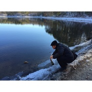

瓦尔登湖
============================

|  |  |
| :--: | :-- |
| [ 瓦尔登湖](https://emumo.xiami.com/album/2102974692) | **艺人**: [周云蓬](../index.md) **语种**: 国语 **唱片公司**: 独立发行 **发行时间**: 2017年12月15日 **专辑类别**: EP, 单曲 **专辑风格**: 当代民谣 Contemporary Folk **播放数**: 70007 **收藏数**: 141 **评论数**: 21  |

## 简介

《表叔》有关中国病人的一首歌。

## 曲目

- [表叔](./2102974692/8HXQxAe7b32.md)
- [南方的女人](./2102974692/mSFqTw80ff1.md)

## 评论

|  |  |  |
| :-- | :-- | :-- |
|  [虾米用户](https://emumo.xiami.com/u/47874468) 信伴侣 2020-05-09 15:48 赞(0) 踩(0) | 
瓦尔登湖这歌哪年能正式发布
 |
|  [虾米用户](https://emumo.xiami.com/u/50521343) 乘着尘世的马，驾着超世的... 2019-05-21 15:22 赞(1) 踩(0) | 
我是不是不应该表示失望
 |
| ⇒ |  [虾米用户](https://emumo.xiami.com/u/415064724)  2019-11-04 03:39 赞(0) 踩(0) | 
为什么要失望
 |
|  [虾米用户](https://emumo.xiami.com/u/418954994) ?  2019-05-08 15:17 赞(0) 踩(0) | 
当然满分啊。
 |
|  [虾米用户](https://emumo.xiami.com/u/118895356) 愿有未老未冷的情怀 2019-03-12 13:18 赞(0) 踩(0) | 
到底是头像成了唱片封面，还是唱片封面成了头像？= =
 |
|  [虾米用户](https://emumo.xiami.com/u/1689069)  2018-09-05 23:30 赞(3) 踩(0) | 
还是当时现场听过的瓦尔登湖，后来一直只能用乐视听，什么时候瓦尔登湖能出音频版。。
 |
|  [虾米用户](https://emumo.xiami.com/u/330410736)   2018-07-23 10:09 赞(1) 踩(0) | 
今天依然没有瓦尔登湖。
 |
|  [虾米用户](https://emumo.xiami.com/u/330410736)   2018-07-10 12:49 赞(3) 踩(0) | 
瓦尔登湖什么时候有啊啊啊啊_(:з」&amp;ang;)_都辣么久了
 |
|  [虾米用户](https://emumo.xiami.com/u/810857) 坚持 2018-03-06 15:43 赞(1) 踩(0) | 
老周又要出新专了吗？期待
 |
|  [虾米用户](https://emumo.xiami.com/u/242022847) 你当独立且自由。  2018-02-11 10:03 赞(0) 踩(0) | 

 |
|  [虾米用户](https://emumo.xiami.com/u/21336466) 第二职业 2018-01-31 21:52 赞(0) 踩(0) | 
爱你
 |
|  [虾米用户](https://emumo.xiami.com/u/337000987) 我真的还没想好要写什么.... 2018-01-30 09:11 赞(2) 踩(0) | 
瓦尔登湖
 |
|  [虾米用户](https://emumo.xiami.com/u/5809306)   2017-12-22 17:13 赞(3) 踩(0) | 
沉默如迷时期的功力又回来了。太好了。
 |
|  [虾米用户](https://emumo.xiami.com/u/118150102) 20岁出头的苦日子 2017-12-16 22:14 赞(0) 踩(0) | 
来晚了
 |
|  [虾米用户](https://emumo.xiami.com/u/9813603) 虾米都听。 2017-12-16 10:38 赞(2) 踩(0) | 
精神病院里可好了
 |
| ⇒ |  [虾米用户](https://emumo.xiami.com/u/7103936) 我只是下线了 2018-01-18 21:52 赞(0) 踩(0) | 
哪里有？
 |
|  [虾米用户](https://emumo.xiami.com/u/2807048) 噢 乖 2017-12-16 02:00 赞(0) 踩(0) | 
生日快乐
 |
|  [虾米用户](https://emumo.xiami.com/u/346047) 撒旦踏着探戈的舞步，一日... 2017-12-15 20:01 赞(0) 踩(0) | 
。
 |
|  [虾米用户](https://emumo.xiami.com/u/36147268) 苦路第十四处：耶稣死于我... 2017-12-15 16:48 赞(0) 踩(0) | 
挖
 |
|  [虾米用户](https://emumo.xiami.com/u/1126943)  2017-12-15 16:07 赞(3) 踩(0) | 
这对吗?这对吗?这对吗?这对吗?这对吗?这对吗?这对吗?这对吗?这对吗?这对吗?这对吗?这对吗?这对吗?这对吗?这对吗?这对吗?这对吗?这对吗?这对吗?这对吗?这对吗?这对吗?这对吗?这对吗?这对吗?这对吗?这对吗?这对吗?这对吗?这对吗?这对吗?这对吗?这对吗?这对吗?这对吗?这对吗?这对吗?这对吗?这对吗?这对吗?这对吗?这对吗?这对吗?这对吗?这对吗?这对吗?这对吗?这对吗?这对吗?这对吗?这对吗?这对吗?这对吗?这对吗?这对吗?这对吗?这对吗?这对吗?这对吗?这对吗?这对吗?这对吗?这对吗?这对吗?这对吗?这对吗?这对吗?这对吗?这对吗?这对吗?这对吗?这对吗?这对吗?这对吗?:)。。
 |
|  [虾米用户](https://emumo.xiami.com/u/82248268)  2017-12-15 10:12 赞(1) 踩(0) | 
沙发，坐着慢慢听
 |
