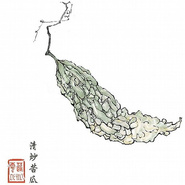

清炒苦瓜
============================

|  |  |
| :--: | :-- |
| [ 清炒苦瓜](https://emumo.xiami.com/album/217877) | **艺人**: [周云蓬](../index.md) **语种**: 国语 **唱片公司**: 刀马旦 **发行时间**: 2008年07月16日 **专辑类别**: 录音室专辑 **专辑风格**: 民谣 Folk, 国语流行 Mandarin Pop, 华语唱作人 Chinese Singer-Songwriter **播放数**: 1759779 **收藏数**: 1478 **评论数**: 56  |

## 简介

特别收录了大家期待已久的“九月”和几首周云蓬的诗朗诵，再有第一张唱片的Demo 此间收入的是周云蓬未经录音棚加工过的原始小样，略显粗糙但原汁原味。 相信当时当地的音乐情绪是后来的技术无法完全复原的。 &nbsp; 周云蓬简介  
  
周云蓬，盲诗人、民谣歌手。1970年12月15日出生于辽宁。9岁失明，留在 &nbsp;周云蓬视觉中的最后印象是动物园里的大象用鼻子吹口琴。15岁弹吉他，23岁大学毕业，其后游历十余城市，以弹唱为生，目前暂居浙江绍兴。   
看似沉默如谜，却仿佛早已窥破命运的秘密。作品中精美细致的编曲和充满人文色彩的歌词，以及盲人歌手周云蓬极具磁性的深厚的嗓音，给听者描画出一种古旧，恬静的生活画面，同时这些画面又饱含哲理和感伤。《沉默如迷的呼吸》与小河的《飞不高的鸟不落在跑不快的牛的背上》和万晓利的《走过来，走过去》相比，体现出另外一种气质，但仍不失为民谣音乐中的经典。在他这张个人专辑当中充满了没有经过任何做作、与声俱来的人文气质，从整体上而言，虽然歌曲中没有刻意写出华丽唯美的旋律，但却充满了发自心底的真诚。   
2011年11月3日，周云蓬的诗歌《不会说话的爱情》获得2011年度人民文学奖诗歌奖。

## 曲目

- [飞得高的鸟不落在跑不快的前门楼子上 (煮熟的鸭子要飞走)](./217877/QJ5J961a5.md)
- [空水杯](./217877/QJ5K886eb.md)
- [沉默如迷的呼吸](./217877/QJ5L7b385.md)
- [我听到某人在唱一首忧伤的歌](./217877/b6GYga4a85.md)
- [鱼相忘于江湖](./217877/cmE01f593a.md)
- [山鬼](./217877/QJ5O91aed.md)
- [幻觉支撑我们活下去 (秦琴版)](./217877/QJ5P54212.md)
- [荡荡悠悠](./217877/b6GYkc8fe8.md)
- [失业者](./217877/QJ5R5f59b.md)
- [盲人影院](./217877/b6GYmbddf4.md)
- [不着边际的香山](./217877/QJ5T9a35e.md)
- [九月 (第三版)](./217877/QJ5U95cce.md)
- [没有](./217877/b6GYpdda30.md)

## 评论

|  |  |  |
| :-- | :-- | :-- |
|  [虾米用户](https://emumo.xiami.com/u/243102660)   2021-01-12 18:20 赞(0) 踩(0) | 
这是歌儿么…不懂了
 |
|  [虾米用户](https://emumo.xiami.com/u/10696597) smile 2020-02-29 11:33 赞(0) 踩(0) | 
周云蓬是大师
 |
|  [虾米用户](https://emumo.xiami.com/u/289607653)  日日夜夜的雨 2019-08-13 19:03 赞(0) 踩(0) | 
万晓利《北方的北方》跟这张挺像的，非典型和弦，都用分解弹法，不过词可比不过周云蓬，周是诗人，万是童话作者。
 |
|  [虾米用户](https://emumo.xiami.com/u/317674) 地狱的秘密就是我的秘密。 2019-05-31 20:44 赞(0) 踩(0) | 
甘苦自知
 |
|  [虾米用户](https://emumo.xiami.com/u/315751769)  2019-03-24 04:29 赞(0) 踩(0) | 
老周看到的比我多多了
 |
|  [虾米用户](https://emumo.xiami.com/u/287962794)  2018-12-10 22:53 赞(0) 踩(0) | 
精选集很用心
 |
|  [虾米用户](https://emumo.xiami.com/u/16337726)  2018-11-25 11:37 赞(0) 踩(0) | 
)
 |
|  [虾米用户](https://emumo.xiami.com/u/14351)  2017-10-27 23:42 赞(0) 踩(0) | 
<a href="http://item.taobao.com/item.htm?spm=a1z10.1-c.w4004-2323373923.16.Erqe9V&amp;id=520354315643" target="_blank" rel="nofollow noreferrer noopener">http://item.taobao.com/item.htm?spm=a1z10.1-c.w4004-2323373923.16.Erqe9V&amp;id=520354315643</a>  周云蓬歌曲汇集U盘 有他的所有专辑的MP3版 还有电台主持 和 演讲 希望可以支持啊
 |
|  [虾米用户](https://emumo.xiami.com/u/12137600) 聋哑 2017-10-27 22:58 赞(1) 踩(0) | 
嘿，好久不见。 喜欢过什么呢？空水杯，沉默如谜的呼吸，我听到某人在唱一首忧伤的歌，幻觉支持我们活下去，山鬼开头的音乐，没有，甚至盲人影院。。。像是年轻的心忍不住热爱这些献给虚无的赞歌，就如同叛逆期的迷惘找到了某种归宿。然而，并不是这样，没有要试图否定这不可否定的虚无，只是和朋友聊到了建构，而这新的兴致又够我活几个年头。所以，好久不见，这自话自说，不相信有会看评论的瞎子，就像不相信评论区里一大片无聊的人话居然是来自听过你的歌的人  ，
 |
|  [虾米用户](https://emumo.xiami.com/u/11749453)  2017-08-04 10:40 赞(0) 踩(0) | 
现实
 |
|  [虾米用户](https://emumo.xiami.com/u/28310530) 我还没想好要写什么... 2016-12-21 22:46 赞(1) 踩(0) | 
九月，没人能唱出海子的意境，但周做到了。单曲循环无数遍~就是这么喜欢~
 |
|  [虾米用户](https://emumo.xiami.com/u/45298985) Wechat:dqx19... 2016-10-01 16:41 赞(0) 踩(0) | 
+
 |
|  [虾米用户](https://emumo.xiami.com/u/189482590) 你本是尘土 仍要归于尘土 2016-06-15 02:27 赞(0) 踩(0) | 
原汁原味 带着那么一点味道的感觉
 |
|  [虾米用户](https://emumo.xiami.com/u/760031) 反正都是要独自死去 2016-01-16 07:24 赞(0) 踩(0) | 
他算真是和小河不分你我了
 |
|  [虾米用户](https://emumo.xiami.com/u/188044) 一个高尚纯粹有道德充满了... 2015-11-21 13:32 赞(0) 踩(0) | 
老周写的这是歌吗？曲子不是曲子调子不是调子，莫名其妙自我陶醉的歌词！我觉得现在玩民谣的大多数都在互相吹捧抬高自娱自乐！没几首能打动我的说实话！
 |
| ⇒ |  [虾米用户](https://emumo.xiami.com/u/2493390) 他从未成熟，却一刻也没有... 2020-12-03 00:27 赞(0) 踩(0) | 
是你的鉴赏不了罢了
 |
| ⇒ |  [虾米用户](https://emumo.xiami.com/u/188044) 一个高尚纯粹有道德充满了... 2021-01-06 11:52 赞(0) 踩(0) | 
<q><b>shotgun说：</b></q>
 |
|  [虾米用户](https://emumo.xiami.com/u/23144668) 我需要安靜。我自已和自己... 2015-09-21 18:27 赞(2) 踩(0) | 
我今天需要哭一下。
 |
|  [虾米用户](https://emumo.xiami.com/u/22917818)  2015-08-12 07:49 赞(3) 踩(0) | 
超喜欢周云蓬版的《九月》！
 |
|  [虾米用户](https://emumo.xiami.com/u/3661471)  2015-03-17 14:44 赞(1) 踩(0) | 
好听的歌，像草，在春天静静地长，那么自然，不喧哗
 |
|  [虾米用户](https://emumo.xiami.com/u/1844) 农夫 山泉 有点田 2015-03-09 17:13 赞(0) 踩(0) | 
你歌唱 是不是就可以恣意忧伤
 |
|  [虾米用户](https://emumo.xiami.com/u/4896642) 已识乾坤大，犹怜草木青 2015-03-07 02:59 赞(1) 踩(0) | 
重新发布的专辑啊…最初的评论已是六年前…
 |
| ⇒ |  [虾米用户](https://emumo.xiami.com/u/18282119) 我就是我，独一无二 2015-03-07 18:30 赞(0) 踩(0) | 
以前由于周云蓬本人不同意虾米发行，所以这张专辑的资料被服务器屏蔽了，现在版权刚刚谈妥。
 |
|  [虾米用户](https://emumo.xiami.com/u/4234256)  2015-03-06 19:27 赞(0) 踩(0) | 
+3
 |
|  [虾米用户](https://emumo.xiami.com/u/7208075) 隐居修炼 2015-03-06 15:02 赞(0) 踩(0) | 
vb
 |
|  [虾米用户](https://emumo.xiami.com/u/1618810) 毙 2015-03-06 08:23 赞(0) 踩(0) | 
甲级！老周炸了~~
 |
|  [虾米用户](https://emumo.xiami.com/u/37463340) 哎哟喂 2015-03-05 23:14 赞(0) 踩(0) | 
终于来啦！老周元宵快乐！
 |
|  [虾米用户](https://emumo.xiami.com/u/40531878) 暂无签名~ 2015-03-05 22:55 赞(0) 踩(0) | 
哎呀！元宵节快乐米娜桑
 |
|  [虾米用户](https://emumo.xiami.com/u/134697)  2015-03-05 21:37 赞(1) 踩(0) | 
当年送这张专辑给她的那个姑娘、儿子都能上小学了、当初放手因为心疼她儿子、如今这姑娘却还是跟另一个姑娘厮混、真担心自己是不是一辈子都会这么SB !!!
 |
| ⇒ |  [虾米用户](https://emumo.xiami.com/u/32248185) 暗恋悲剧 2015-03-08 13:01 赞(0) 踩(0) | 
老周
 |
|  [虾米用户](https://emumo.xiami.com/u/36147268) 苦路第十四处：耶稣死于我... 2015-03-05 21:33 赞(0) 踩(0) | 
嗯，不错，下火
 |
|  [虾米用户](https://emumo.xiami.com/u/18282119) 我就是我，独一无二 2015-03-05 21:22 赞(0) 踩(0) | 
<a href="http://emumo.xiami.com/u/4275776" target="_blank" rel="nofollow" name_card="4275776">@320K专门店</a> 无损压缩合格320K，其中第1首、第11首和第13首由于源盘问题导致频谱不佳，请再添加上源盘频谱不佳标签。
 |
|  [虾米用户](https://emumo.xiami.com/u/36057872) 网易/BC: Breat... 2015-03-05 21:21 赞(0) 踩(0) | 
~
 |
|  [虾米用户](https://emumo.xiami.com/u/11322994) Good things 2015-03-05 21:21 赞(0) 踩(0) | 
:)
 |
|  [虾米用户](https://emumo.xiami.com/u/134697)  2015-03-05 21:19 赞(0) 踩(0) | 
^_^
 |
|  [虾米用户](https://emumo.xiami.com/u/1385284)  2010-09-06 09:49 赞(0) 踩(0) | 
天籁之音，天天想听
 |
|  [虾米用户](https://emumo.xiami.com/u/1368450)  2010-08-25 13:42 赞(0) 踩(0) | 
听着九月 马首 想哭。。。回忆涌现出来。。。像电影片段 像流泪的路牌
 |
|  [虾米用户](https://emumo.xiami.com/u/1369930)  2010-08-23 23:36 赞(0) 踩(0) | 
很感动，要流泪的感觉，久违了的感觉！
 |
|  [虾米用户](https://emumo.xiami.com/u/1264268)  2010-08-03 21:22 赞(0) 踩(0) | 
从韩寒的杂志里看到他的文章，然后网上搜他的歌，听了几首，感觉和我以前听的歌完全不是一会回。其中盲人影院和中国孩子听得我流泪了，混在这个一个世俗的社会里，已经很少有东西让人流泪了，很感谢周云蓬，这次打算下他所有的歌听听。
 |
| ⇒ |  [虾米用户](https://emumo.xiami.com/u/1223514)  2010-08-07 13:40 赞(0) 踩(0) | 
两年前第一次听就是这样的感觉，今年终于去看了现场 ：)
 |
| ⇒ |  [虾米用户](https://emumo.xiami.com/u/188044) 一个高尚纯粹有道德充满了... 2015-11-21 13:34 赞(0) 踩(0) | 
你这么容易流泪的？
 |
|  [虾米用户](https://emumo.xiami.com/u/1219998)  2010-07-31 23:51 赞(18) 踩(0) | 
周云蓬、第一次知道他是通过七堇年的散文、题目是《沉默如谜的呼吸》  我的语言太过贫瘠、所以还是摘抄一下七堇年的文字好了。这是七堇年的文字中我特别喜欢的一篇。  在月光一般的吉他声中，我一边听周云蓬的民谣，一边读它的自述，于是看到了由一双盲眼，三十多年的时光跨度，和一些飘荡无着的歌声所组成的人生片段。  ------------------------  忽然觉得自己富有，却又赤贫。  如果非到有朝一日，我们失去而今的年轻、健康、衣食无忧、肩上无所负担，才恍觉自己当年没有理由不快乐，不珍惜生命……那该是怎样的一种懊悔。  民主、共和、自由、良知……这些抽象而遥远的词汇，打开了人生中诸多个无处宣泄的泄潮的闸门，亦成了为活着的虚无和痛楚引流的渠道。  而在我们这个太平的年代里，还有没有什么事情，能够成为我们为活着的虚无和痛楚引流的渠道呢？  我们还是太年轻。对这个世界的理解带着盲目的信任或者盲目的不信任。因活着本身是为了活着而活着，所以一切流于空泛的热血和牺牲，最终都注定是——在个人意义上来讲——无疾而终的。除了或者本身之外，没有什么能够弥补活着的贫瘠。  人们绝望的原由，从来没有新颖的动机。终极的失落，是人类原罪的原罪。哈罗德.布鲁姆说，心灵的自我对话本质上不是一种社会现实。西方经典的全部意义在于使人善用自己的孤独，这一孤独的最终形式是一个人和自己的死亡相遇。  -------------------------  朋友告诉我，有一次在周云蓬的民间演唱会上，他做出了求助的示意，于是旁边的人走进，俯首问，“有什么事吗？”  周云蓬说：“现在开了几盏灯？”  那个人说：“两盏。”  周云蓬说：“那关掉一盏吧，听众只需要我的音乐，而我不需要灯，所以这样浪费了光明。”
 |
| ⇒ |  [虾米用户](https://emumo.xiami.com/u/3566813) 菩萨，祝您身体健康！34... 2015-03-05 21:34 赞(0) 踩(0) | 
可以作为乐评的一种贴到最上端。
 |
|  [虾米用户](https://emumo.xiami.com/u/18786) 不是真的 2010-05-14 16:14 赞(0) 踩(0) | 
虾米真是了不起，还有这样的专辑，好样的！
 |
|  [虾米用户](https://emumo.xiami.com/u/698458) 我还没想好要写什么... 2010-02-26 23:20 赞(0) 踩(0) | 
很喜欢他的声音啊，越听越喜欢啊！
 |
|  [虾米用户](https://emumo.xiami.com/u/338562)  2009-12-02 15:43 赞(0) 踩(0) | 
喜欢吃苦瓜的人悄悄的飘过~
 |
|  [虾米用户](https://emumo.xiami.com/u/358630) 如果为世界按下静音键，然... 2009-10-22 07:08 赞(0) 踩(0) | 
这才华，涌出来直冒泡啊
 |
|  [虾米用户](https://emumo.xiami.com/u/60974)  2009-07-20 09:55 赞(0) 踩(0) | 
老周的声音阐释海子的诗，绝配。
 |
|  [虾米用户](https://emumo.xiami.com/u/45752)  2009-07-09 11:40 赞(0) 踩(0) | 
苦瓜清炒…但願生活中還留有一絲甘甜……
 |
|  [虾米用户](https://emumo.xiami.com/u/160793) dog lover丨Yo... 2009-07-01 15:34 赞(0) 踩(0) | 
唱片封面还满好看的啊
 |
|  [虾米用户](https://emumo.xiami.com/u/199299)  2009-06-07 08:39 赞(0) 踩(0) | 
“九月”的词是用逝去诗人海子的诗，可惜啊，这么一个才子不在了
 |
|  [虾米用户](https://emumo.xiami.com/u/50362)  2009-02-13 03:07 赞(0) 踩(0) | 
最爱盲人影院
 |
|  [虾米用户](https://emumo.xiami.com/u/10972)  2008-12-17 19:34 赞(0) 踩(0) | 
九月---很喜欢 ---一句：我的琴声呜咽，我的泪水全无....
 |
|  [虾米用户](https://emumo.xiami.com/u/11353)  2008-12-09 11:17 赞(0) 踩(0) | 
已经买到这张唱片了，不错。尤其是喜欢九月。
 |
|  [虾米用户](https://emumo.xiami.com/u/5670) 暂无签名~ 2008-11-21 15:21 赞(0) 踩(0) | 
上周去看了他的现场，果然不同凡响！
 |
|  [虾米用户](https://emumo.xiami.com/u/8434)  2008-11-18 22:07 赞(0) 踩(0) | 
周云蓬的底层诗人和歌者气质是我最喜欢的
 |
