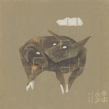

牛羊下山
============================

|  |  |
| :--: | :-- |
| [ 牛羊下山](https://emumo.xiami.com/album/400505) | **艺人**: [周云蓬](../index.md) **语种**: 国语 **唱片公司**: 独立发行 **发行时间**: 2010年09月11日 **专辑类别**: 录音室专辑 **专辑风格**:  **播放数**: 2062177 **收藏数**: 2471 **评论数**: 133  |

## 简介

谁也没想到这次周云蓬会带来一张唐宋诗歌，专辑名字充满诗意 《牛羊下山》。当所有人都认为这位勇猛直言的民谣歌手会朝着上张专辑《中国孩子》的路线继续前行时，周云蓬却突然压低了声调，折回到他久违的诗歌田园，回忆那“明月出天山，胡窥青海湾”的恬静岁月。  
  
《牛羊下山》专辑名字的立意源自周云蓬传唱多年的一首名曲《不会说话的爱情》中的一句，“绣花绣得累了吧，牛羊也下山喽。”那是一个多么诗意盎然的年代啊。  
  
李白的《关山月》、杜甫的《杜甫三章》、孟郊的《游子吟》、李煜、纳兰性德的《长相思》、无门禅师的《颂》、刘禹锡的《乌衣巷》、《竹枝词 杨柳青青》、周云蓬的曲《草木深》、《冤家》、周云蓬的歌《不会说话的爱情》，在《牛羊下山》深情的眷恋中，这些古今名人不再被隔离在遥不可及的每一个朝代，而一个个端庄地穿梭在彼此的梦境里，他们在诗词曲牌里纵横延绵的那个山河不再是断裂的，而是“今夕复何夕，共此灯烛光。”(《杜甫三章之赠卫八处士》)。  
  
周云蓬原本就是一个诗人，在这趟“青春作伴好还乡”的放歌远游中，他以一个后辈的身份去拜访前辈，怀着无限的虔诚，带着极简的行囊，“身向榆关那畔行”，“飞入寻常百姓家”。 在千百年前的一寸寸山河里，我们会看到我们的祖先是如何生活的。“明月出天山，苍茫云海间”，周云蓬就在这些千年的古诗中咀嚼“人间好时节”的滋味，憧憬“长江滚滚来”的明天。  
  
这张专辑的制作与录音依然是周云蓬最铁的哥们小河担纲的，他把最简朴的古意都保留在了《牛羊下山》中，成全了一次现实对历史的访问。 整张专辑基本只有吉他和钢琴伴奏，他们把现代化的器乐都扔在了山上，让牛羊们安安心心地下山觅食。在它们慢吞吞的一路溜达中，你还会觉得它们只是美味佳肴吗？ 周云蓬觉得粤语和吴侬语是在神韵上最贴近古汉语的，所以在《游子吟》中，周云蓬让几个广州青年来主唱，在《竹枝词杨柳青青》中，他又让一位嗓音柔美的江南女子来念口白，他们让人感同身受到地方人文独具的美感。而作为一位言行一致的歌者，周云蓬在录制完《牛羊下山》后，已经撤离京城，携心爱女友迁往他心仪已久的江南水乡生活。“杨柳青青江水平，闻郎江上唱歌声。”神仙般的生活，竟然可以如法炮制。

## 曲目

- [关山月The Moon At the Fortified Pass](./400505/xLrDWDb638d.md)
- [杜甫三章The trilogy of DuFu](./400505/xLrDWEa90a9.md)
- [草木深The Spring in Grassness and Forest](./400505/xLrDWF1042e.md)
- [游子吟A Traveller's Song](./400505/xLrDWGaa58e.md)
- [长相思To the tune of Chang Xiang Si](./400505/U58Ay12bfc3.md)
- [春歌A Song of Spring](./400505/mQ6Fii8bf53.md)
- [冤家Enemy-Like Lovers](./400505/xLrDWJd932d.md)
- [不会说话的爱情MVLove Without Speaking](./400505/xLrDWKdc5ab.md)
- [不会说话的爱情MVLove Without Speaking (Xiao He)](./400505/mQ6Fil7142b.md)

## 评论

|  |  |  |  |
| :-- | :-- | :-- | :-- |
|  [虾米用户](https://emumo.xiami.com/u/85220304)  2020-12-10 18:18 赞(0) 踩(0) | 
春歌在这里～
 |
|  [虾米用户](https://emumo.xiami.com/u/32231879) Eine kosmisc... 2019-12-23 05:19 赞(0) 踩(0) | 
~
 |
|  [虾米用户](https://emumo.xiami.com/u/10090991)  2019-11-14 16:12 赞(0) 踩(0) | 
古诗词另类吟唱，特能摄人心魄
 |
|  [虾米用户](https://emumo.xiami.com/u/47803906)  2019-04-29 21:42 赞(0) 踩(0) | 
白日放歌须纵酒，青春作伴好还乡。
 |
|  [虾米用户](https://emumo.xiami.com/u/7782708) 万物皆自然，道法皆自然 2019-03-29 01:02 赞(3) 踩(0) | 
歌声里透露着朴质
 |
|  [虾米用户](https://emumo.xiami.com/u/16337726)  2019-01-10 10:27 赞(0) 踩(0) | 
)
 |
|  [虾米用户](https://emumo.xiami.com/u/302830785)  2018-06-22 22:34 赞(4) 踩(0) | 
******
 |
|  [虾米用户](https://emumo.xiami.com/u/323982579) 若文明消失,惟有音乐值得... 2018-06-22 19:46 赞(1) 踩(0) | 
收听
 |
|  [虾米用户](https://emumo.xiami.com/u/37131579) 暂无签名~ 2018-05-23 12:48 赞(2) 踩(0) | 
此专辑真乃神专！！
 |
|  [虾米用户](https://emumo.xiami.com/u/43492923) 行到水穷我才开始害怕，夕... 2018-03-02 14:51 赞(2) 踩(0) | 
嗯哼
 |
|  [虾米用户](https://emumo.xiami.com/u/14351)  2017-10-27 23:42 赞(3) 踩(0) | 
内容已删除
 |
| ⇒ |  [虾米用户](https://emumo.xiami.com/u/333399425) 已经困在你眼里了，我也很... 2017-11-19 20:07 赞(0) 踩(0) | 
这样众目睽睽的售卖侵权复制件，真的好吗
 |
|  [虾米用户](https://emumo.xiami.com/u/282629198) 众里寻他千百度，那人却在... 2017-05-06 18:33 赞(1) 踩(0) | 
666
 |
|  [虾米用户](https://emumo.xiami.com/u/8675881) Quid pro quo... 2017-03-27 08:27 赞(4) 踩(0) | 
《关山月》和&amp;ldquo;白日放歌须纵酒 青春作伴好还乡&amp;rdquo;就值五星。我目前最大的悲伤：想要的碟买不到。
 |
|  [虾米用户](https://emumo.xiami.com/u/260789685) Andy love 2017-03-08 16:12 赞(0) 踩(0) | 
爱
 |
|  [虾米用户](https://emumo.xiami.com/u/10045714)  2017-03-02 10:28 赞(1) 踩(0) | 
牛羊下山这张专辑可真好听啊，带墨镜的周云蓬也好酷啊～
 |
|  [虾米用户](https://emumo.xiami.com/u/254092995)  2017-01-30 21:59 赞(1) 踩(0) | 
赠卫八处士前面念得有轻浮感，从新炊剪春韭开始好一些。但游子吟真是好!
 |
|  [虾米用户](https://emumo.xiami.com/u/170211738) 上帝在开始爱着了 2016-09-19 23:47 赞(0) 踩(0) | 
亲切自然 融合得很好
 |
|  [虾米用户](https://emumo.xiami.com/u/38798908) 愿你孤独时有烟抽泣时有歌 2016-03-26 09:14 赞(0) 踩(0) | 
一个扫地僧，
 |
|  [虾米用户](https://emumo.xiami.com/u/38403077)  2016-02-22 13:15 赞(0) 踩(0) | 
十年前第一次听到周云蓬 喜欢他的声音 
 |
|  [虾米用户](https://emumo.xiami.com/u/57871448) 不可说不可说… 2016-02-17 19:54 赞(0) 踩(0) | 
同高三
 |
|  [虾米用户](https://emumo.xiami.com/u/9156158) 心 月似钩三星挂 2016-02-02 09:40 赞(0) 踩(0) | 
求在哪里买这张CD？谢谢各位
 |
|  [虾米用户](https://emumo.xiami.com/u/8512669)  2015-10-19 16:35 赞(0) 踩(0) | 
不会说话的爱情 奥康娜的Thank You For Hearing Me 调调很像
 |
| ⇒ |  [虾米用户](https://emumo.xiami.com/u/3119562)  2015-10-19 16:58 赞(0) 踩(0) | 
******
 |
| ⇒ |  [虾米用户](https://emumo.xiami.com/u/8512669)  2015-10-19 17:03 赞(0) 踩(0) | 
<q><b>未知生物说：</b></q>
 |
| ⇒ |  [虾米用户](https://emumo.xiami.com/u/1531214) 傲娇还要腹黑搭 2015-12-09 09:59 赞(0) 踩(0) | 
哈哈是的，前几句的曲子
 |
| ⇒ |  [虾米用户](https://emumo.xiami.com/u/37131579) 暂无签名~ 2018-05-23 12:49 赞(0) 踩(0) | 
就是改编的这首曲子呢
 |
|  [虾米用户](https://emumo.xiami.com/u/43640037)  2015-10-03 02:06 赞(0) 踩(0) | 
关山月和小河有关系吗？听着像小河的曲子
 |
| ⇒ |  [虾米用户](https://emumo.xiami.com/u/49909723)  2015-11-15 22:21 赞(0) 踩(0) | 
是古曲
 |
|  [虾米用户](https://emumo.xiami.com/u/41350692)  2015-09-14 00:12 赞(0) 踩(0) | 
很好
 |
|  [虾米用户](https://emumo.xiami.com/u/5540260)  2015-08-29 14:29 赞(0) 踩(0) | 

 |
|  [虾米用户](https://emumo.xiami.com/u/11998811)  2015-06-04 10:18 赞(1) 踩(0) | 
今天下雨，好适合听这张~~
 |
| ⇒ |  [虾米用户](https://emumo.xiami.com/u/327511467) 我还没想好要写什么... 2018-09-06 17:14 赞(0) 踩(0) | 
今天也下雨
 |
|  [虾米用户](https://emumo.xiami.com/u/9882172) 瞳 2015-05-06 18:00 赞(20) 踩(0) | 
杜甫三首和关山月真是唐风，牛逼
 |
| ⇒ |  [虾米用户](https://emumo.xiami.com/u/3282643) 我还没想好要写什么... 2019-10-25 23:17 赞(0) 踩(0) | 
真的，青春作伴好还乡那儿哭了，他太懂杜甫了
 |
|  [虾米用户](https://emumo.xiami.com/u/6093885) 思想的野馬 2015-04-16 19:23 赞(0) 踩(0) | 
我想说；封面太到位了！高级灰加装饰变形图案！极具国际平面设计味道！
 |
|  [虾米用户](https://emumo.xiami.com/u/5571596) jelifish-lee 2015-04-16 09:58 赞(0) 踩(0) | 
我也很喜欢这张
 |
|  [虾米用户](https://emumo.xiami.com/u/6413833)  2015-03-26 23:16 赞(0) 踩(0) | 
今天又听到，赶紧网购两本唐诗宋词，春天进补
 |
|  [虾米用户](https://emumo.xiami.com/u/12690979)  2015-03-24 22:25 赞(11) 踩(0) | 
我还是喜欢老周自己唱的《不会说话的爱情》，可能是听的比较早先入为主的缘故。
 |
|  [虾米用户](https://emumo.xiami.com/u/2893553) 与其苟延残喘，不如从容燃... 2015-03-21 23:32 赞(0) 踩(0) | 
鸡冻啊！终于上架了！
 |
|  [虾米用户](https://emumo.xiami.com/u/1587492) 暂无签名~ 2015-03-20 21:07 赞(0) 踩(0) | 
撒一床雪花白~解开你红肚带~
 |
|  [虾米用户](https://emumo.xiami.com/u/11667176)   2015-03-18 01:45 赞(2) 踩(0) | 
虾米终于放出来了。
 |
|  [虾米用户](https://emumo.xiami.com/u/1844) 农夫 山泉 有点田 2015-03-09 17:12 赞(1) 踩(0) | 
用《不会说话的爱情》且是小河的那版压轴，极好极好。
 |
|  [虾米用户](https://emumo.xiami.com/u/849080)  2015-03-09 10:41 赞(1) 踩(0) | 
终于上架了
 |
|  [虾米用户](https://emumo.xiami.com/u/5545998)  2015-03-08 15:48 赞(0) 踩(0) | 
正经的良心民谣
 |
|  [虾米用户](https://emumo.xiami.com/u/4896642) 已识乾坤大，犹怜草木青 2015-03-07 03:12 赞(2) 踩(0) | 
前几天还在想，虾米上为何至今大部分周云蓬的专辑听不到，不想昨天就重新上架了。一张清炒苦瓜最初的评论已是六年前，六年前到四年前只有那十几条评论，然后便陡然跳到一天前了，一天中已积攒下十多条新评论…多年前寥寥几条评论中也有人同我一样最初是从七堇年的文字中知道了周云蓬。而我读七堇年已是初中的事了…当年读完也去搜了周云蓬这个名字，听了二三首，却少年不懂其中真味。高三以来渐渐开始喜欢上周云蓬的声音，近日常在深夜听杜甫三章，落下泪来。
 |
|  [虾米用户](https://emumo.xiami.com/u/4234256)  2015-03-06 19:24 赞(0) 踩(0) | 
+2
 |
|  [虾米用户](https://emumo.xiami.com/u/31506557)  2015-03-06 12:02 赞(0) 踩(0) | 
几年前听过，念念不忘。
 |
|  [虾米用户](https://emumo.xiami.com/u/1618810) 毙 2015-03-06 08:22 赞(0) 踩(0) | 
老周要炸了！！
 |
|  [虾米用户](https://emumo.xiami.com/u/29249838) Wechat:david... 2015-03-06 00:44 赞(0) 踩(0) | 
今天晚上就听这张了～
 |
|  [虾米用户](https://emumo.xiami.com/u/29249838) Wechat:david... 2015-03-06 00:44 赞(0) 踩(0) | 
封面~
 |
|  [虾米用户](https://emumo.xiami.com/u/15465448)  2015-03-05 22:43 赞(0) 踩(0) | 
最喜欢的专辑之一
 |
|  [虾米用户](https://emumo.xiami.com/u/12318585)  2015-03-05 21:40 赞(0) 踩(0) | 
好喜欢这张专辑啊 简直就是dream songs
 |
|  [虾米用户](https://emumo.xiami.com/u/12690979)  2015-03-05 19:58 赞(0) 踩(0) | 
我靠 终于等到这张了
 |
|  [虾米用户](https://emumo.xiami.com/u/9) 不来都得死 2015-03-05 17:36 赞(0) 踩(0) | 
老周回来啦:D
 |
|  [虾米用户](https://emumo.xiami.com/u/34780379)  2015-03-05 17:33 赞(0) 踩(0) | 
蛤。
 |
|  [虾米用户](https://emumo.xiami.com/u/4162095)  2015-03-05 17:25 赞(0) 踩(0) | 
终于有了
 |
|  [虾米用户](https://emumo.xiami.com/u/36147268) 苦路第十四处：耶稣死于我... 2015-03-05 17:23 赞(0) 踩(0) | 
呜呜呜呜呜
 |
|  [虾米用户](https://emumo.xiami.com/u/155947) 一期一会 2015-03-05 17:16 赞(0) 踩(0) | 
楼下评论都五年前了啊，目瞎
 |
| ⇒ |  [虾米用户](https://emumo.xiami.com/u/10953340) 我还没想好要写什么... 2015-03-05 17:19 赞(0) 踩(0) | 
同瞎
 |
| ⇒ |  [虾米用户](https://emumo.xiami.com/u/6500137)  2015-03-05 17:20 赞(0) 踩(0) | 
生命的奇迹√
 |
| ⇒ |  [虾米用户](https://emumo.xiami.com/u/24006168)   2015-03-05 17:21 赞(0) 踩(0) | 
<q><b>Mei说：</b></q>
 |
|  [虾米用户](https://emumo.xiami.com/u/134697)  2015-03-05 17:16 赞(0) 踩(0) | 
^_^
 |
|  [虾米用户](https://emumo.xiami.com/u/359575)  2010-09-25 16:02 赞(0) 踩(0) | 
虾米网你这么挂老周的音乐供人收费下载不道义啊！！！
 |
|  [虾米用户](https://emumo.xiami.com/u/1190112) 荒原一马闯天涯…… 2010-09-25 14:06 赞(0) 踩(0) | 
风一样的男子，感觉。真的很喜欢《不会说话的的爱情》~
 |
|  [虾米用户](https://emumo.xiami.com/u/252020)  2010-09-24 03:21 赞(0) 踩(0) | 
不会说话的爱情，大家可以找一下现场版的，之前唱过的比这个收录的更有感觉。
 |
|  [虾米用户](https://emumo.xiami.com/u/385859)  2010-09-23 19:20 赞(0) 踩(0) | 
我知道你上次在《小崔说事》的现场唱过《不说话的爱情》
 |
|  [虾米用户](https://emumo.xiami.com/u/872812)  2010-09-22 22:30 赞(1) 踩(0) | 
听着这些歌，就好像自己身处一个大草原上或者一个开阔的自然空间，声音像风一样穿拂着你，旁边还有酒供你品尝，这是一种自由的味道
 |
|  [虾米用户](https://emumo.xiami.com/u/1560) 尽虚空…… 2010-09-22 21:23 赞(0) 踩(0) | 
你喜欢的歌手周云蓬有一张专辑《牛羊下山》由凹凸成功发布了，快去听听吧。 6小时前— 9月14号不就发布过一次了吗？
 |
|  [虾米用户](https://emumo.xiami.com/u/874332) 虾米要关站，再见各位！ 2010-09-22 19:49 赞(0) 踩(0) | 
大家可以听下俞伯荪大师演奏的《关山月》,又是另外一份滋味。
 |
|  [虾米用户](https://emumo.xiami.com/u/1013235)  2010-09-22 19:38 赞(0) 踩(0) | 
太轰动了！我正好在《独唱团》看他写的《绿皮火车》，在中秋夜听这些歌真是别有一番韵味。
 |
|  [虾米用户](https://emumo.xiami.com/u/32655)  2010-09-22 08:22 赞(0) 踩(0) | 
怎么不能听了？老周有淘宝了，还是去买正版吧……
 |
|  [虾米用户](https://emumo.xiami.com/u/406003) 虾米！我不想听你推荐给我... 2010-09-21 16:56 赞(1) 踩(0) | 
！！！！！！！！！！！！！
 |
|  [虾米用户](https://emumo.xiami.com/u/406003) 虾米！我不想听你推荐给我... 2010-09-21 16:55 赞(0) 踩(0) | 
抓狂啊！！！
 |
|  [虾米用户](https://emumo.xiami.com/u/406003) 虾米！我不想听你推荐给我... 2010-09-21 16:55 赞(0) 踩(0) | 
早知道下载下来了
 |
|  [虾米用户](https://emumo.xiami.com/u/406003) 虾米！我不想听你推荐给我... 2010-09-21 16:55 赞(0) 踩(0) | 
怎么没了~~~？？？听不到了？？？
 |
|  [虾米用户](https://emumo.xiami.com/u/1198886) 我还没想好要写什么... 2010-09-18 18:37 赞(0) 踩(0) | 
我们最后一次收割对方从此仇深似海...
 |
|  [虾米用户](https://emumo.xiami.com/u/1036855)  2010-09-16 09:38 赞(0) 踩(0) | 
专辑出错了游子吟  不是周云蓬的。此歌是萧.十三郎的。
 |
| ⇒ |  [虾米用户](https://emumo.xiami.com/u/1315231)  2010-09-16 17:58 赞(0) 踩(0) | 
貌似萧十三郎的是另外一首？？
 |
| ⇒ |  [虾米用户](https://emumo.xiami.com/u/1036855)  2010-09-16 19:23 赞(0) 踩(0) | 
<q><b>鱼幼微说：</b></q>
 |
| ⇒ |  [虾米用户](https://emumo.xiami.com/u/166519) 我 2010-09-18 21:14 赞(0) 踩(0) | 
<q><b>鱼幼微说：</b></q>
 |
| ⇒ |  [虾米用户](https://emumo.xiami.com/u/252020)  2010-09-24 03:14 赞(0) 踩(0) | 
<q><b>洞瑀说：</b></q>
 |
| ⇒ |  [虾米用户](https://emumo.xiami.com/u/166519) 我 2010-09-24 20:06 赞(0) 踩(0) | 
<q><b>木子说：</b></q>
 |
|  [虾米用户](https://emumo.xiami.com/u/625630)  2010-09-15 17:11 赞(0) 踩(0) | 
这是一个月上虾米以来最激动地时刻。
 |
|  [虾米用户](https://emumo.xiami.com/u/179636)  2010-09-15 11:51 赞(0) 踩(0) | 
必须下载 必须购买正版
 |
|  [虾米用户](https://emumo.xiami.com/u/1098525)  2010-09-15 11:01 赞(0) 踩(0) | 
必须下
 |
|  [虾米用户](https://emumo.xiami.com/u/1242066)  2010-09-15 10:50 赞(0) 踩(0) | 
顶你一下顺便推荐一个很不错的音乐博客<a href="http://www.ningmeng.name/?post=270" target="_blank" rel="nofollow noreferrer noopener">http://www.ningmeng.name/?post=270</a>
 |
|  [虾米用户](https://emumo.xiami.com/u/1504622) 我还没想好什么时候回去 2010-09-15 10:47 赞(0) 踩(0) | 
我新来的 你放心 我一定下了你！
 |
|  [虾米用户](https://emumo.xiami.com/u/383963) 摩擦，摩擦 2010-09-14 22:53 赞(0) 踩(0) | 
果断下了........
 |
|  [虾米用户](https://emumo.xiami.com/u/1141663) 我还没想好要写什么... 2010-09-14 22:47 赞(0) 踩(0) | 
超喜欢。。。
 |
|  [虾米用户](https://emumo.xiami.com/u/316573) to provide 2010-09-14 22:32 赞(0) 踩(0) | 
0试听。。。
 |
|  [虾米用户](https://emumo.xiami.com/u/1078665) 我还没想好要写什么... 2010-09-14 21:48 赞(0) 踩(0) | 
无与伦比的喜欢。
 |
|  [虾米用户](https://emumo.xiami.com/u/806724)  2010-09-14 21:25 赞(0) 踩(0) | 
发布了？！  淘宝上还没到货呢。。。
 |
|  [虾米用户](https://emumo.xiami.com/u/5034)  2010-09-14 20:58 赞(0) 踩(0) | 
这张专辑真不是一般的好听啊。。很有中国风。
 |
|  [虾米用户](https://emumo.xiami.com/u/513290)  2010-09-14 19:26 赞(0) 踩(0) | 
最后一次收割对方
 |
|  [虾米用户](https://emumo.xiami.com/u/368144)  2010-09-14 19:08 赞(0) 踩(0) | 
走向高山流水了
 |
|  [虾米用户](https://emumo.xiami.com/u/356)  2010-09-14 18:46 赞(0) 踩(0) | 
听完就去买正版吧.
 |
|  [虾米用户](https://emumo.xiami.com/u/204168) 努力享受青春，勇敢安于平... 2010-09-14 17:56 赞(0) 踩(0) | 
真悠远啊。。。。很好很强大
 |
|  [虾米用户](https://emumo.xiami.com/u/376769) 活着的，最寂寞 2010-09-14 17:39 赞(0) 踩(0) | 
初听类似子曰。。。后来觉得像竇唯...最后发觉还是老周同志...
 |
|  [虾米用户](https://emumo.xiami.com/u/814240)  2010-09-14 15:40 赞(0) 踩(0) | 
太好听了 很有中国风的感觉！
 |
|  [虾米用户](https://emumo.xiami.com/u/346780)  2010-09-14 15:16 赞(0) 踩(0) | 
春歌真好，和试听会差别不是很大
 |
|  [虾米用户](https://emumo.xiami.com/u/18786) 不是真的 2010-09-14 14:15 赞(0) 踩(0) | 
感谢~
 |
|  [虾米用户](https://emumo.xiami.com/u/406003) 虾米！我不想听你推荐给我... 2010-09-14 13:39 赞(0) 踩(0) | 
等好久，
 |
|  [虾米用户](https://emumo.xiami.com/u/196920)  2010-09-14 13:35 赞(0) 踩(0) | 
很舒服·~~~
 |
|  [虾米用户](https://emumo.xiami.com/u/1109138)  2010-09-14 12:17 赞(0) 踩(0) | 
第一个听到的
 |
|  [虾米用户](https://emumo.xiami.com/u/1438879)  2010-09-14 11:53 赞(0) 踩(0) | 
哎呦，听着听着脑子就开始想事情了。很多人和话都涌现在脑子里。不错。
 |
|  [虾米用户](https://emumo.xiami.com/u/749157)  2010-09-14 11:51 赞(0) 踩(0) | 
歌词歌词，歌词歌词！！
 |
|  [虾米用户](https://emumo.xiami.com/u/828950)  2010-09-14 11:38 赞(0) 踩(0) | 
杜甫三章里的唱段很有韵味啊！
 |
|  [虾米用户](https://emumo.xiami.com/u/828950)  2010-09-14 11:38 赞(0) 踩(0) | 
老周啊老周，我怎么这么爱你呢
 |
|  [虾米用户](https://emumo.xiami.com/u/874332) 虾米要关站，再见各位！ 2010-09-14 11:38 赞(0) 踩(0) | 
能付费下载多好。
 |
|  [虾米用户](https://emumo.xiami.com/u/874332) 虾米要关站，再见各位！ 2010-09-14 11:35 赞(0) 踩(0) | 
老周的新专出来了！！！！！！！
 |
|  [虾米用户](https://emumo.xiami.com/u/267467)  2010-09-14 11:10 赞(0) 踩(0) | 
为啥游子吟是粤语的，昏～
 |
| ⇒ |  [虾米用户](https://emumo.xiami.com/u/628296) 洒洒落落 2010-09-14 12:52 赞(0) 踩(0) | 
我也觉得有些缺憾
 |
| ⇒ |  [虾米用户](https://emumo.xiami.com/u/457939)  2010-09-14 15:24 赞(0) 踩(0) | 
<q><b>祥子你去了哪儿说：</b></q>
 |
| ⇒ |  [虾米用户](https://emumo.xiami.com/u/267467)  2010-09-15 10:41 赞(0) 踩(0) | 
<q><b>fish说：</b></q>
 |
| ⇒ |  [虾米用户](https://emumo.xiami.com/u/771903)  2010-09-15 16:06 赞(0) 踩(0) | 
方言的发音更能真切反映出古汉语的节奏和韵律～～当然，任何一种方言都能有如此效果。Gooooood idea!春歌 里似乎就是吴侬软语，味道大不一样！
 |
| ⇒ |  [虾米用户](https://emumo.xiami.com/u/294269)  2010-09-19 12:41 赞(0) 踩(0) | 
<q><b>narmiya说：</b></q>
 |
| ⇒ |  [虾米用户](https://emumo.xiami.com/u/252020)  2010-09-24 03:19 赞(0) 踩(0) | 
只是周想更接近古汉语的味道
 |
|  [虾米用户](https://emumo.xiami.com/u/895054) 凌冽 2010-09-14 11:01 赞(0) 踩(0) | 
老周 支持哦
 |
|  [虾米用户](https://emumo.xiami.com/u/348465)  2010-09-14 10:50 赞(0) 踩(0) | 
用老大的耳机听的，效果好的一地的鸡皮疙瘩。杜甫三章大爱。。很好，狠好。。
 |
|  [虾米用户](https://emumo.xiami.com/u/628296) 洒洒落落 2010-09-14 10:40 赞(0) 踩(0) | 
很精彩的一张专辑
 |
|  [虾米用户](https://emumo.xiami.com/u/873483)  2010-09-14 10:35 赞(0) 踩(0) | 
哎呀呀呀。。。终于发布了。。必须得听一听。
 |
|  [虾米用户](https://emumo.xiami.com/u/11047)  2010-09-14 10:30 赞(0) 踩(0) | 
我倒是希望一张专辑都是边塞诗歌
 |
|  [虾米用户](https://emumo.xiami.com/u/11047)  2010-09-14 10:30 赞(0) 踩(0) | 
关山月，好
 |
|  [虾米用户](https://emumo.xiami.com/u/153147)  2010-09-14 10:04 赞(0) 踩(0) | 
歌词歌词呢
 |
|  [虾米用户](https://emumo.xiami.com/u/487088) 我爱你，是我的幸运。 2010-09-14 10:01 赞(0) 踩(0) | 
没有窗亮着灯。没有人在途中。
 |
|  [虾米用户](https://emumo.xiami.com/u/111247)  2010-09-13 14:52 赞(0) 踩(0) | 
我操 终于发布了
 |
|  [虾米用户](https://emumo.xiami.com/u/198653)  2010-09-13 11:11 赞(0) 踩(0) | 
等不及了，豆瓣上10分……虽然评分的人数比较少，但还是很期待
 |
|  [虾米用户](https://emumo.xiami.com/u/806724)  2010-09-12 21:19 赞(0) 踩(0) | 
不会说话的爱情啊   ~~
 |
|  [虾米用户](https://emumo.xiami.com/u/1109138)  2010-09-12 15:55 赞(0) 踩(0) | 
还不发布啊？？
 |
|  [虾米用户](https://emumo.xiami.com/u/1469907)  2010-09-09 03:22 赞(0) 踩(0) | 
不會說話的愛情
 |
|  [虾米用户](https://emumo.xiami.com/u/460858)  2010-09-08 21:31 赞(0) 踩(0) | 
期待
 |
|  [虾米用户](https://emumo.xiami.com/u/665859) 我还没想好要写什么... 2010-09-08 18:23 赞(0) 踩(0) | 
看着名字就好听    不会说话的爱情终于有专辑版啦
 |
|  [虾米用户](https://emumo.xiami.com/u/204168) 努力享受青春，勇敢安于平... 2010-09-07 20:08 赞(0) 踩(0) | 
还不发布。。。。。。。等不及了
 |
