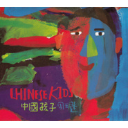

中国孩子Chinese Kids
============================

|  |  |
| :--: | :-- |
| [ 中国孩子Chinese Kids](https://emumo.xiami.com/album/6694) | **艺人**: [周云蓬](../index.md) **语种**: 国语 **唱片公司**: 独立发行 **发行时间**: 2007年04月01日 **专辑类别**: 录音室专辑 **专辑风格**: 新民谣 Neofolk **播放数**: 316881 **收藏数**: 1574 **评论数**: 68  |

## 简介

蛇只能看见运动着的东西，狗的世界是黑白的，蜻蜓的眼睛里有一千个太阳。很多深海里的鱼，眼睛蜕化成了两个白点。能看见什么，不能看见什么，那是我们的宿命。我热爱自己的命运，她跟我最亲，她是专为我开，专为我关的独一无二的门。  
  
某些遥远的地方，一辈子都不可能去。四川有个县叫“白玉”，西藏昌都有个地方叫“也要走”，新疆的“叶尔羌”，湖南的“苍梧”，这些地名撼人心魄，有神态有灵魄，在天之涯海之角他们有隐秘的故事，殷勤地招呼我过去听。但人生苦短，我大概没有时间听所有的故事，如果今生无缘，那就隔着山山水水握一握手。  
  
走在街上，想唱上一句，恰巧旁边的人唱出了那句歌。是什么样的神秘的力量抓住了两颗互不相识的心？音乐是游荡在我们头上的幽灵，它抓住谁，谁就发了疯似的想唱歌，可我怎么才能被它永远抓在手里？我走遍大地或是长久地蜗居一处，白日纵酒黑夜诵经，我呼喊音乐，把我从我的现实生活中拔出来，但常常落空，我只有埋头于生活里，专注地走一步看一步。音乐不在空中，它在泥土里，在蚂蚁的隔壁，在蜗牛的对门。当我们无路可走的时候，当我们说不出来的时候，音乐，愿你降临。  
  
——周云蓬于香山 

## 曲目

- [黄金粥](./6694/fLTj82c0e.md)

## 评论

|  |  |  |  |
| :-- | :-- | :-- | :-- |
|  [虾米用户](https://emumo.xiami.com/u/3684663) 我还没想好要写什么... 2020-06-26 12:27 赞(0) 踩(0) | 
瞎子 诗人 音乐家 艺术家
 |
|  [虾米用户](https://emumo.xiami.com/u/7381227) 全是屁话 2020-04-30 17:29 赞(3) 踩(0) | 
谁能解释下为啥还剩了黄金粥
 |
|  [虾米用户](https://emumo.xiami.com/u/7381227) 全是屁话 2020-04-30 17:28 赞(0) 踩(0) | 
我刚发的评论就 没了   
 |
|  [虾米用户](https://emumo.xiami.com/u/7381227) 全是屁话 2020-04-30 17:24 赞(0) 踩(0) | 
就剩了一首歌yoxi
 |
|  [虾米用户](https://emumo.xiami.com/u/13926891) 说学逗唱 2020-02-27 15:56 赞(0) 踩(0) | 
没有孩子  就没有未来
 |
|  [虾米用户](https://emumo.xiami.com/u/426152980)  2019-09-05 23:17 赞(0) 踩(0) | 
专辑介绍写得好好能看见什么，不能看见什么
 |
|  [虾米用户](https://emumo.xiami.com/u/427095908)  2019-08-24 00:19 赞(0) 踩(0) | 
没了刚刚还有？？
 |
|  [虾米用户](https://emumo.xiami.com/u/16865558) 音乐，你没戏..... 2018-05-17 06:38 赞(0) 踩(0) | 
转让一张中国孩子，正版唱片，未拆。需要私聊 
 |
| ⇒ |  [虾米用户](https://emumo.xiami.com/u/346159714)  2019-12-08 19:58 赞(0) 踩(0) | 
什么价格
 |
| ⇒ |  [虾米用户](https://emumo.xiami.com/u/407980925)  2020-03-10 08:42 赞(0) 踩(0) | 
价
 |
|  [虾米用户](https://emumo.xiami.com/u/314208) 000 2018-04-26 22:32 赞(1) 踩(0) | 
当年一齐买了他五张专辑 
 |
|  [虾米用户](https://emumo.xiami.com/u/24711605) 于是转身向大海走去！ 2018-03-21 09:43 赞(10) 踩(0) | 
最大的讽刺，中国孩子没有中国孩子
 |
|  [虾米用户](https://emumo.xiami.com/u/324663706) 我还没想好要写什么... 2018-03-13 22:36 赞(1) 踩(0) | 
唉 之前还是在qq空间里听到的中国孩子 没想到竟然是第一次也是最后一次听到
 |
|  [虾米用户](https://emumo.xiami.com/u/274350612) 無恥而熱鬧。 2018-01-31 22:28 赞(34) 踩(0) | 
没有中国孩子的中国孩子
 |
|  [虾米用户](https://emumo.xiami.com/u/320374437)   2018-01-23 12:39 赞(1) 踩(0) | 
中国孩子已不在
 |
|  [虾米用户](https://emumo.xiami.com/u/48057973)   2017-12-11 23:12 赞(0) 踩(0) | 
气死我了手抖把网易云的删了，跑来虾米也被删了&amp;hellip;&amp;hellip;
 |
|  [虾米用户](https://emumo.xiami.com/u/235050) 我就说我是穷逼嘛~ 2017-11-27 21:57 赞(0) 踩(0) | 
美滋滋，好五百倍！飘柔，就是这么自信！
 |
|  [虾米用户](https://emumo.xiami.com/u/118150102) 20岁出头的苦日子 2017-11-26 14:48 赞(1) 踩(0) | 
多半是心寒
 |
|  [虾米用户](https://emumo.xiami.com/u/19152275) 你只是个听众 而不是创造... 2017-11-25 12:12 赞(3) 踩(0) | 
民智未开
 |
|  [虾米用户](https://emumo.xiami.com/u/16865558) 音乐，你没戏..... 2017-11-25 10:12 赞(4) 踩(0) | 
不可多得的一张神作。
 |
|  [虾米用户](https://emumo.xiami.com/u/48541390) 签名神马的该过时了吧 2017-11-24 22:01 赞(4) 踩(0) | 
真可以，天天移民广告。 
 |
|  [虾米用户](https://emumo.xiami.com/u/5165221) less is more... 2017-11-24 21:45 赞(3) 踩(0) | 
魔幻主义，寸地皆是
 |
|  [虾米用户](https://emumo.xiami.com/u/29) 耍中偶得 2017-11-24 15:23 赞(3) 踩(0) | 
中国孩子，好自为之。
 |
|  [虾米用户](https://emumo.xiami.com/u/276561734)  2017-11-24 15:00 赞(0) 踩(0) | 
中国孩子。
 |
|  [虾米用户](https://emumo.xiami.com/u/21157616) 如果有些歌始终没唱 2017-11-24 12:46 赞(1) 踩(0) | 
为什么没有中国孩子？？？
 |
|  [虾米用户](https://emumo.xiami.com/u/48854196) 我还没想好要写什么... 2017-11-24 10:32 赞(3) 踩(0) | 
本想再温习一遍中国孩子 可。。
 |
|  [虾米用户](https://emumo.xiami.com/u/280093119) 握紧我矛盾密布的手 2017-11-24 09:02 赞(2) 踩(0) | 
昨天颜色幼儿园的事件又想到了中国孩子
 |
|  [虾米用户](https://emumo.xiami.com/u/10375632)  2017-11-24 08:20 赞(45) 踩(0) | 
十年了&amp;hellip;&amp;hellip;要是歌词能续写，已经满屏写不下了
 |
|  [虾米用户](https://emumo.xiami.com/u/9617076) 我还没想好要写什么... 2017-11-24 02:15 赞(2) 踩(0) | 
中国孩子 三种颜色
 |
|  [虾米用户](https://emumo.xiami.com/u/32412464)   2017-11-24 00:43 赞(10) 踩(0) | 
夜晚，黑暗的被窝里，人们悄悄打开手机，用朋友圈里转发的文章互相确认。有数据显示，今夜我们都是中国孩子
 |
|  [虾米用户](https://emumo.xiami.com/u/33478624) 少女的心事 在夜里发光 2017-11-23 23:08 赞(52) 踩(0) | 
中国孩子里又可以添加新内容了 科科
 |
|  [虾米用户](https://emumo.xiami.com/u/34425550)  2017-11-23 19:37 赞(69) 踩(0) | 
内容已删除
 |
| ⇒ |  [虾米用户](https://emumo.xiami.com/u/5483223)  2017-11-23 23:16 赞(0) 踩(0) | 
就如同中文版小说集肠子删了肠子，引进版异形删了异形
 |
|  [虾米用户](https://emumo.xiami.com/u/11904138)  2017-11-05 11:07 赞(1) 踩(0) | 
让领导先走~
 |
|  [虾米用户](https://emumo.xiami.com/u/293142259) 若我還是不回來 就把我靈... 2017-11-01 14:38 赞(1) 踩(0) | 
中國孩子
 |
|  [虾米用户](https://emumo.xiami.com/u/47004271) 松散生命 2017-10-30 12:32 赞(7) 踩(0) | 
“有时候我想/悲观的极致/或许就是希望的再生”
 |
|  [虾米用户](https://emumo.xiami.com/u/49905125)  2017-10-28 14:38 赞(51) 踩(0) | 
这张专辑少了 中国孩子， 四月旧州少了林昭给母亲的信， 两张专辑就成了没有眼睛的飞龙，没有灵魂的躯体
 |
|  [虾米用户](https://emumo.xiami.com/u/130311942) 默默来听个歌 2017-10-28 00:47 赞(3) 踩(0) | 
刚才看老周的《一席.行到水穷处，偏要大声唱》，我希望有人能在听这些歌之前认真的看一下。
 |
|  [虾米用户](https://emumo.xiami.com/u/43492923) 行到水穷我才开始害怕，夕... 2017-10-05 20:50 赞(0) 踩(0) | 
看到了些什么
 |
|  [虾米用户](https://emumo.xiami.com/u/305679847) …… 2017-07-07 22:28 赞(4) 踩(0) | 
打脸了，不是很自信吗？经不起批评啊
 |
|  [虾米用户](https://emumo.xiami.com/u/170211738) 上帝在开始爱着了 2016-09-18 23:22 赞(0) 踩(0) | 
哎哟好喜欢这张专辑 
 |
|  [虾米用户](https://emumo.xiami.com/u/80032730)  2015-11-05 19:40 赞(0) 踩(0) | 
只这嗓音造就的境界就值得听。
 |
|  [虾米用户](https://emumo.xiami.com/u/13785843) 保持一颗玩世不恭的童心 2015-09-08 01:45 赞(83) 踩(0) | 
内容已删除
 |
| ⇒ |  [虾米用户](https://emumo.xiami.com/u/844220) 我还没想好要写什么... 2017-07-22 11:39 赞(0) 踩(0) | 
十年后我今天第一次听这歌，泪目...
 |
|  [虾米用户](https://emumo.xiami.com/u/45341226)  2015-05-10 15:24 赞(0) 踩(0) | 
我不知道
 |
|  [虾米用户](https://emumo.xiami.com/u/11341787)   2015-04-05 14:25 赞(0) 踩(0) | 

 |
|  [虾米用户](https://emumo.xiami.com/u/24490458) Psyche 2015-03-29 11:45 赞(0) 踩(0) | 
血性
 |
|  [虾米用户](https://emumo.xiami.com/u/2857420) 昨天晚上我梦见你 2015-03-07 17:47 赞(0) 踩(0) | 
前来围观
 |
|  [虾米用户](https://emumo.xiami.com/u/44559650)  2015-03-07 00:09 赞(0) 踩(0) | 
他真是个奇妙的人～
 |
|  [虾米用户](https://emumo.xiami.com/u/629019)  2015-03-06 15:15 赞(0) 踩(0) | 
终于上歌曲了。
 |
|  [虾米用户](https://emumo.xiami.com/u/11265612)  2015-03-06 10:43 赞(0) 踩(0) | 
终于来了T T
 |
|  [虾米用户](https://emumo.xiami.com/u/1618810) 毙 2015-03-06 08:22 赞(0) 踩(0) | 
呜呼！万岁！
 |
|  [虾米用户](https://emumo.xiami.com/u/29249838) Wechat:david... 2015-03-06 00:26 赞(0) 踩(0) | 
终于有了啊
 |
|  [虾米用户](https://emumo.xiami.com/u/9972139) -Welcome to ... 2015-03-05 20:33 赞(0) 踩(0) | 
嗬！来拉！
 |
|  [虾米用户](https://emumo.xiami.com/u/1903574) 抛弃自由，笼中的你和我。 2015-03-05 19:50 赞(0) 踩(0) | 
终于…
 |
|  [虾米用户](https://emumo.xiami.com/u/36057872) 网易/BC: Breat... 2015-03-05 18:09 赞(0) 踩(0) | 
~~~
 |
|  [虾米用户](https://emumo.xiami.com/u/46869909)   2015-03-05 17:40 赞(0) 踩(0) | 
出现了！
 |
|  [虾米用户](https://emumo.xiami.com/u/2104186)  2015-03-05 17:37 赞(0) 踩(0) | 
居然有了
 |
|  [虾米用户](https://emumo.xiami.com/u/134697)  2015-03-05 17:31 赞(0) 踩(0) | 
^_^
 |
|  [虾米用户](https://emumo.xiami.com/u/40531878) 暂无签名~ 2015-03-05 17:25 赞(0) 踩(0) | 
来了！
 |
|  [虾米用户](https://emumo.xiami.com/u/36147268) 苦路第十四处：耶稣死于我... 2015-03-05 17:22 赞(0) 踩(0) | 
嚯。。。
 |
|  [虾米用户](https://emumo.xiami.com/u/1861143) 活出自己比讨好世界更重要 2015-03-05 17:20 赞(0) 踩(0) | 
回来了！
 |
|  [虾米用户](https://emumo.xiami.com/u/1256752)  2010-08-01 23:53 赞(0) 踩(0) | 
下载这张专辑需要多少虾币？
 |
|  [虾米用户](https://emumo.xiami.com/u/512302)   2010-07-18 19:02 赞(0) 踩(0) | 
找得好辛苦
 |
|  [虾米用户](https://emumo.xiami.com/u/973639)  2010-07-09 11:06 赞(0) 踩(0) | 
如果你突然瞎了该怎么办我实在听不下去了 心里憋的慌
 |
|  [虾米用户](https://emumo.xiami.com/u/448599)  2009-10-21 11:13 赞(0) 踩(0) | 
大彻大悟，痛彻心扉
 |
|  [虾米用户](https://emumo.xiami.com/u/414980)  2009-10-10 11:09 赞(1) 踩(0) | 
自然最美。没有假模假样的慵懒，没有矫揉造作的清纯，所以喜欢。
 |
|  [虾米用户](https://emumo.xiami.com/u/326772)  2009-09-28 22:10 赞(0) 踩(0) | 
支持学哥
 |
|  [虾米用户](https://emumo.xiami.com/u/196758)  2009-06-04 18:52 赞(0) 踩(0) | 
非常不错的东东。
 |
|  [虾米用户](https://emumo.xiami.com/u/14834)  2008-12-15 09:46 赞(0) 踩(0) | 
人生苦短且行且歌
 |
