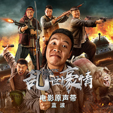

《乱世豪情》电影原声带
============================

|  |  |
| :--: | :-- |
| [ 《乱世豪情》电影原声带](https://emumo.xiami.com/album/2102965319) | **艺人**: [蓝波](../index.md) **语种**: 国语 **唱片公司**: 四平青年 **发行时间**: 2017年12月01日 **专辑类别**: 录音室专辑 **专辑风格**: 国语流行 Mandarin Pop **播放数**: 3116088 **收藏数**: 27 **评论数**: 4  |

## 简介

  
 

《乱世豪情》延续了“二龙湖浩哥”系列电影一贯的“东北喜剧”风格，以诙谐幽默的东北“二人转”抖包袱说段子形式，实则展现了抗日战争早期普通东北人民自发保家卫国的时代缩影。除了主演二龙湖浩哥与“四平兄弟团”张赢、张厦、郑胖、蓝波、李老八外，更邀请到知名演员晋松、日籍演员松田笃儿、田天暦参与演出，中日演员同台飚戏，令各位新老戏骨大呼过瘾。  
 

 
 

《乱世豪情》时代背景为1931年九一八事变，在日本关东军策划下，铁道“守备队”炸毁沈阳柳条湖附近日本修筑的南满铁路路轨，并栽赃嫁祸于中国军队，揭开了日本侵华战争的序幕。本片聚焦于大时代背景下千百个东北乡村中最典型的一个村子，从普通小人物“浩哥”经历从迷茫到坚定、从被误解到被寄托、从“日军走狗”到“抗日战士”成长历程，展现了千万中国人民抗日斗争的缩影。
 

 

## 曲目

## 评论

|  |  |  |
| :-- | :-- | :-- |
|  [虾米用户](https://emumo.xiami.com/u/378790652)  2019-11-04 20:09 赞(0) 踩(0) | 
好听
 |
|  [虾米用户](https://emumo.xiami.com/u/366474711)  2019-06-27 02:50 赞(0) 踩(0) | 
好
 |
|  [虾米用户](https://emumo.xiami.com/u/376904939)  2019-04-03 22:20 赞(0) 踩(0) | 
我希望能有更好的作品
 |
|  [虾米用户](https://emumo.xiami.com/u/78483508) 平平淡淡才是真 2017-12-27 21:55 赞(2) 踩(0) | 
我可以说，浩哥这个电影真的不好看
 |
