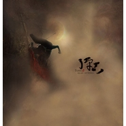

潼关
============================

|  |  |
| :--: | :-- |
| [ 潼关](https://emumo.xiami.com/album/1185364918) | **艺人**: [蔡翊昇](../index.md) **语种**: 国语 **唱片公司**: 独立发行 **发行时间**: 2012年12月24日 **专辑类别**: EP, 单曲 **专辑风格**:  **播放数**: 3 **收藏数**: 21 **评论数**: 0  |

## 简介

《潼关》——【剑三•天策】  
曲：《西狂》—小旭游戏音乐  
词：启翎 – 千城醉歌  
唱/和：贰婶 – 鸾凤鸣  
和声编写：宝物  
后期：织布君  
美工：汀一 

## 曲目

## 评论

