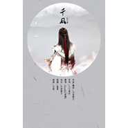

千风
============================

|  |  |
| :--: | :-- |
| [ 千风](https://emumo.xiami.com/album/1196333817) | **艺人**: [蔡翊昇](../index.md) **语种**: 国语 **唱片公司**: 独立发行 **发行时间**: 2013年11月11日 **专辑类别**: EP, 单曲 **专辑风格**: 古风 GuFeng Music **播放数**: 356682 **收藏数**: 81 **评论数**: 7  |

## 简介

千风——记子澹  
  
子澹子澹,人如其名。公子山中人兮,皇家误君。他本该是一介青衣,肆意于山水之间,观日出日落,与青山绿竹为伍。可是命运让他出生于帝王之家。他如夏日的一缕清泉,是这个阴暗朝堂中的唯一一丝甘甜。纵然如此高洁,他却依然要承受了命运带给他的一切苦难。只是他,历经风霜,却依然只是阿妩的子澹。纵然所有人都变了,只有他,永远是那年青衣缓带面带微笑的少年。他以为,只要他执著,就可以找回他的阿妩,他以为,只要他坚持,就可以回到当日风含情水含笑的时光,只是,人生若只如见。这个少年,终究被滚滚大浪所吞没。就算最后青山竹舍的相伴,也不过是身残心死后的苟延残喘。他守了一生,盼了一世,却也只得有山水深处,叹红颜易逝。

## 曲目

## 评论

|  |  |  |
| :-- | :-- | :-- |
|  [虾米用户](https://emumo.xiami.com/u/357477970) 喜欢我的，着来全民K歌互... 2018-04-30 10:41 赞(0) 踩(0) | 
不能在听了，要哭了都
 |
|  [虾米用户](https://emumo.xiami.com/u/2754685)  2015-10-02 10:34 赞(1) 踩(0) | 
欲罢不能停啊
 |
|  [虾米用户](https://emumo.xiami.com/u/28190484) ♡voice♡melod... 2014-12-18 00:40 赞(0) 踩(0) | 
好美～贰婶～
 |
|  [虾米用户](https://emumo.xiami.com/u/7847337)  2014-12-05 15:48 赞(0) 踩(0) | 
贰婶！
 |
|  [虾米用户](https://emumo.xiami.com/u/40327260)  2014-08-25 10:53 赞(0) 踩(0) | 
哀伤
 |
|  [虾米用户](https://emumo.xiami.com/u/6801845)  2014-04-30 10:36 赞(0) 踩(0) | 
很好
 |
|  [虾米用户](https://emumo.xiami.com/u/9007376) 喵丸大魔神 2014-04-02 15:21 赞(0) 踩(0) | 
好听好听，给贰婶顶一个
 |
