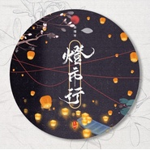

灯市行
============================

|  |  |
| :--: | :-- |
| [ 灯市行](https://emumo.xiami.com/album/2105194840) | **艺人**: [蔡翊昇](../index.md) **语种**: 国语 **唱片公司**: 黑马科技 **发行时间**: 2019年08月30日 **专辑类别**: EP, 单曲 **专辑风格**:  **播放数**: 9208 **收藏数**: 3 **评论数**: 0  |

## 简介

国风唱作人蔡翊昇（贰婶）全新作品《灯市行》发行。《灯市行》展现古代一位俊朗少年在上元夜灯市观灯，看繁华盛景、刹那烟花，深受感触一心想要成就功业的壮志豪情——少年公子骑白马，一夜长安乐无涯；月明楼高需独饮，他朝归来不看花。《灯市行》在保留蔡翊昇（贰婶）个人特色基础上，融合轻摇滚、电音多元曲风，令演绎与聆听酣畅淋漓。  
 

## 曲目

## 评论

|  |  |  |  |
| :-- | :-- | :-- | :-- |
