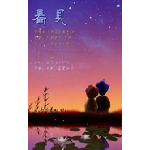

看见
============================

|  |  |
| :--: | :-- |
| [ 看见](https://emumo.xiami.com/album/287791480) | **艺人**: [蔡翊昇](../index.md) **语种**: 国语 **唱片公司**: 独立发行 **发行时间**: 2013年09月20日 **专辑类别**: EP, 单曲 **专辑风格**:  **播放数**: 40980 **收藏数**: 37 **评论数**: 1  |

## 简介

《看见》广播剧天王番外ED  
  
策划：即离若亡 墨玖   
原曲：感激遇到你  
填词：Pavane A·G Orison （小鱼萝莉 ）  
演唱：贰婶&amp;小义  
后期：三星堆后期组  
海报：千风 真夏 みゆ 

## 曲目

## 评论

|  |  |  |  |
| :-- | :-- | :-- | :-- |
|  [虾米用户](https://emumo.xiami.com/u/12086596) 我这人很轴 2014-05-14 17:39 赞(0) 踩(0) | 
很好听 那种慢慢的娓娓道来的感觉很好
 |
