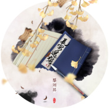

蔡翊昇
============================

|  |  |
| :--: | :-- |
| [ 蔡翊昇](https://i.xiami.com/cccces) | **播放数**: 4988807 **粉丝数**: 7576 **评论数**: 161 **地区**: China 中国大陆 **风格**: 古风 GuFeng Music  |

## 档案

所属团队：鸾凤鸣原创音乐团队声部 
蔡翊昇 (贰婶 / CcccEs)，网络歌手，知名古风音乐唱作人。鸾凤鸣原创音乐团队成员。代表作有《长绝》《盗墓笔记·痕迹》《无脚鸟》《花间辞》《一世长安》。2014年个人第一张原创古风专辑《不贰》发行中。

## 专辑

| 名称 | 语种 | 唱片公司 | 发行时间 | 专辑类别 | 专辑风格 |
| :--: | :-- | :-- | :-- | :-- | :-- |
| [ 戏奉先](./albums/5021658111.md) | 国语 | 独立乐 | 2020年09月25日 | EP, 单曲 | 国语流行 Mandarin Pop, 中国风 China-Wave |
| [ 冬拾](./albums/2106059778.md) | 国语 | 网易云音乐 | 2020年02月16日 | EP, 单曲 |  |
| [ 不完美](./albums/2106072866.md) | 国语 | 独立发行 | 2020年02月02日 | EP, 单曲 |  |
| [ 长安遥想](./albums/2105258112.md) | 国语 | 黑马科技 | 2019年09月20日 | EP, 单曲 |  |
| [ 空](./albums/2105236186.md) | 国语 | Live Music | 2019年09月12日 | EP, 单曲 |  |
| [ 灯市行](./albums/2105194840.md) | 国语 | 黑马科技 | 2019年08月30日 | EP, 单曲 |  |
| [ 假面自白](./albums/2105160837.md) | 国语 | Live Music | 2019年08月20日 | EP, 单曲 |  |
| [ 一首想不通的古风](./albums/2103468030.md) | 国语 | 看见文娱 | 2018年01月05日 | EP, 单曲 | 古风 GuFeng Music |
| [ 如何征服心机喵橙光OST](./albums/2103467609.md) | 国语 | 橙光游戏 | 2018年01月04日 | 录音室专辑 | 流行 Pop, 国语流行 Mandarin Pop |
| [ 仙侠世界 2](./albums/2102857349.md) | 国语 | 次元文化 | 2017年09月15日 | EP, 单曲 | 中国风 China-Wave, 古风 GuFeng Music |
| [ 幻境](./albums/2102762379.md) | 国语 | 千幻信息 | 2017年06月09日 | EP, 单曲 | 古风 GuFeng Music |
| [ 云巅长歌](./albums/2102700773.md) | 国语 | 鸾凤鸣原创音乐 | 2017年02月26日 | EP, 单曲 |  |
| [ 千风](./albums/1196333817.md) | 国语 | 独立发行 | 2013年11月11日 | EP, 单曲 | 古风 GuFeng Music |
| [ 看见](./albums/287791480.md) | 国语 | 独立发行 | 2013年09月20日 | EP, 单曲 |  |
| [ 三十而遇](./albums/1760214531.md) | 国语 | 独立发行 | 2013年01月30日 | EP, 单曲 |  |
| [ 梦望断](./albums/575360.md) | 国语 | 鸾凤鸣原创音乐团队 | 2013年01月26日 | EP, 单曲 | 古风 GuFeng Music |
| [ 烟火的季节](./albums/161330253.md) | 国语 | 独立发行 | 2013年01月23日 | EP, 单曲 |  |
| [ 潼关](./albums/1185364918.md) | 国语 | 独立发行 | 2012年12月24日 | EP, 单曲 |  |
| [ 盗墓笔记·痕迹](./albums/575359.md) | 国语 | 鸾凤鸣原创音乐团队 | 2012年11月17日 | EP, 单曲 | 古风 GuFeng Music |
| [ 月弯弯](./albums/1990380834.md) | 国语 | 独立发行 | 2012年09月17日 | EP, 单曲 | 古风 GuFeng Music |
| [ 仙剑一同人歌](./albums/1769104248.md) | 国语 | 鸾凤鸣 | 2012年05月21日 | 合集, 杂锦 |  |
| [ 须臾广播剧《江影沉浮》第二集ED](./albums/575680.md) | 国语 | 独立发行 | 2012年03月30日 | EP, 单曲 | 古风 GuFeng Music |
| [ 浅浅的心广播剧天籁纸鸢《天王》ED](./albums/575380.md) | 国语 | 鸾凤鸣 | 2012年01月08日 | EP, 单曲 |  |
| [ 一世长安](./albums/896334150.md) | 国语 | 独立发行 | 2011年09月15日 | EP, 单曲 |  |

## 评论

|  |  |  |  |
| :-- | :-- | :-- | :-- |
|  [虾米用户](https://emumo.xiami.com/u/2796166) 最爱莫文蔚..... 2020-11-04 04:00 赞(1) 踩(0) | 
加油 很好听呀
 |
|  [虾米用户](https://emumo.xiami.com/u/13979322) 一手行愿千手护持 2020-02-28 00:25 赞(1) 踩(0) | 
听了这么多年的音乐还不知要在哪儿关注 看来这些年对古代艺术品的研究导致跟现代科技不大贴合了 电子产品软件至今还不大会用 高科技的时代看来得花点儿时间学习了 
 |
|  [虾米用户](https://emumo.xiami.com/u/426647003)  2019-12-22 16:44 赞(1) 踩(0) | 
看看我发现了什么嘿嘿嘿o(^▽^)o
 |
|  [虾米用户](https://emumo.xiami.com/u/375311355) 猜猜头像是谁 2019-11-29 16:38 赞(4) 踩(0) | 
所以你是有两个号吗……然后就成功的把我彻底给搞蒙了
 |
|  [虾米用户](https://emumo.xiami.com/u/430307085)  2019-10-18 22:48 赞(6) 踩(0) | 
太爱你了，贰婶，喜欢你是从你参加国风美少年开始，虽然时间不长，但你唱过的每一首歌我都听过，我得你是一个忧郁与英雄气概并存的人，你的眼里有一种让我特别心动的感觉。希望你的歌唱道路能走得更好。你是我的四月天。
 |
|  [虾米用户](https://emumo.xiami.com/u/427314805) 这个人太帅了，什么也没写... 2019-07-23 16:36 赞(2) 踩(0) | 
想听哪吒啊TAT
 |
|  [虾米用户](https://emumo.xiami.com/u/5045815) 终有一天猫狗双全 2019-05-10 12:33 赞(1) 踩(0) | 
没有燎原
 |
|  [虾米用户](https://emumo.xiami.com/u/335431201)  2019-05-09 09:24 赞(1) 踩(0) | 
好多歌曲没有哦……
 |
|  [虾米用户](https://emumo.xiami.com/u/10089084) 音乐，心理，写作，动漫，... 2019-05-07 18:12 赞(2) 踩(0) | 
这个声音我真是没有抵抗力
 |
|  [虾米用户](https://emumo.xiami.com/u/85568296) 只有阳光而无阴影 只有欢... 2019-04-12 15:59 赞(2) 踩(0) | 
想不通的古风 
 |
|  [虾米用户](https://emumo.xiami.com/u/333278698)  2019-03-25 23:13 赞(3) 踩(0) | 
好有灵性的声音，好喜欢，一听就迷上了
 |
|  [虾米用户](https://emumo.xiami.com/u/333278698)  2019-03-25 23:12 赞(2) 踩(0) | 
好有灵性的声音，好喜欢，一听就迷上了
 |
|  [虾米用户](https://emumo.xiami.com/u/270815092) 刻命学习 2019-02-09 22:23 赞(1) 踩(0) | 
贰婶声音真好。喜欢
 |
|  [虾米用户](https://emumo.xiami.com/u/72975706)  2019-02-09 21:16 赞(1) 踩(0) | 
此心不贰 此情唯一
 |
|  [虾米用户](https://emumo.xiami.com/u/412946535) 有风自南，万家灯火 2019-01-30 23:23 赞(1) 踩(0) | 
提前祝贰婶新年快乐！
 |
|  [虾米用户](https://emumo.xiami.com/u/281457015)  2019-01-30 20:05 赞(2) 踩(0) | 
声音实在好听！！
 |
|  [虾米用户](https://emumo.xiami.com/u/43875708)  遣词造句 穿山过水 他... 2018-12-23 23:10 赞(1) 踩(0) | 
哪吒和悟空都听不到 还怎么听
 |
|  [虾米用户](https://emumo.xiami.com/u/328882166) 天地与我并生，万物与我为... 2018-11-18 11:11 赞(1) 踩(0) | 
  
 |
|  [虾米用户](https://emumo.xiami.com/u/352608629) 我还没想好要写什么... 2018-08-01 13:20 赞(1) 踩(0) | 
想听 悟空
 |
|  [虾米用户](https://emumo.xiami.com/u/376864764)  2018-06-27 06:18 赞(3) 踩(0) | 
他的音乐天赋很好的，声音比鹿唅动听。^&amp;omega;^~@^_^@~
 |
|  [虾米用户](https://emumo.xiami.com/u/208381899) 生如夏花之绚烂，死如秋叶... 2018-06-17 13:22 赞(0) 踩(0) | 
话说，有谁知道【南烟斋笔录 昙逝】配乐吗
 |
|  [虾米用户](https://emumo.xiami.com/u/140926744)  2018-02-09 14:58 赞(2) 踩(0) | 
贰婶，你的声音怎么就这么好听呢  
 |
| ⇒ |  [虾米用户](https://emumo.xiami.com/u/118760198) 我还没想好要写什么... 2018-04-30 17:25 赞(0) 踩(0) | 
是因为长得帅
 |
|  [虾米用户](https://emumo.xiami.com/u/269882438)  2018-01-06 22:20 赞(2) 踩(0) | 
你唱的好好听，挺你
 |
|  [虾米用户](https://emumo.xiami.com/u/334697487) 我还没想好要写什么... 2017-12-08 16:41 赞(1) 踩(0) | 
贰婶的声音一直是心头好，可惜这边歌好少
 |
|  [虾米用户](https://emumo.xiami.com/u/335200288)  2017-11-14 06:37 赞(1) 踩(0) | 
这里没有悟空
 |
|  [虾米用户](https://emumo.xiami.com/u/34616381) ^-^ 2017-10-27 23:55 赞(1) 踩(0) | 
听了《光明之子》，对大明教的尊敬瞬间突.破.天.际~
 |
|  [虾米用户](https://emumo.xiami.com/u/257965929) 我还没想好要写什么... 2017-09-11 21:43 赞(0) 踩(0) | 
没有石楠小札 
 |
|  [虾米用户](https://emumo.xiami.com/u/264446284)  2017-07-30 11:37 赞(0) 踩(0) | 
贰婶!
 |
|  [虾米用户](https://emumo.xiami.com/u/276876986)  2017-07-29 18:23 赞(0) 踩(0) | 
怎么还有男生啊，我喜欢女生唱的，男生的嗓音听着对这首歌拉低了很多
 |
|  [虾米用户](https://emumo.xiami.com/u/284953981)  2017-07-19 14:16 赞(0) 踩(0) | 
↖(^&amp;omega;^)↗
 |
|  [虾米用户](https://emumo.xiami.com/u/262674962)  2017-07-05 21:00 赞(0) 踩(0) | 
表白贰婶
 |
|  [虾米用户](https://emumo.xiami.com/u/272668969)   2017-06-15 15:37 赞(0) 踩(0) | 
真爱粉，绝对的～
 |
|  [虾米用户](https://emumo.xiami.com/u/272668969)   2017-06-15 15:36 赞(1) 踩(0) | 
超喜欢的～
 |
|  [虾米用户](https://emumo.xiami.com/u/300693584)  2017-06-06 13:32 赞(0) 踩(0) | 
汕头人在此哈哈哈哈哈哈
 |
|  [虾米用户](https://emumo.xiami.com/u/262674962)  2017-05-20 18:20 赞(0) 踩(0) | 
贰婶，听了一年了
 |
|  [虾米用户](https://emumo.xiami.com/u/285436557) 青梅枯萎，竹马老去，从此... 2017-05-13 20:01 赞(2) 踩(0) | 
贰婶的音乐听了耳朵会怀孕哦（正经脸）^(oo)^
 |
|  [虾米用户](https://emumo.xiami.com/u/12011524) 张艺兴 贰婶的歌曲一点都... 2017-05-10 08:54 赞(1) 踩(0) | 
某人估计 有可能密码忘记了   好久没更新了
 |
|  [虾米用户](https://emumo.xiami.com/u/115813262)  千万人总有相和。 2017-04-30 07:22 赞(0) 踩(0) | 
好声音。
 |
|  [虾米用户](https://emumo.xiami.com/u/115813262)  千万人总有相和。 2017-04-30 07:22 赞(0) 踩(0) | 
梦忘断
 |
|  [虾米用户](https://emumo.xiami.com/u/292281344)  2017-04-29 12:42 赞(0) 踩(0) | 
第一次听一身诗意千寻瀑就被吸引了，贰婶贼美，大爱！
 |
|  [虾米用户](https://emumo.xiami.com/u/276521318)  2017-03-30 22:57 赞(0) 踩(0) | 

 |
|  [虾米用户](https://emumo.xiami.com/u/93479994)  2017-02-18 04:55 赞(1) 踩(0) | 
贰婶   汕头的，潮汕人，哇，，，滴麻麻呀，好想偶遇
 |
| ⇒ |  [虾米用户](https://emumo.xiami.com/u/12011524) 张艺兴 贰婶的歌曲一点都... 2017-05-10 08:55 赞(0) 踩(0) | 
他现在 好像在南京.....
 |
|  [虾米用户](https://emumo.xiami.com/u/44274872)   2017-02-07 13:44 赞(1) 踩(0) | 
没有不贰这张砖啊 最好听的一张居然没有
 |
|  [虾米用户](https://emumo.xiami.com/u/263317762)  2017-01-20 03:03 赞(1) 踩(0) | 
湖心亭
 |
|  [虾米用户](https://emumo.xiami.com/u/264675378)  2017-01-20 02:25 赞(0) 踩(0) | 
悟空啊！
 |
|  [虾米用户](https://emumo.xiami.com/u/264675378)  2017-01-20 02:24 赞(0) 踩(0) | 
悟空呢！！！
 |
|  [虾米用户](https://emumo.xiami.com/u/251112574) 天清浅，且行且恋 2017-01-15 17:37 赞(0) 踩(0) | 
此心不贰此情唯一
 |
|  [虾米用户](https://emumo.xiami.com/u/9693054) 3.1415926535 2016-11-23 11:48 赞(0) 踩(0) | 
先锋awwww
 |
|  [虾米用户](https://emumo.xiami.com/u/227069914)  2016-11-12 16:29 赞(0) 踩(0) | 
喜歡
 |
|  [虾米用户](https://emumo.xiami.com/u/233159488)  2016-10-20 19:16 赞(1) 踩(0) | 
悟空悟空
 |
|  [虾米用户](https://emumo.xiami.com/u/93226796) 只见雪色映衣袂，抚琴月显... 2016-09-15 08:51 赞(0) 踩(0) | 
那首悟空呢？
 |
|  [虾米用户](https://emumo.xiami.com/u/149280822)  2016-07-07 21:53 赞(0) 踩(0) | 
我看好你
 |
|  [虾米用户](https://emumo.xiami.com/u/149280822)  2016-07-07 21:53 赞(0) 踩(0) | 
加油吧！
 |
|  [虾米用户](https://emumo.xiami.com/u/125426586) 我一直都在流浪 2016-05-31 19:15 赞(17) 踩(0) | 
大家好我是贰婶的痴汉(迷妹)
 |
| ⇒ |  [虾米用户](https://emumo.xiami.com/u/281806876)  2017-03-30 19:14 赞(0) 踩(0) | 
非常感谢！
 |
|  [虾米用户](https://emumo.xiami.com/u/5632897)  2016-05-10 03:51 赞(0) 踩(0) | 
哇咔咔~
 |
|  [虾米用户](https://emumo.xiami.com/u/149327976)  2016-04-24 10:26 赞(0) 踩(0) | 
好听 不过须臾真心不适合  
 |
|  [虾米用户](https://emumo.xiami.com/u/149327976)  2016-04-24 10:24 赞(0) 踩(0) | 
心醉ψ(｀∇´)
 |
|  [虾米用户](https://emumo.xiami.com/u/55786008) 听歌品人生 2016-03-13 11:16 赞(1) 踩(0) | 
有颜，有才。贰婶不火才怪！ 加油！
 |
|  [虾米用户](https://emumo.xiami.com/u/103376650)  2016-02-04 09:39 赞(1) 踩(0) | 
我想要一身诗意三千瀑 
 |
|  [虾米用户](https://emumo.xiami.com/u/103376650)  2016-02-04 09:37 赞(1) 踩(0) | 
贰婶。。。
 |
|  [虾米用户](https://emumo.xiami.com/u/51945345) 莫听穿林打叶声，何妨吟啸... 2016-01-14 09:52 赞(2) 踩(0) | 
居然没有悟空 
 |
| ⇒ |  [虾米用户](https://emumo.xiami.com/u/187617264) 不要试图接近我 2016-09-04 00:45 赞(0) 踩(0) | 
想听悟空
 |
|  [虾米用户](https://emumo.xiami.com/u/40182426) -三生宿命三生缘忘川摆渡... 2016-01-13 21:30 赞(0) 踩(0) | 
每次听都听不够。
 |
|  [虾米用户](https://emumo.xiami.com/u/25227486) 天气真不错，去晒太阳吧！ 2015-12-27 16:38 赞(0) 踩(0) | 
悟空
 |
|  [虾米用户](https://emumo.xiami.com/u/48611300)  2015-12-16 19:08 赞(0) 踩(0) | 
有倾城之恋吗，好喜欢那首
 |
|  [虾米用户](https://emumo.xiami.com/u/55259168)  2015-11-03 21:32 赞(2) 踩(0) | 
居然没有悟空
 |
|  [虾米用户](https://emumo.xiami.com/u/77416938) 谈梦笑 2015-10-28 12:11 赞(1) 踩(0) | 
加油↖(^ω^)↗呦
 |
|  [虾米用户](https://emumo.xiami.com/u/76313012) cn   cn   cn... 2015-10-24 22:32 赞(0) 踩(0) | 
没有粤语版的那个石楠？
 |
| ⇒ |  [虾米用户](https://emumo.xiami.com/u/51695214) 不至于像无头苍蝇一样盲目 2015-11-26 11:16 赞(0) 踩(0) | 
那不是邓丽欣的 电灯胆 吗
 |
| ⇒ |  [虾米用户](https://emumo.xiami.com/u/1625841)  2016-02-29 12:22 赞(0) 踩(0) | 
<q><b>牛屁股说：</b></q>
 |
|  [虾米用户](https://emumo.xiami.com/u/49474485) 为他们心疼 2015-10-22 22:33 赞(1) 踩(0) | 
每次听你你的歌，都有种莫名的伤感，好想一辈子听着你温柔的声音，听着你唱的歌。
 |
|  [虾米用户](https://emumo.xiami.com/u/49474485) 为他们心疼 2015-10-17 23:31 赞(1) 踩(0) | 
温柔的嗓音，听多少遍也不会觉得腻，每一首歌都可以单曲循环好久。听歌的时候真的觉得你是有真感情投入在里面的，娓娓道来。见到真人的时候，便更觉得你是个温柔的人了，浅浅的笑着，温柔的说些“没事”，真是要让人醉了。
 |
|  [虾米用户](https://emumo.xiami.com/u/49474485) 为他们心疼 2015-10-17 23:25 赞(1) 踩(0) | 
我家贰婶怎么才这么点评论……没关系，反正我喜欢你就好。
 |
|  [虾米用户](https://emumo.xiami.com/u/52193537)  2015-09-21 00:59 赞(0) 踩(0) | 
二婶男神我来啦
 |
|  [虾米用户](https://emumo.xiami.com/u/7012483)  2015-09-14 21:33 赞(1) 踩(0) | 
居然没悟空？
 |
|  [虾米用户](https://emumo.xiami.com/u/55115562)    随性就好 2015-09-08 20:26 赞(0) 踩(0) | 
喜欢你的声音
 |
|  [虾米用户](https://emumo.xiami.com/u/55115562)    随性就好 2015-09-08 20:26 赞(0) 踩(0) | 
喜欢你的声音
 |
|  [虾米用户](https://emumo.xiami.com/u/42631018) I music 2015-09-08 19:36 赞(0) 踩(0) | 
悟空！
 |
|  [虾米用户](https://emumo.xiami.com/u/60869592) 蜗牛酱酱 2015-09-04 21:31 赞(0) 踩(0) | 
很喜欢你的歌，希望能在虾米音乐看到你更多的作品哦。
 |
|  [虾米用户](https://emumo.xiami.com/u/44375658) 恋爱中… 2015-08-25 13:00 赞(0) 踩(0) | 
悟空 悟空 悟空
 |
|  [虾米用户](https://emumo.xiami.com/u/1362946) 我多想找到你 2015-08-07 00:04 赞(0) 踩(0) | 
悟空呢？
 |
|  [虾米用户](https://emumo.xiami.com/u/40342486) 四月，我说了一个谎，然后... 2015-08-04 07:04 赞(0) 踩(0) | 
说好的悟空呢。。。
 |
|  [虾米用户](https://emumo.xiami.com/u/51759030)    你曾是少年‖ 2015-08-02 15:17 赞(0) 踩(0) | 
同求悟空！！！！
 |
|  [虾米用户](https://emumo.xiami.com/u/51759030)    你曾是少年‖ 2015-08-02 15:17 赞(0) 踩(0) | 
同求悟空！！！！
 |
|  [虾米用户](https://emumo.xiami.com/u/49389462) 只愿宇宙中的星点能遇见地... 2015-08-01 22:18 赞(0) 踩(0) | 
此心不贰，此情唯一。
 |
|  [虾米用户](https://emumo.xiami.com/u/54198266)  2015-08-01 19:05 赞(0) 踩(0) | 
喜欢他的声音
 |
|  [虾米用户](https://emumo.xiami.com/u/54198266)  2015-08-01 18:59 赞(0) 踩(0) | 
就是喜欢
 |
|  [虾米用户](https://emumo.xiami.com/u/47579930)  2015-07-30 20:00 赞(0) 踩(0) | 
悟空
 |
|  [虾米用户](https://emumo.xiami.com/u/47579930)  2015-07-30 20:00 赞(0) 踩(0) | 
悟空。
 |
|  [虾米用户](https://emumo.xiami.com/u/53688737) 卖药郎窝要给你生猴子！【 2015-07-28 11:31 赞(0) 踩(0) | 
大爱贰婶声线！w
 |
|  [虾米用户](https://emumo.xiami.com/u/51624023)  我不是来自00后的男生... 2015-07-27 00:41 赞(0) 踩(0) | 
很好听，不错  
 |
|  [虾米用户](https://emumo.xiami.com/u/40342486) 四月，我说了一个谎，然后... 2015-07-26 16:25 赞(0) 踩(0) | 
求悟空!!!!!!!!!!
 |
|  [虾米用户](https://emumo.xiami.com/u/1263948)  2015-07-23 22:26 赞(0) 踩(0) | 
悟空……
 |
|  [虾米用户](https://emumo.xiami.com/u/5555714) 酆都竹海 2015-07-21 19:30 赞(0) 踩(0) | 
为什么我在酷我音乐上搜到大圣的那首歌叫不贰而不是悟空。。。。
 |
|  [虾米用户](https://emumo.xiami.com/u/40039627) 暂无签名~ 2015-07-21 15:05 赞(0) 踩(0) | 
悟空
 |
|  [虾米用户](https://emumo.xiami.com/u/23775851)  2015-07-21 11:03 赞(0) 踩(0) | 
求悟空！！！！！！！
 |
|  [虾米用户](https://emumo.xiami.com/u/2516667)  2015-07-20 22:14 赞(0) 踩(0) | 
求悟空！！！！
 |
|  [虾米用户](https://emumo.xiami.com/u/16437818) 暂无签名~ 2015-07-20 15:45 赞(0) 踩(0) | 
竟然没有悟空
 |
|  [虾米用户](https://emumo.xiami.com/u/9312874)  2015-07-20 08:24 赞(0) 踩(0) | 
求悟空！
 |
|  [虾米用户](https://emumo.xiami.com/u/10212941) 这家伙很聪明什么也没留下... 2015-07-19 22:49 赞(0) 踩(0) | 
悟空啊啊啊啊！！
 |
|  [虾米用户](https://emumo.xiami.com/u/46006507)  2015-07-19 18:39 赞(0) 踩(0) | 
悟空啊！！！！！！
 |
|  [虾米用户](https://emumo.xiami.com/u/45118847) 如泣，且歌 2015-07-18 16:40 赞(0) 踩(0) | 
悟空……
 |
|  [虾米用户](https://emumo.xiami.com/u/37568307) Be your own ... 2015-07-16 23:56 赞(1) 踩(0) | 
看了大圣归来，想听悟空
 |
|  [虾米用户](https://emumo.xiami.com/u/6440693) 我爱贝多芬 2015-07-16 13:26 赞(1) 踩(0) | 
悟空啊，快传上来啊，我要悟空！！
 |
|  [虾米用户](https://emumo.xiami.com/u/6440693) 我爱贝多芬 2015-07-16 13:26 赞(1) 踩(0) | 
悟空啊，快传上来啊，我要悟空！！
 |
|  [虾米用户](https://emumo.xiami.com/u/34391167) 无常即有常，无需介怀。 2015-07-16 03:10 赞(1) 踩(0) | 
我要悟空！！
 |
|  [虾米用户](https://emumo.xiami.com/u/43496577) 暂无签名~ 2015-07-14 10:38 赞(0) 踩(0) | 
贰婶终于嫁出去了ԅ(¯ㅂ¯ԅ)
 |
|  [虾米用户](https://emumo.xiami.com/u/51706781)  2015-06-26 00:19 赞(0) 踩(0) | 
很好听
 |
|  [虾米用户](https://emumo.xiami.com/u/50833849) 譬如昨日死 2015-06-19 13:20 赞(0) 踩(0) | 
二婶！
 |
|  [虾米用户](https://emumo.xiami.com/u/44802719) 心不动，不动则不伤 2015-05-15 09:05 赞(1) 踩(0) | 
三十而遇，喜欢。
 |
|  [虾米用户](https://emumo.xiami.com/u/47396806)  2015-03-06 23:43 赞(1) 踩(0) | 
为什么没有悟空！好想听悟空    湖心亭是路转粉的歌！
 |
|  [虾米用户](https://emumo.xiami.com/u/4400366) 再也不见 2015-02-17 00:33 赞(0) 踩(0) | 
。
 |
|  [虾米用户](https://emumo.xiami.com/u/13867738)  2014-12-01 03:21 赞(0) 踩(0) | 
喜欢！
 |
|  [虾米用户](https://emumo.xiami.com/u/14482310) 物情今已见，从此欲无言。 2014-10-08 23:51 赞(0) 踩(0) | 
贰货头子
 |
|  [虾米用户](https://emumo.xiami.com/u/11704349) 一世长安 2014-10-04 21:00 赞(0) 踩(0) | 
哦~希望虾米勤劳一点多搬一些贰婶的歌哦~
 |
|  [虾米用户](https://emumo.xiami.com/u/9619198) 蛋疼君~ 2014-09-18 19:59 赞(0) 踩(0) | 
贰婶为啥不上这发不贰qwq
 |
|  [虾米用户](https://emumo.xiami.com/u/7539235)  2014-09-18 10:15 赞(0) 踩(0) | 
二婶
 |
|  [虾米用户](https://emumo.xiami.com/u/9218947)  2014-08-25 10:38 赞(0) 踩(0) | 
喜欢中国风
 |
|  [虾米用户](https://emumo.xiami.com/u/2764939) 暂无签名~ 2014-08-17 15:57 赞(0) 踩(0) | 
贰婶的声音真的太赞了～～～
 |
|  [虾米用户](https://emumo.xiami.com/u/5826184)  2014-07-29 13:57 赞(0) 踩(0) | 
听了痕迹跑了过来 看了看评论还有好多放上来啦wwww要听
 |
|  [虾米用户](https://emumo.xiami.com/u/38583974) 我只是宅腐基的搬运工 2014-07-22 14:08 赞(0) 踩(0) | 
ccces的声音太棒了，支持你！
 |
|  [虾米用户](https://emumo.xiami.com/u/39202341)  2014-07-21 13:31 赞(0) 踩(0) | 
贰贰贰，都是贰婶的错~
 |
|  [虾米用户](https://emumo.xiami.com/u/38923533) 暂无签名~ 2014-07-18 15:45 赞(0) 踩(0) | 
没有青岩梦罢，很喜欢这个呢~T_T
 |
|  [虾米用户](https://emumo.xiami.com/u/39033082)  2014-07-15 22:54 赞(0) 踩(0) | 
声音真棒
 |
|  [虾米用户](https://emumo.xiami.com/u/34042334) 霜楓醉 2014-07-13 14:34 赞(0) 踩(0) | 
GOOD
 |
|  [虾米用户](https://emumo.xiami.com/u/38850785)  2014-07-10 10:14 赞(0) 踩(0) | 
贰婶
 |
|  [虾米用户](https://emumo.xiami.com/u/7923879) 以乐悟此生 2014-07-07 11:39 赞(0) 踩(0) | 
无法抗拒的嗓音~
 |
|  [虾米用户](https://emumo.xiami.com/u/37683948)  2014-06-24 08:45 赞(0) 踩(0) | 
贰婶的脑残粉！那么多歌都放上来啊！
 |
|  [虾米用户](https://emumo.xiami.com/u/31493754) 贰货党一枚^_^ 2014-06-15 16:08 赞(0) 踩(0) | 
最爱[痕迹]啦，还有[光明之子]~走过路过千万不要错过啊啊啊啊啊啊顶贰婶
 |
|  [虾米用户](https://emumo.xiami.com/u/13347787)  2014-06-12 19:53 赞(0) 踩(0) | 
很喜欢啊！一世长安惊艳到我了！！为什么虾米这里不上传？
 |
|  [虾米用户](https://emumo.xiami.com/u/6975678) 生命如此短暂我比烟花灿烂 2014-05-31 22:01 赞(0) 踩(0) | 
喜欢《陆年》那首！
 |
|  [虾米用户](https://emumo.xiami.com/u/4175363)   2014-05-31 00:07 赞(0) 踩(0) | 
来舔prprpr
 |
|  [虾米用户](https://emumo.xiami.com/u/1008170) 音乐杂食者 2014-05-15 19:27 赞(0) 踩(0) | 
超喜欢的风格，支持贰婶！
 |
|  [虾米用户](https://emumo.xiami.com/u/34278586)  2014-04-26 12:59 赞(0) 踩(0) | 
喜歡你的聲音，什麼歌都好聽
 |
|  [虾米用户](https://emumo.xiami.com/u/347473) 闭站前好友打捞计划正式启... 2014-04-13 22:36 赞(0) 踩(0) | 
围观贰婶男神！！男神！！窝是泥的脑残粉！！！么么哒！！贰婶要一直帅（er）下去哦！！！
 |
|  [虾米用户](https://emumo.xiami.com/u/1239241) 畅游书海中 2014-04-13 11:08 赞(0) 踩(0) | 
围观贰婶
 |
|  [虾米用户](https://emumo.xiami.com/u/1239241) 畅游书海中 2014-04-13 11:07 赞(0) 踩(0) | 
贰婶入驻虾米了~万岁！
 |
|  [虾米用户](https://emumo.xiami.com/u/35218535)  2014-04-13 10:27 赞(186) 踩(0) | 
我刚入驻了虾米音乐人，欢迎大家来我的个人主页，收听我的最新音乐
 |
| ⇒ |  [虾米用户](https://emumo.xiami.com/u/1468882)  2014-05-04 14:19 赞(0) 踩(0) | 
贰婶来虾米了~好嗨森~~
 |
| ⇒ |  [虾米用户](https://emumo.xiami.com/u/49180369) 走的最急的都是最美的时光 2015-07-28 21:05 赞(0) 踩(0) | 
求悟空！！！
 |
| ⇒ |  [虾米用户](https://emumo.xiami.com/u/49180369) 走的最急的都是最美的时光 2015-07-28 21:05 赞(0) 踩(0) | 
求悟空！！！
 |
| ⇒ |  [虾米用户](https://emumo.xiami.com/u/84838846)  2015-11-20 19:26 赞(0) 踩(0) | 
贰婶你咋不入住网易云？！！！！
 |
| ⇒ |  [虾米用户](https://emumo.xiami.com/u/84838846)  2015-11-20 19:30 赞(0) 踩(0) | 
虾米里你的歌好少，我回网易云听去了 
 |
| ⇒ |  [虾米用户](https://emumo.xiami.com/u/25134201)  2017-04-23 22:39 赞(0) 踩(0) | 
你好，喜欢你
 |
| ⇒ |  [虾米用户](https://emumo.xiami.com/u/12011524) 张艺兴 贰婶的歌曲一点都... 2017-08-15 08:24 赞(0) 踩(0) | 
<q><b>熙羽说：</b></q>
 |
|  [虾米用户](https://emumo.xiami.com/u/11052613) 阳光猛烈，万物显形。 2014-04-04 20:51 赞(0) 踩(0) | 
不二不二
 |
|  [虾米用户](https://emumo.xiami.com/u/11052613) 阳光猛烈，万物显形。 2014-04-04 20:51 赞(0) 踩(0) | 
最爱千樽雪
 |
|  [虾米用户](https://emumo.xiami.com/u/16060190) xiao 2014-03-08 19:03 赞(1) 踩(0) | 
公的！？
 |
|  [虾米用户](https://emumo.xiami.com/u/11346552) 成为比现在自己更好的人吧 2014-02-09 17:42 赞(0) 踩(0) | 
有感情的声音
 |
|  [虾米用户](https://emumo.xiami.com/u/32045133)  2014-01-23 07:41 赞(0) 踩(0) | 
伤感
 |
|  [虾米用户](https://emumo.xiami.com/u/22696279)  2013-09-22 17:31 赞(0) 踩(0) | 
原来这是唱 浅浅的心 的 → →
 |
|  [虾米用户](https://emumo.xiami.com/u/17768629) 听一场雨，用一段时光等你 2013-07-21 07:29 赞(0) 踩(0) | 
..
 |
|  [虾米用户](https://emumo.xiami.com/u/15440228)  2013-07-05 11:41 赞(0) 踩(0) | 
很喜欢贰婶的声音啊
 |
|  [虾米用户](https://emumo.xiami.com/u/3186478) 我还没想好要写什么... 2013-05-27 22:24 赞(0) 踩(0) | 
喜欢贰婶的声音，求《月弯弯》~
 |
| ⇒ |  [虾米用户](https://emumo.xiami.com/u/11427127)   2014-01-31 10:22 赞(0) 踩(0) | 
月弯弯来了！妹子别嫌晚哟～昨天刚过审233
 |
| ⇒ |  [虾米用户](https://emumo.xiami.com/u/3186478) 我还没想好要写什么... 2014-02-01 01:03 赞(0) 踩(0) | 
<q><b>Yale遥说：</b></q>
 |
|  [虾米用户](https://emumo.xiami.com/u/3746691)  2013-04-27 22:39 赞(0) 踩(0) | 
我喜欢。三十贰遇
 |
