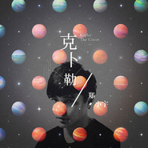

克卜勒 (Cover)
============================

|  |  |
| :--: | :-- |
| [ 克卜勒 (Cover)](https://emumo.xiami.com/album/1297787835) | **艺人**: [郑小宇](../index.md) **语种**: 国语 **唱片公司**: 独立发行 **发行时间**: 2014年04月18日 **专辑类别**: EP, 单曲 **专辑风格**: 独立摇滚 Indie Rock, 国语流行 Mandarin Pop **播放数**: 33309 **收藏数**: 4 **评论数**: 6  |

## 简介

重新改编  
孙燕姿-《克卜勒》

## 曲目

## 评论

|  |  |  |
| :-- | :-- | :-- |
|  [虾米用户](https://emumo.xiami.com/u/1536099) キラキラ 2015-08-15 15:10 赞(0) 踩(0) | 
好听呀 我觉得还不错啊 为什么楼下之前评论里一个个都是大公知的样子…
 |
|  [虾米用户](https://emumo.xiami.com/u/4988919)  2015-04-23 19:08 赞(0) 踩(0) | 
唱法做作，节奏感差
 |
|  [虾米用户](https://emumo.xiami.com/u/12832061) 行善沒有條件 2015-04-05 18:43 赞(0) 踩(0) | 
好好聽，口氣真好
 |
|  [虾米用户](https://emumo.xiami.com/u/26331668) rebel heart 2014-08-14 15:10 赞(0) 踩(0) | 
唱的还不错啊。哈哈哈，能求个伴奏吗？<a href="mailto:414042229@qq.com">414042229@qq.com</a>
 |
|  [虾米用户](https://emumo.xiami.com/u/3419686)  2014-05-16 23:18 赞(0) 踩(0) | 
换气断句问题多多
 |
|  [虾米用户](https://emumo.xiami.com/u/3961680)  2014-04-21 21:56 赞(0) 踩(0) | 
咬字还是有瑕疵，鼓励鼓励。
 |
