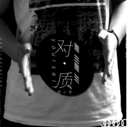

对质Confrontation
============================

|  |  |
| :--: | :-- |
| [ 对质Confrontation](https://emumo.xiami.com/album/1873899091) | **艺人**: [郑小宇](../index.md) **语种**: 国语 **唱片公司**: 独立发行 **发行时间**: 2013年07月15日 **专辑类别**: 录音室专辑 **专辑风格**:  **播放数**: 966477 **收藏数**: 2 **评论数**: 2  |

## 简介

我想我忘了 我怕我记得 和自己对质着

## 曲目

## 评论

|  |  |  |
| :-- | :-- | :-- |
|  [虾米用户](https://emumo.xiami.com/u/7130633)  2013-09-23 11:39 赞(0) 踩(0) | 
我怕我忘了，我想我记得；我想我忘了，我怕我记得...和回忆对峙着
 |
|  [虾米用户](https://emumo.xiami.com/u/17355830)   2013-07-15 23:16 赞(0) 踩(0) | 

 |
