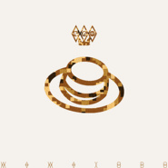

Always (中文版 cover) 太阳的后裔OST中文版 cover
============================

|  |  |
| :--: | :-- |
| [ Always (中文版 cover) 太阳的后裔OST中文版 cover](https://emumo.xiami.com/album/2100319662) | **艺人**: [郑小宇](../index.md) **语种**: 国语 **唱片公司**: 独立发行 **发行时间**: 2016年04月22日 **专辑类别**: EP, 单曲 **专辑风格**: 国语流行 Mandarin Pop, 韩国流行 K-Pop **播放数**: 66590 **收藏数**: 50 **评论数**: 3  |

## 简介

 XXX

## 曲目

## 评论

|  |  |  |
| :-- | :-- | :-- |
|  [虾米用户](https://emumo.xiami.com/u/157384374)  2016-05-01 17:58 赞(0) 踩(0) | 
歌词呢？
 |
|  [虾米用户](https://emumo.xiami.com/u/49824113) 未登记失踪瑞口 2016-04-30 01:05 赞(0) 踩(0) | 
哈哈 改的好有意思
 |
|  [虾米用户](https://emumo.xiami.com/u/67330784) 人生苦短，没空伤感 2016-04-23 00:36 赞(1) 踩(0) | 
没看过太阳的后裔，没迷恋宋仲基老公，却在凌晨被你的声音醉得不要不要的
 |
