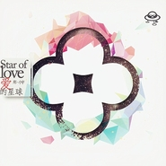

郑小宇
============================

|  |  |
| :--: | :-- |
| [ 郑小宇](https://i.xiami.com/jododo) | **地区**: China 中国大陆 **风格**: 摇滚 Rock & Roll, 灵魂乐 Soul, 独立流行 Indie Pop **播放数**: 1891763 **粉丝数**: 710 **评论数**: 31  |

## 档案

袁野《WOW！春天》作曲编曲 
胡歌 《指纹》作曲 
李炜 《唯一的选择》、《夜太空》作曲 
信 《爱在边缘》作曲 
歌浴森《荣我不懂》作曲 
李代沫《即客》作曲 
戚薇 《你是对的人》《福尔马林》作曲 
东南《还好》作词作曲 
张赫宣 《空心人》作曲 
范玮琪 《落单》作曲 
BOX 《爱你的混帐》作曲 
胡夏 《静电》作曲 
周子琰 《有一个我》作曲 
袁成杰 《怎么拥有才算是爱》作曲 
王博文 《我能够》作曲 
回音哥 《废物利用》作曲 
张智成 《Walk away》作曲 
平安 《极光》作曲 
厉娜 《可疑》作曲 
王啸坤 《窗打开》作曲 
赵紫骅《陌上花》作曲 
法老《大气层》作曲编曲制作 
杨丞琳 《年轮说》《脸孔》《忘课》作曲 
李荣浩《耳朵》作曲 
房东的猫《颠倒》作曲 
杨紫《有风的夜晚》作曲 
沙漠五子D5《战场》作曲编曲 
刘维《蓝》作曲编曲 
徐炳超《下不为例》作曲编曲制作 
刘瑞琪《标准答案》作曲编曲 
胡夏《未定的注定》作曲编曲制作

## 专辑

| 名称 | 语种 | 唱片公司 | 发行时间 | 专辑类别 | 专辑风格 |
| :--: | :-- | :-- | :-- | :-- | :-- |
| [ Personal tape #1实验小卡带](./albums/2102885630.md) | 英语 | 独立发行 | 2017年10月30日 | EP, 单曲 | 嘻哈 Hip-Hop, 沙发音乐 Lounge, 轻音乐 Easy Listening |
| [ LOSER 爵士 中文版LOSER 爵士中文版 cover](./albums/2100336742.md) | 国语 | 独立发行 | 2016年05月15日 | EP, 单曲 | 爵士流行 Jazz Pop, 国语流行 Mandarin Pop, 韩国流行 K-Pop |
| [ Always (中文版 cover) 太阳的后裔OST中文版 cover](./albums/2100319662.md) | 国语 | 独立发行 | 2016年04月22日 | EP, 单曲 | 国语流行 Mandarin Pop, 韩国流行 K-Pop |
| [ If you (Cover)中韩双语版](./albums/2100307770.md) | 国语 | 独立发行 | 2016年04月07日 | EP, 单曲 | 国语流行 Mandarin Pop, 韩国流行 K-Pop |
| [ 宅男和欧巴쟈이난과 오빠](./albums/2100287150.md) | 其他 | 独立发行 | 2016年03月05日 | EP, 单曲 | 独立流行 Indie Pop, 国语流行 Mandarin Pop, 韩国流行 K-Pop |
| [ 克卜勒 (Cover)](./albums/1297787835.md) | 国语 | 独立发行 | 2014年04月18日 | EP, 单曲 | 独立摇滚 Indie Rock, 国语流行 Mandarin Pop |
| [ 还好](./albums/577659065.md) | 国语 | 海蝶音乐 | 2013年09月27日 | EP, 单曲 |  |
| [ Star of love](./albums/1578643215.md) | 国语 | 独立发行 | 2013年09月08日 | EP, 单曲 |  |
| [ Mr.FIGHT](./albums/778217932.md) | 国语 | 独立发行 | 2013年09月03日 | EP, 单曲 | 朋克 Punk Rock |
| [ 指纹](./albums/1074316117.md) | 国语 | 独立发行 | 2013年07月16日 | EP, 单曲 |  |
| [ 对质Confrontation](./albums/1873899091.md) | 国语 | 独立发行 | 2013年07月15日 | 录音室专辑 |  |

## 评论

|  |  |  |
| :-- | :-- | :-- |
|  [虾米用户](https://emumo.xiami.com/u/443488827) 我还没想好要写什么... 2020-06-08 21:09 赞(0) 踩(0) | 
法老 我该怎么说我有多爱你
 |
|  [虾米用户](https://emumo.xiami.com/u/358104299) 悲观的唯心存在现实解构虚... 2019-12-26 11:53 赞(0) 踩(0) | 
14574
 |
|  [虾米用户](https://emumo.xiami.com/u/432552052) 轻信唯一，相依背叛 2019-11-22 14:02 赞(0) 踩(0) | 
不错的
 |
|  [虾米用户](https://emumo.xiami.com/u/74639208) Music is per... 2019-06-11 12:06 赞(0) 踩(0) | 
加油，很好听的
 |
|  [虾米用户](https://emumo.xiami.com/u/293692544) 你敢给我说话吗？我咬你 2018-09-02 10:56 赞(1) 踩(0) | 
好听
 |
|  [虾米用户](https://emumo.xiami.com/u/278978502) 朴donkey的小迷妹~ 2018-07-01 11:52 赞(1) 踩(0) | 
不是郑宇界吗？
 |
|  [虾米用户](https://emumo.xiami.com/u/352034199)  2018-05-23 22:51 赞(1) 踩(0) | 
其实小宇翻唱《等》这首歌很好听的，只是在虾米没有
 |
|  [虾米用户](https://emumo.xiami.com/u/224983891)  2018-03-11 11:17 赞(1) 踩(0) | 
鱼先生  你要学会圆滑 让坏人抓不住你 但是你永远逃离不了水的束缚  每天幻想自己能变成龙   你不停跃着所谓的龙门 逐渐变得比别的鱼强壮 你以为自己就快逃离水 直到有天你跳到岸上 重重一下 你知道自己就快死了 你才发现 你被这个美丽的谎言骗了一生 看着身后水里的同类 为他们感慨 可是你说不出话 他们也听不见 身后又一群鱼先生 涌上岸来 步你后尘
 |
|  [虾米用户](https://emumo.xiami.com/u/324725330)  2017-11-02 20:57 赞(0) 踩(0) | 
  
 |
|  [虾米用户](https://emumo.xiami.com/u/306417705)  2017-11-01 22:06 赞(0) 踩(0) | 
⭐
 |
|  [虾米用户](https://emumo.xiami.com/u/172884682)  2017-09-30 03:07 赞(0) 踩(0) | 
宇哥我想要鱼的伴奏啊！
 |
|  [虾米用户](https://emumo.xiami.com/u/52853129) 最爱BIGBANG 2017-08-21 22:11 赞(0) 踩(0) | 
你把Bigbang的歌改编得非常好
 |
|  [虾米用户](https://emumo.xiami.com/u/312389875)  2017-08-08 14:24 赞(0) 踩(0) | 
加油！，一直在，
 |
|  [虾米用户](https://emumo.xiami.com/u/120767090) 狮子山小公举 2016-10-04 23:37 赞(1) 踩(0) | 
谢谢年轮说里你的曲子喔～
 |
|  [虾米用户](https://emumo.xiami.com/u/97956016)  2016-09-07 17:34 赞(1) 踩(0) | 
谢谢你为丞琳做出这么好听的歌
 |
|  [虾米用户](https://emumo.xiami.com/u/214837039)   2016-09-07 14:30 赞(2) 踩(0) | 
你好棒！听了丞琳的年轮说过来找到Demo，然后听了你的其他歌，喜欢！
 |
|  [虾米用户](https://emumo.xiami.com/u/136021710) 书痴者文必工，艺痴者技必... 2016-07-13 00:32 赞(0) 踩(0) | 
我们竟然是同一个名字！好神奇啊！好想认识你！
 |
|  [虾米用户](https://emumo.xiami.com/u/67330784) 人生苦短，没空伤感 2016-04-15 00:09 赞(0) 踩(0) | 
来成都的草莓啊郑老师！顺带吃哈串串！保证巴适得板！
 |
|  [虾米用户](https://emumo.xiami.com/u/44025990) 是个人 2016-04-01 16:02 赞(0) 踩(0) | 
之前唱歌是好听 风格改变了一点之后 就是 好听炸了
 |
|  [虾米用户](https://emumo.xiami.com/u/49466016) 我看见繁星与海洋 彩虹与... 2016-03-24 00:54 赞(0) 踩(0) | 
什么时候会来广州呢？
 |
|  [虾米用户](https://emumo.xiami.com/u/39962249) suede never ... 2015-12-13 16:03 赞(0) 踩(0) | 
你好！！我想要那首克卜勒的伴奏！付费也可以！
 |
|  [虾米用户](https://emumo.xiami.com/u/30889641) people sure ... 2015-07-17 14:38 赞(0) 踩(0) | 

 |
|  [虾米用户](https://emumo.xiami.com/u/2391913) ....... 2015-03-27 22:05 赞(1) 踩(0) | 
wa o~
 |
|  [虾米用户](https://emumo.xiami.com/u/31759666) 不玩啦 2015-03-02 00:46 赞(0) 踩(0) | 
难道是传说中的小宇老师？
 |
| ⇒ |  [虾米用户](https://emumo.xiami.com/u/2939029)  2015-03-02 11:57 赞(0) 踩(0) | 
是啊
 |
|  [虾米用户](https://emumo.xiami.com/u/43041179)  2014-10-26 15:45 赞(1) 踩(0) | 
加油！！！！
 |
|  [虾米用户](https://emumo.xiami.com/u/41029308) 正在搬砖呢…… 2014-09-14 11:10 赞(0) 踩(0) | 
好听~
 |
|  [虾米用户](https://emumo.xiami.com/u/20585304)  2013-09-18 00:23 赞(0) 踩(0) | 
郑小宇同学和东南是一个人吗 ？
 |
| ⇒ |  [虾米用户](https://emumo.xiami.com/u/18282119) 我就是我，独一无二 2014-10-16 21:52 赞(0) 踩(0) | 
不是。
 |
|  [虾米用户](https://emumo.xiami.com/u/20812830)  2013-09-01 00:05 赞(0) 踩(0) | 
我有急用
 |
|  [虾米用户](https://emumo.xiami.com/u/20812830)  2013-09-01 00:02 赞(0) 踩(0) | 
给我还好的歌词    在吗？不好意思   谢谢
 |
