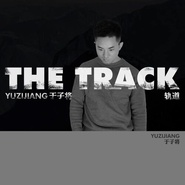

轨道The Track
============================

|  |  |
| :--: | :-- |
| [ 轨道The Track](https://emumo.xiami.com/album/2102412240) | **艺人**: [于子将](../index.md) **语种**: 国语 **唱片公司**: 凤凰涅盘 **发行时间**: 2016年09月24日 **专辑类别**: EP, 单曲 **专辑风格**:  **播放数**: 2029 **收藏数**: 1 **评论数**: 0  |

## 简介

人生的路上，会有很多相遇，就像他和她，不过是两条交叉的轨道，相交之后只能分离，而且只会越走越远。在以后的夜里，那一池莲花也曾偶尔入他梦，梦醒后却一笑释然。

## 曲目

## 评论

|  |  |  |  |
| :-- | :-- | :-- | :-- |
