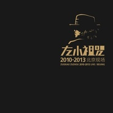

2010-2013北京现场
============================

|  |  |
| :--: | :-- |
| [ 2010-2013北京现场](https://emumo.xiami.com/album/1127200987) | **艺人**: [左小祖咒](../index.md) **语种**: 国语 **唱片公司**: 左小祖咒工作室 **发行时间**: 2015年03月16日 **专辑类别**: 现场专辑 **专辑风格**: 当代民谣 Contemporary Folk, 前卫摇滚 Progressive Rock, 摇滚 Rock & Roll **播放数**: 895819 **收藏数**: 923 **评论数**: 73  |

## 简介

《左小祖咒2010-2013北京现场》于2015年3月16日正式发行。该专辑首次采用高规格画册装帧，秒杀一切的视觉艺术与音乐本身相结合，此方式在左小祖咒以往作品中极为罕见。音乐人，艺术家，摇滚师风采将被一网打尽。  
  
专辑收录作品首首经典，全部重新混音打造，享受最完美现场的同时想必视觉冲击力也会让你发狂到淋漓尽致，左爷这次就是要给足所有你想要的。  
专辑以画册的形式限量出品2015张，每张都附有独立编码，毋庸置疑，这将是一次摇滚与艺术相互融汇的新标志，新高度。

## 曲目

- [小莉 (Live)](./1127200987/mQOUKy859c5.md)
- [我不能悲伤地坐在你身旁 (Live)](./1127200987/mQOUKz87f2d.md)
- [乌兰巴托的夜 (Live)MV](./1127200987/mQOUK16b64a.md)
- [当我离开你的时候 (Live)](./1127200987/xL9T9cc51dc.md)
- [忧伤的老板 (Live)](./1127200987/xL9T9d14e35.md)
- [平安大道的延伸 (Live)](./1127200987/8GuSxEe902e.md)
- [像孩子似的倾听 (Live)](./1127200987/JBfRmp22956.md)
- [关河令 (Live)](./1127200987/U5QQaQ26879.md)
- [可忘不可忘 (Live)](./1127200987/xL9T9i9e128.md)
- [咖啡时光（Live）](./1127200987/b1CtVMP3dac0.md)
- [再见 可爱的小伙子2011（Live）](./1127200987/nnbbTC5e4eb.md)

## 评论

|  |  |  |  |
| :-- | :-- | :-- | :-- |
|  [虾米用户](https://emumo.xiami.com/u/421397997) 我还没想好要写什么... 2020-02-17 05:55 赞(2) 踩(0) | 
爱情的枪 哪里去了
 |
| ⇒ |  [虾米用户](https://emumo.xiami.com/u/280483507)   2020-12-05 22:36 赞(0) 踩(0) | 
因为有升哥，所以&amp;hellip;
 |
|  [虾米用户](https://emumo.xiami.com/u/44030946) 我还没想好要写什么... 2020-02-14 21:54 赞(0) 踩(0) | 
真是一张很棒的专辑，旋律编曲特别好。不喜欢左小唱腔的，可以多听几遍习惯就好或者直接忽略他的腔调。其实习惯了还是很舒服的。
 |
|  [虾米用户](https://emumo.xiami.com/u/44030946) 我还没想好要写什么... 2020-02-14 21:52 赞(0) 踩(0) | 
真是一张很棒的专辑，旋律编曲特别好。不喜欢左小唱腔的，可以多听几遍习惯就好或者直接忽略他的腔 其实习惯了还是很舒服的。
 |
|  [虾米用户](https://emumo.xiami.com/u/370714771)  2019-08-12 23:48 赞(0) 踩(0) | 
good
 |
|  [虾米用户](https://emumo.xiami.com/u/47315261) 听美乐 入盛世 2019-07-29 23:01 赞(0) 踩(0) | 
苦鬼呢
 |
|  [虾米用户](https://emumo.xiami.com/u/260269588) 何為生命 2019-04-15 14:01 赞(1) 踩(0) | 
可以把爱情的枪还回来吗
 |
| ⇒ |  [虾米用户](https://emumo.xiami.com/u/149145134) 春水初生，春林初盛，春風... 2019-04-19 08:38 赞(0) 踩(0) | 
还好我提都下载了。我就知道会被和谐
 |
| ⇒ |  [虾米用户](https://emumo.xiami.com/u/260269588) 何為生命 2019-04-19 09:03 赞(0) 踩(0) | 
<q><b>涂小嘉说：</b></q>
 |
|  [虾米用户](https://emumo.xiami.com/u/149145134) 春水初生，春林初盛，春風... 2019-04-08 06:53 赞(1) 踩(0) | 
还有三首：爱情的枪，咖啡时光，苦鬼，被官方和谐了
 |
|  [虾米用户](https://emumo.xiami.com/u/319726224) 原来我是凡人 2019-02-03 19:10 赞(0) 踩(0) | 
慢慢品，细细尝，乍一听没觉得什么甚至觉得难听，听的时间长了……还是听不懂
 |
|  [虾米用户](https://emumo.xiami.com/u/409925292)  2018-12-04 12:01 赞(0) 踩(0) | 
他的音乐极具感情色彩。
 |
|  [虾米用户](https://emumo.xiami.com/u/48183064)  2018-04-03 15:30 赞(0) 踩(0) | 
牛逼
 |
|  [虾米用户](https://emumo.xiami.com/u/1054755) 欲火中烧 盘古 2017-12-02 10:57 赞(2) 踩(0) | 
录音和现场保持一贯高水准！
 |
|  [虾米用户](https://emumo.xiami.com/u/7204799)  2016-12-07 01:16 赞(0) 踩(0) | 
什么时候再开演唱会我要去
 |
|  [虾米用户](https://emumo.xiami.com/u/1152798)  2016-07-30 01:36 赞(1) 踩(0) | 
左叔的歌还是有毒的，那种你听了会觉得奇怪，却还莫名其妙的听下去，不愿停止的听下去
 |
|  [虾米用户](https://emumo.xiami.com/u/671696)  2016-05-22 11:41 赞(0) 踩(0) | 
不可吃掉的是
 |
|  [虾米用户](https://emumo.xiami.com/u/7118858)   2016-05-18 00:29 赞(0) 踩(0) | 
从现场开始喜欢听
 |
|  [虾米用户](https://emumo.xiami.com/u/11234562) 默然潜行人生 2016-04-08 20:21 赞(0) 踩(0) | 
贾樟柯 哈哈
 |
|  [虾米用户](https://emumo.xiami.com/u/54518)  2016-01-24 20:17 赞(0) 踩(0) | 
佳
 |
|  [虾米用户](https://emumo.xiami.com/u/1463041)  2015-12-22 19:14 赞(2) 踩(0) | 
史上最好听的左小祖咒专辑
 |
|  [虾米用户](https://emumo.xiami.com/u/78338532)  2015-11-22 14:39 赞(0) 踩(0) | 
现场
 |
|  [虾米用户](https://emumo.xiami.com/u/28554652) 中低音烟嗓才是最有磁性的... 2015-11-07 04:13 赞(7) 踩(0) | 
内容已删除
 |
| ⇒ |  [虾米用户](https://emumo.xiami.com/u/6435422) 我还没想好要写什么... 2018-04-03 23:18 赞(0) 踩(0) | 
我第一遍听就觉得出不去了
 |
|  [虾米用户](https://emumo.xiami.com/u/1730251)  2015-10-06 19:59 赞(0) 踩(0) | 
竟然觉得...真好听
 |
|  [虾米用户](https://emumo.xiami.com/u/22111007) 生于最寒冷的冬天，取名叫... 2015-09-29 14:22 赞(0) 踩(0) | 
~
 |
|  [虾米用户](https://emumo.xiami.com/u/8244559)  2015-09-22 10:26 赞(1) 踩(0) | 
******
 |
|  [虾米用户](https://emumo.xiami.com/u/7809994) 云 2015-08-13 10:58 赞(0) 踩(0) | 
他就不怕我打破他的头？
 |
|  [虾米用户](https://emumo.xiami.com/u/50129287) 哪那么多事咧～ 2015-08-09 22:54 赞(0) 踩(0) | 
一坨S一样的玩意独立音乐里面奇葩
 |
|  [虾米用户](https://emumo.xiami.com/u/37149364) 我不是不爱你 看不到自己... 2015-08-09 13:39 赞(1) 踩(0) | 
喜欢老烟枪 喜欢旧的东西
 |
|  [虾米用户](https://emumo.xiami.com/u/28722750) 同类 2015-06-16 22:19 赞(0) 踩(0) | 
爱
 |
|  [虾米用户](https://emumo.xiami.com/u/27338237) 是的 2015-06-15 12:05 赞(0) 踩(0) | 
感情好细腻。
 |
|  [虾米用户](https://emumo.xiami.com/u/4406065) （闷树） 2015-06-14 13:51 赞(0) 踩(0) | 
难听的声音，确让人沉迷。
 |
|  [虾米用户](https://emumo.xiami.com/u/1979410) 暂无签名~ 2015-05-29 01:07 赞(0) 踩(0) | 
独特，个性，有意思
 |
|  [虾米用户](https://emumo.xiami.com/u/38081589)   2015-05-07 16:41 赞(0) 踩(0) | 
欣赏不动
 |
|  [虾米用户](https://emumo.xiami.com/u/49858350) 按常理此处应该添加自拍 2015-05-06 21:21 赞(0) 踩(0) | 
气泡音吖
 |
|  [虾米用户](https://emumo.xiami.com/u/7957965) 隐喻最浪漫 2015-05-02 14:19 赞(0) 踩(0) | 
好
 |
|  [虾米用户](https://emumo.xiami.com/u/1676106) 在承担责任下，独立，自由 2015-04-17 14:40 赞(0) 踩(0) | 
左老板
 |
|  [虾米用户](https://emumo.xiami.com/u/8709378)  2015-04-17 11:13 赞(1) 踩(0) | 
升哥现场演唱爱情的枪太有劲儿了,力量感十足.
 |
|  [虾米用户](https://emumo.xiami.com/u/1265200) 精神病人欢乐多 2015-04-12 06:25 赞(0) 踩(0) | 
只需RMB2015就能得到它！是这样吗？
 |
|  [虾米用户](https://emumo.xiami.com/u/3206053) 照章办事 2015-04-11 23:00 赞(0) 踩(0) | 
总体来说，感觉葡萄的混音比万事如意好
 |
|  [虾米用户](https://emumo.xiami.com/u/7541943) 我还没想好要写什么... 2015-04-11 16:56 赞(0) 踩(0) | 
我去～Live很不错啊！
 |
|  [虾米用户](https://emumo.xiami.com/u/10530777) 奇异空间 2015-04-11 13:38 赞(0) 踩(0) | 
可忘不可忘听笑了，有趣哈哈
 |
|  [虾米用户](https://emumo.xiami.com/u/11116674)   2015-04-09 01:40 赞(0) 踩(0) | 
左小？诅咒！ 
 |
|  [虾米用户](https://emumo.xiami.com/u/36264200)   2015-04-09 00:54 赞(0) 踩(0) | 
听完一遍，已经不会好好唱歌了，受益匪浅，出专辑送诗集么
 |
|  [虾米用户](https://emumo.xiami.com/u/21262612)  2015-04-08 15:38 赞(0) 踩(0) | 
实体唱片购买链接<a href="http://detail.tmall.com/item.htm?spm=a220m.1000858.1000725.1.gbmOoB&amp;amp;id=44026055246&amp;amp;skuId=4611686062453443150&amp;amp;areaId=110100&amp;amp;cat_id=2&amp;amp;rn=000f99f09b9c807e9e5b4d370e9fc933&amp;amp;user_id=428573252&amp;amp;is_b=1" target="_blank" rel="nofollow noreferrer noopener">http://detail.tmall.com/item.htm?spm=a220m.1000858.1000725.1.gbmOoB&amp;amp;id=44026055246&amp;amp;skuId=4611686062453443150&amp;amp;areaId=110100&amp;amp;cat_id=2&amp;amp;rn=000f99f09b9c807e9e5b4d370e9fc933&amp;amp;user_id=428573252&amp;amp;is_b=1</a>
 |
|  [虾米用户](https://emumo.xiami.com/u/191224) 自笑狂夫老更狂 2015-04-08 13:22 赞(0) 踩(0) | 
逸品。
 |
|  [虾米用户](https://emumo.xiami.com/u/45823339) 伪文艺工作者，各种演出、... 2015-04-07 23:36 赞(4) 踩(0) | 
如果打分唱功，左小只能为负分。。
 |
| ⇒ |  [虾米用户](https://emumo.xiami.com/u/14453932) no personali... 2015-04-08 13:41 赞(0) 踩(0) | 
手动点赞
 |
| ⇒ |  [虾米用户](https://emumo.xiami.com/u/5885235)  2015-04-08 23:12 赞(0) 踩(0) | 
确定？...
 |
| ⇒ |  [虾米用户](https://emumo.xiami.com/u/12462387)  2015-04-09 16:15 赞(0) 踩(0) | 
呵呵
 |
| ⇒ |  [虾米用户](https://emumo.xiami.com/u/45823339) 伪文艺工作者，各种演出、... 2015-04-09 18:36 赞(0) 踩(0) | 
<q><b>183小骨架MSN先森说：</b></q>
 |
| ⇒ |  [虾米用户](https://emumo.xiami.com/u/4784429) 我站在繁星上等你 2015-04-23 10:36 赞(0) 踩(0) | 
哈哈哈哈
 |
| ⇒ |  [虾米用户](https://emumo.xiami.com/u/45156071) 以文乱法，以武犯禁 2015-06-08 12:33 赞(0) 踩(0) | 
你也不是音乐专业的吧
 |
|  [虾米用户](https://emumo.xiami.com/u/610315)  2015-04-07 21:47 赞(0) 踩(0) | 
前奏美哭了
 |
|  [虾米用户](https://emumo.xiami.com/u/11761284) 听歌只听丢菜卡” 2015-04-07 20:59 赞(0) 踩(0) | 
这张我在微博都下载完了前年
 |
|  [虾米用户](https://emumo.xiami.com/u/46401953) 不忘记最初就不怕以后 2015-04-07 19:49 赞(0) 踩(0) | 
哇哦
 |
|  [虾米用户](https://emumo.xiami.com/u/8244559)  2015-04-07 15:37 赞(0) 踩(0) | 
******
 |
|  [虾米用户](https://emumo.xiami.com/u/43256169) 路过了青春 我们还拥有什... 2015-04-07 15:06 赞(0) 踩(0) | 
  
 |
|  [虾米用户](https://emumo.xiami.com/u/13756474) 神棍就是神棍 2015-04-07 14:54 赞(0) 踩(0) | 
很抒情的左小
 |
|  [虾米用户](https://emumo.xiami.com/u/54518)  2015-04-07 14:21 赞(0) 踩(0) | 
好
 |
|  [虾米用户](https://emumo.xiami.com/u/28291455) 2019不自闭 2015-04-07 13:29 赞(0) 踩(0) | 
啥
 |
|  [虾米用户](https://emumo.xiami.com/u/22409343) 我还没想好要写什么... 2015-04-07 13:18 赞(0) 踩(0) | 
挺好啊
 |
|  [虾米用户](https://emumo.xiami.com/u/16828780) 豆豆我爱你 2015-04-07 13:14 赞(0) 踩(0) | 
大爱
 |
|  [虾米用户](https://emumo.xiami.com/u/32961761) 一切终将化为乌有 2015-04-07 12:49 赞(0) 踩(0) | 
平安大道躺着一个人
 |
|  [虾米用户](https://emumo.xiami.com/u/30493) 偏爱重型音乐 2015-04-07 12:11 赞(1) 踩(0) | 
这张全是耳熟能详，便于KTV的歌嘛
 |
|  [虾米用户](https://emumo.xiami.com/u/27224237) 永远在寻找能唤醒我耳朵的... 2015-04-07 12:02 赞(0) 踩(0) | 
♥
 |
|  [虾米用户](https://emumo.xiami.com/u/15452208) 虾米是这几年唯一的听歌软... 2015-04-07 11:46 赞(0) 踩(0) | 
哇偶~
 |
|  [虾米用户](https://emumo.xiami.com/u/16828780) 豆豆我爱你 2015-04-07 11:45 赞(0) 踩(0) | 
我来听一下
 |
|  [虾米用户](https://emumo.xiami.com/u/40759242) 暂无签名~ 2015-04-07 11:33 赞(0) 踩(0) | 
a
 |
|  [虾米用户](https://emumo.xiami.com/u/4157248) 但请不要停止我的音乐 2015-04-07 11:31 赞(0) 踩(0) | 
赞赞赞
 |
|  [虾米用户](https://emumo.xiami.com/u/5918923) Be Bold 2015-04-07 11:29 赞(0) 踩(0) | 
忽悠忽悠
 |
|  [虾米用户](https://emumo.xiami.com/u/4400366) 再也不见 2015-04-07 11:29 赞(0) 踩(0) | 
～
 |
|  [虾米用户](https://emumo.xiami.com/u/54518)  2015-04-02 20:37 赞(0) 踩(0) | 
不是双唱片吧？
 |
