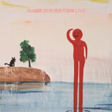

2016西安不插电
============================

|  |  |
| :--: | :-- |
| [ 2016西安不插电](https://emumo.xiami.com/album/2102757102) | **艺人**: [左小祖咒](../index.md) **语种**: 国语 **唱片公司**: 左小祖咒工作室 **发行时间**: 2016年05月28日 **专辑类别**: 现场专辑 **专辑风格**: 摇滚 Rock & Roll, 民谣 Folk, 迷幻摇滚 Psychedelic Rock **播放数**: 89364 **收藏数**: 193 **评论数**: 17  |

## 简介

2016年5月28日，音乐艺术家左小祖咒在西安举行个人演唱会。这是噪音乐团首次以不插电形式演出，全场所有歌曲都进行重新编排与诠释，回归最原始的快感。往日怪诞狂躁的摇滚师，摇身一变成为温暖的音乐诗人，引发全场共鸣悸动。  
时隔一年，收录当晚《最荒唐》、《泸沽湖情歌》、《阿弥陀佛》等11首经典曲目的《左小祖咒2016西安不插电LIVE》发布，左小祖咒与制作人方无行率领全新阵容带来左氏风味独特的摇滚盛宴。现场LIVE也展现出左小祖咒另一面的音乐态度，对于喜爱左小乐风的朋友们来说是一张不可错过的精品演绎专辑。

## 曲目

- [泸沽湖情歌 Unplugged](./2102757102/xNd5Eeb680b.md)
- [平安大道的延伸Unplugged](./2102757102/xNd5Ed99f62.md)
- [爱的劳工 Unplugged](./2102757102/xNd5Ef14652.md)
- [钱歌Unplugged](./2102757102/U7u2fQ2b6f6.md)
- [阿弥陀佛 Unplugged](./2102757102/mSs6P7796b0.md)
- [吹牛 Unplugged](./2102757102/9c7bwUec934.md)
- [忧伤的老板 Unplugged](./2102757102/8HO42Jef919.md)
- [我不能悲伤地坐在你身旁 Unplugged](./2102757102/mSs6PA6a2e3.md)
- [最高处 Unplugged](./2102757102/mSs6PB51ad6.md)
- [小莉 Unplugged](./2102757102/mSs6PC5ca45.md)

## 评论

|  |  |  |  |
| :-- | :-- | :-- | :-- |
|  [虾米用户](https://emumo.xiami.com/u/49660160)   2020-02-08 17:13 赞(0) 踩(0) | 
难听的让人难过。
 |
|  [虾米用户](https://emumo.xiami.com/u/43646390) 喜欢音乐真是太好了～♡ 2020-01-01 20:08 赞(0) 踩(0) | 
在现场
 |
|  [虾米用户](https://emumo.xiami.com/u/427714248)  2019-08-02 08:29 赞(0) 踩(0) | 
优秀的艺术家
 |
|  [虾米用户](https://emumo.xiami.com/u/378023059) 念佛成佛阿弥陀佛 2019-03-01 13:12 赞(0) 踩(0) | 
阿弥陀佛
 |
|  [虾米用户](https://emumo.xiami.com/u/1579453)   2018-07-29 00:21 赞(1) 踩(0) | 
这张好！现场为王
 |
|  [虾米用户](https://emumo.xiami.com/u/42146967) 岁月如歌 那首疯狂的歌又... 2018-05-11 02:37 赞(0) 踩(0) | 
这个专辑好听
 |
|  [虾米用户](https://emumo.xiami.com/u/43492923) 行到水穷我才开始害怕，夕... 2018-02-01 21:06 赞(0) 踩(0) | 
▲
 |
|  [虾米用户](https://emumo.xiami.com/u/85114506) 明月夜 短松冈 2018-01-24 12:10 赞(0) 踩(0) | 
最喜欢的版本乌兰巴托的夜没有
 |
|  [虾米用户](https://emumo.xiami.com/u/85114506) 明月夜 短松冈 2018-01-24 12:07 赞(0) 踩(0) | 
为啥没有乌兰巴托的夜那首歌
 |
|  [虾米用户](https://emumo.xiami.com/u/258856330) 神秘人 2017-09-15 13:24 赞(0) 踩(0) | 
靠，能听了。
 |
|  [虾米用户](https://emumo.xiami.com/u/79515706)  2017-09-09 11:58 赞(0) 踩(0) | 
歌中的鲁迅
 |
|  [虾米用户](https://emumo.xiami.com/u/6560811) 在下失礼，并语祝吉安。 2017-09-03 20:31 赞(0) 踩(0) | 
有的呀 左小在公号说了
 |
|  [虾米用户](https://emumo.xiami.com/u/18628182) 虽然也没怎么照顾虾仔，但... 2017-06-03 16:51 赞(0) 踩(0) | 
为什么不在虾米卖，我肯定在这买呀
 |
|  [虾米用户](https://emumo.xiami.com/u/258856330) 神秘人 2017-06-03 00:01 赞(5) 踩(0) | 
良心虾米啊，就算没版权也要放出来，就冲这一点，转粉。
 |
|  [虾米用户](https://emumo.xiami.com/u/39219787) 音樂才是我的解藥 2017-06-01 23:08 赞(0) 踩(0) | 
购买连接都没有
 |
|  [虾米用户](https://emumo.xiami.com/u/21581338)  2017-06-01 20:03 赞(0) 踩(0) | 
干毛，虾米居然没有版权？
 |
| ⇒ |  [虾米用户](https://emumo.xiami.com/u/3566813) 菩萨，祝您身体健康！34... 2017-09-01 22:29 赞(0) 踩(0) | 
快来听！！！    
 |
